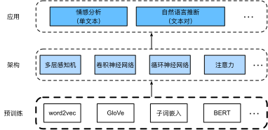

# 自然语言处理：预训练
:label:`chap_nlp_pretrain`

人与人之间需要交流。
出于人类这种基本需要，每天都有大量的书面文本产生。
比如，社交媒体、聊天应用、电子邮件、产品评论、新闻文章、
研究论文和书籍中的丰富文本，
使计算机能够理解它们以提供帮助或基于人类语言做出决策变得至关重要。

*自然语言处理*是指研究使用自然语言的计算机和人类之间的交互。
在实践中，使用自然语言处理技术来处理和分析文本数据是非常常见的，
例如 :numref:`sec_language_model`的语言模型
和 :numref:`sec_machine_translation`的机器翻译模型。

要理解文本，我们可以从学习它的表示开始。
利用来自大型语料库的现有文本序列，
*自监督学习*（self-supervised learning）
已被广泛用于预训练文本表示，
例如通过使用周围文本的其它部分来预测文本的隐藏部分。
通过这种方式，模型可以通过有监督地从*海量*文本数据中学习，而不需要*昂贵*的标签标注！

本章我们将看到：当将每个单词或子词视为单个词元时，
可以在大型语料库上使用word2vec、GloVe或子词嵌入模型预先训练每个词元的词元。
经过预训练后，每个词元的表示可以是一个向量。
但是，无论上下文是什么，它都保持不变。
例如，“bank”（可以译作银行或者河岸）的向量表示在
“go to the bank to deposit some money”（去银行存点钱）
和“go to the bank to sit down”（去河岸坐下来）中是相同的。
因此，许多较新的预训练模型使相同词元的表示适应于不同的上下文，
其中包括基于Transformer编码器的更深的自监督模型BERT。
在本章中，我们将重点讨论如何预训练文本的这种表示，
如 :numref:`fig_nlp-map-pretrain`中所强调的那样。


:label:`fig_nlp-map-pretrain`

 :numref:`fig_nlp-map-pretrain`显示了
预训练好的文本表示可以放入各种深度学习架构，应用于不同自然语言处理任务。
我们将在 :numref:`chap_nlp_app`中介绍它们。


```toc
:maxdepth: 2

word2vec
approx-training
word-embedding-dataset
word2vec-pretraining
glove
subword-embedding
similarity-analogy
bert
bert-dataset
bert-pretraining
```
