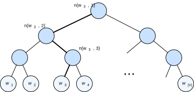

# 近似训练

回忆上一节的内容。跳字模型的核心在于使用softmax运算得到给定中心词$w_c$来生成背景词$w_o$的条件概率

$$P(w_o \mid w_c) = \frac{\text{exp}(\boldsymbol{u}_o^\top \boldsymbol{v}_c)}{ \sum_{i \in \mathcal{V}} \text{exp}(\boldsymbol{u}_i^\top \boldsymbol{v}_c)}.$$

该条件概率相应的对数损失

$$-\log P(w_o \mid w_c) =
-\boldsymbol{u}_o^\top \boldsymbol{v}_c + \log\left(\sum_{i \in \mathcal{V}} \text{exp}(\boldsymbol{u}_i^\top \boldsymbol{v}_c)\right).$$

由于softmax运算考虑了背景词可能是词典$\mathcal{V}$中的任一词，以上损失包含了词典大小数目的项的累加。在上一节中我们看到，不论是跳字模型还是连续词袋模型，由于条件概率使用了softmax运算，每一步的梯度计算都包含词典大小数目的项的累加。对于含几十万或上百万词的较大词典，每次的梯度计算开销可能过大。为了降低该计算复杂度，本节将介绍两种近似训练方法，即负采样（negative sampling）或层序softmax（hierarchical softmax）。由于跳字模型和连续词袋模型类似，本节仅以跳字模型为例介绍这两种方法。

## 负采样

负采样修改了原来的目标函数。给定中心词$w_c$的一个背景窗口，我们把背景词$w_o$出现在该背景窗口看作一个事件，并将该事件的概率计算为

$$P(D=1\mid w_c, w_o) = \sigma(\boldsymbol{u}_o^\top \boldsymbol{v}_c),$$

其中的$\sigma$函数与sigmoid激活函数的定义相同：

$$\sigma(x) = \frac{1}{1+\exp(-x)}.$$

我们先考虑最大化文本序列中所有该事件的联合概率来训练词向量。具体来说，给定一个长度为$T$的文本序列，设时间步$t$的词为$w^{(t)}$且背景窗口大小为$m$，考虑最大化联合概率

$$ \prod_{t=1}^{T} \prod_{-m \leq j \leq m,\ j \neq 0} P(D=1\mid w^{(t)}, w^{(t+j)}).$$

然而，以上模型中包含的事件仅考虑了正类样本。这导致当所有词向量相等且值为无穷大时，以上的联合概率才被最大化为1。很明显，这样的词向量毫无意义。负采样通过采样并添加负类样本使目标函数更有意义。设背景词$w_o$出现在中心词$w_c$的一个背景窗口为事件$P$，我们根据分布$P(w)$采样$K$个未出现在该背景窗口中的词，即噪声词。设噪声词$w_k$（$k=1, \ldots, K$）不出现在中心词$w_c$的该背景窗口为事件$N_k$。假设同时含有正类样本和负类样本的事件$P, N_1, \ldots, N_K$相互独立，负采样将以上需要最大化的仅考虑正类样本的联合概率改写为

$$ \prod_{t=1}^{T} \prod_{-m \leq j \leq m,\ j \neq 0} P(w^{(t+j)} \mid w^{(t)}),$$

其中条件概率被近似表示为
$$ P(w^{(t+j)} \mid w^{(t)}) =P(D=1\mid w^{(t)}, w^{(t+j)})\prod_{k=1,\ w_k \sim P(w)}^K P(D=0\mid w^{(t)}, w_k).$$

设文本序列中时间步$t$的词$w^{(t)}$在词典中的索引为$i_t$，噪声词$w_k$在词典中的索引为$h_k$。有关以上条件概率的对数损失为

$$
\begin{aligned}
-\log P(w^{(t+j)} \mid w^{(t)})
=& -\log P(D=1\mid w^{(t)}, w^{(t+j)}) - \sum_{k=1,\ w_k \sim P(w)}^K \log P(D=0\mid w^{(t)}, w_k)\\
=&-  \log\, \sigma\left(\boldsymbol{u}_{i_{t+j}}^\top \boldsymbol{v}_{i_t}\right) - \sum_{k=1,\ w_k \sim P(w)}^K \log\left(1-\sigma\left(\boldsymbol{u}_{h_k}^\top \boldsymbol{v}_{i_t}\right)\right)\\
=&-  \log\, \sigma\left(\boldsymbol{u}_{i_{t+j}}^\top \boldsymbol{v}_{i_t}\right) - \sum_{k=1,\ w_k \sim P(w)}^K \log\sigma\left(-\boldsymbol{u}_{h_k}^\top \boldsymbol{v}_{i_t}\right).
\end{aligned}
$$

现在，训练中每一步的梯度计算开销不再与词典大小相关，而与$K$线性相关。当$K$取较小的常数时，负采样在每一步的梯度计算开销较小。

## 层序softmax

层序softmax是另一种近似训练法。它使用了二叉树这一数据结构，树的每个叶结点代表词典$\mathcal{V}$中的每个词。

假设$L(w)$为从二叉树的根结点到词$w$的叶结点的路径（包括根结点和叶结点）上的结点数。设$n(w,j)$为该路径上第$j$个结点，并设该结点的背景词向量为$\boldsymbol{u}_{n(w,j)}$。以图10.3为例，$L(w_3) = 4$。层序softmax将跳字模型中的条件概率近似表示为

$$P(w_o \mid w_c) = \prod_{j=1}^{L(w_o)-1} \sigma\left( [\![  n(w_o, j+1) = \text{leftChild}(n(w_o,j)) ]\!] \cdot \boldsymbol{u}_{n(w_o,j)}^\top \boldsymbol{v}_c\right),$$

其中$\sigma$函数与[“多层感知机”](../chapter_deep-learning-basics/mlp.md)一节中sigmoid激活函数的定义相同，$\text{leftChild}(n)$是结点$n$的左子结点：如果判断$x$为真，$[\![x]\!] = 1$；反之$[\![x]\!] = -1$。
让我们计算图10.3中给定词$w_c$生成词$w_3$的条件概率。我们需要将$w_c$的词向量$\boldsymbol{v}_c$和根结点到$w_3$路径上的非叶结点向量一一求内积。由于在二叉树中由根结点到叶结点$w_3$的路径上需要向左、向右再向左地遍历（图10.3中加粗的路径），我们得到

$$P(w_3 \mid w_c) = \sigma(\boldsymbol{u}_{n(w_3,1)}^\top \boldsymbol{v}_c) \cdot \sigma(-\boldsymbol{u}_{n(w_3,2)}^\top \boldsymbol{v}_c) \cdot \sigma(\boldsymbol{u}_{n(w_3,3)}^\top \boldsymbol{v}_c).$$

由于$\sigma(x)+\sigma(-x) = 1$，给定中心词$w_c$生成词典$\mathcal{V}$中任一词的条件概率之和为1这一条件也将满足：

$$\sum_{w \in \mathcal{V}} P(w \mid w_c) = 1.$$

此外，由于$L(w_o)-1$的数量级为$\mathcal{O}(\text{log}_2|\mathcal{V}|)$，当词典$\mathcal{V}$很大时，层序softmax在训练中每一步的梯度计算开销相较未使用近似训练时大幅降低。

## 小结

* 负采样通过考虑同时含有正类样本和负类样本的相互独立事件来构造损失函数。其训练中每一步的梯度计算开销与采样的噪声词的个数线性相关。
* 层序softmax使用了二叉树，并根据根结点到叶结点的路径来构造损失函数。其训练中每一步的梯度计算开销与词典大小的对数相关。

## 练习

* 在阅读下一节之前，你觉得在负采样中应如何采样噪声词？
* 本节中最后一个公式为什么成立？
* 如何将负采样或层序softmax用于训练连续词袋模型？

## 扫码直达[讨论区](https://discuss.gluon.ai/t/topic/8135)

