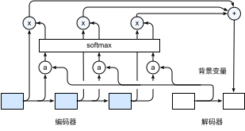

# 注意力机制

在[“编码器—解码器（seq2seq）”](seq2seq.md)一节里，解码器在各个时间步依赖相同的背景变量来获取输入序列信息。当编码器为循环神经网络时，背景变量来自它最终时间步的隐藏状态。

现在让我们再次思考那一节提到的翻译例子：输入为英语序列“They”、“are”、“watching”、“.”，输出为法语序列“Ils”、“regardent”、“.”。不难想到，解码器在生成输出序列中的每一个词时可能只需利用输入序列某一部分的信息。例如，在输出序列的时间步1，解码器可以主要依赖“They”、“are”的信息来生成“Ils”，在时间步2则主要使用来自“watching”的编码信息生成“regardent”，最后在时间步3则直接映射句号“.”。这看上去就像是在解码器的每一时间步对输入序列中不同时间步的编码信息分配不同的注意力一样。这也是注意力机制的由来 [1]。

仍然以循环神经网络为例，注意力机制通过对编码器所有时间步的隐藏状态做加权平均来得到背景变量。解码器在每一时间步调整这些权重，即注意力权重，从而能够在不同时间步分别关注输入序列中的不同部分并编码进相应时间步的背景变量。本节我们将讨论注意力机制是怎么工作的。

在[“编码器—解码器（seq2seq）”](seq2seq.md)一节里我们区分了输入序列或编码器的索引$t$与输出序列或解码器的索引$t'$。该节中，解码器在时间步$t'$的隐藏状态$\boldsymbol{s}_{t'} = g(\boldsymbol{y}_{t'-1}, \boldsymbol{c}, \boldsymbol{s}_{t'-1})$，其中$\boldsymbol{y}_{t'-1}$是上一时间步$t'-1$的输出$y_{t'-1}$的特征表示，且任一时间步$t'$使用相同的背景变量$\boldsymbol{c}$。但在注意力机制中，解码器的每一时间步将使用可变的背景变量。记$\boldsymbol{c}_{t'}$是解码器在时间步$t'$的背景变量，那么解码器在该时间步的隐藏状态可以改写为

$$\boldsymbol{s}_{t'} = g(\boldsymbol{y}_{t'-1}, \boldsymbol{c}_{t'}, \boldsymbol{s}_{t'-1}).$$

这里的关键是如何计算背景变量$\boldsymbol{c}_{t'}$和如何利用它来更新隐藏状态$\boldsymbol{s}_{t'}$。以下将分别描述这两个关键点。

## 计算背景变量

图10.12描绘了注意力机制如何为解码器在时间步2计算背景变量。首先，函数$a$根据解码器在时间步1的隐藏状态和编码器在各个时间步的隐藏状态计算softmax运算的输入。Softmax运算输出概率分布并对编码器各个时间步的隐藏状态做加权平均，从而得到背景变量。

具体来说，令编码器在时间步$t$的隐藏状态为$\boldsymbol{h}_t$，且总时间步数为$T$。那么解码器在时间步$t'$的背景变量为所有编码器隐藏状态的加权平均：

$$\boldsymbol{c}_{t'} = \sum_{t=1}^T \alpha_{t' t} \boldsymbol{h}_t,$$

其中给定$t'$时，权重$\alpha_{t' t}$在$t=1,\ldots,T$的值是一个概率分布。为了得到概率分布，我们可以使用softmax运算:

$$\alpha_{t' t} = \frac{\exp(e_{t' t})}{ \sum_{k=1}^T \exp(e_{t' k}) },\quad t=1,\ldots,T.$$

现在，我们需要定义如何计算上式中softmax运算的输入$e_{t' t}$。由于$e_{t' t}$同时取决于解码器的时间步$t'$和编码器的时间步$t$，我们不妨以解码器在时间步$t'-1$的隐藏状态$\boldsymbol{s}_{t' - 1}$与编码器在时间步$t$的隐藏状态$\boldsymbol{h}_t$为输入，并通过函数$a$计算$e_{t' t}$：

$$e_{t' t} = a(\boldsymbol{s}_{t' - 1}, \boldsymbol{h}_t).$$

这里函数$a$有多种选择，如果两个输入向量长度相同，一个简单的选择是计算它们的内积$a(\boldsymbol{s}, \boldsymbol{h})=\boldsymbol{s}^\top \boldsymbol{h}$。而最早提出注意力机制的论文则将输入连结后通过含单隐藏层的多层感知机变换 [1]：

$$a(\boldsymbol{s}, \boldsymbol{h}) = \boldsymbol{v}^\top \tanh(\boldsymbol{W}_s \boldsymbol{s} + \boldsymbol{W}_h \boldsymbol{h}),$$

其中$\boldsymbol{v}$、$\boldsymbol{W}_s$、$\boldsymbol{W}_h$都是可以学习的模型参数。

### 矢量化计算

我们还可以对注意力机制采用更高效的矢量化计算。广义上，注意力机制模型的输入包括查询项以及一一对应的键项和值项。其中值项是需要加权平均的一组项。在加权平均中，值项的权重来自查询项以及与该值项对应的键项的计算。

在上面的例子中，查询项为解码器的隐藏状态，键项和值项均为编码器的隐藏状态。
让我们考虑一个常见的简单情形，即编码器和解码器的隐藏单元个数均为$h$，且函数$a(\boldsymbol{s}, \boldsymbol{h})=\boldsymbol{s}^\top \boldsymbol{h}$。假设我们希望根据解码器单个隐藏状态$\boldsymbol{s}_{t' - 1} \in \mathbb{R}^{h}$和编码器所有隐藏状态$\boldsymbol{h}_t \in \mathbb{R}^{h}, t = 1,\ldots,T$计算背景向量$\boldsymbol{c}_{t'}\in \mathbb{R}^{h}$。
我们可以将查询项矩阵$\boldsymbol{Q} \in \mathbb{R}^{1 \times h}$设为$\boldsymbol{s}_{t' - 1}^\top$，并令键项矩阵$\boldsymbol{K} \in \mathbb{R}^{T \times h}$和值项矩阵$\boldsymbol{V} \in \mathbb{R}^{T \times h}$相同且第$t$行均为$\boldsymbol{h}_t^\top$。此时，我们只需要通过矢量化计算

$$\text{softmax}(\boldsymbol{Q}\boldsymbol{K}^\top)\boldsymbol{V}$$

即可算出转置后的背景向量$\boldsymbol{c}_{t'}^\top$。当查询项矩阵$\boldsymbol{Q}$的行数为$n$时，上式将得到$n$行的输出矩阵。输出矩阵与查询项矩阵在相同行上一一对应。

## 更新隐藏状态

以门控循环单元为例，在解码器中我们可以对门控循环单元的设计稍作修改 [1]。解码器在时间步$t'$的隐藏状态为

$$\boldsymbol{s}_{t'} = \boldsymbol{z}_{t'} \odot \boldsymbol{s}_{t'-1}  + (1 - \boldsymbol{z}_{t'}) \odot \tilde{\boldsymbol{s}}_{t'},$$

其中的重置门、更新门和候选隐含状态分别为

$$
\begin{aligned}
\boldsymbol{r}_{t'} &= \sigma(\boldsymbol{W}_{yr} \boldsymbol{y}_{t'-1} + \boldsymbol{W}_{sr} \boldsymbol{s}_{t' - 1} + \boldsymbol{W}_{cr} \boldsymbol{c}_{t'} + \boldsymbol{b}_r),\\
\boldsymbol{z}_{t'} &= \sigma(\boldsymbol{W}_{yz} \boldsymbol{y}_{t'-1} + \boldsymbol{W}_{sz} \boldsymbol{s}_{t' - 1} + \boldsymbol{W}_{cz} \boldsymbol{c}_{t'} + \boldsymbol{b}_z),\\
\tilde{\boldsymbol{s}}_{t'} &= \text{tanh}(\boldsymbol{W}_{ys} \boldsymbol{y}_{t'-1} + \boldsymbol{W}_{ss} (\boldsymbol{s}_{t' - 1} \odot \boldsymbol{r}_{t'}) + \boldsymbol{W}_{cs} \boldsymbol{c}_{t'} + \boldsymbol{b}_s),
\end{aligned}
$$

其中含下标的$\boldsymbol{W}$和$\boldsymbol{b}$分别为门控循环单元的权重参数和偏差参数。

## 小结

* 我们可以在解码器的每个时间步使用不同的背景变量，并对输入序列中不同时间步编码的信息分配不同的注意力。
* 广义上，注意力机制模型的输入包括查询项以及一一对应的键项和值项。
* 注意力机制可以采用更为高效的矢量化计算。

## 练习

* 基于本节的模型设计，为什么不可以将解码器在不同时间步的隐藏状态$\boldsymbol{s}_{t' - 1}^\top \in \mathbb{R}^{1 \times h}, t' \in 1, \ldots, T'$连结成查询项矩阵$\boldsymbol{Q} \in \mathbb{R}^{T' \times h}$，从而同时计算不同时间步的含注意力机制的背景变量$\boldsymbol{c}_{t'}^\top, t' \in 1, \ldots, T'$？

* 不修改[“门控循环单元（GRU）”](../chapter_recurrent-neural-networks/gru.md)一节中的`gru`函数，应如何用它实现本节介绍的解码器？

* 除了自然语言处理，注意力机制还可以应用在哪些地方？

## 扫码直达[讨论区](https://discuss.gluon.ai/t/topic/6759)

## 参考文献

[1] Bahdanau, D., Cho, K., & Bengio, Y. (2014). Neural machine translation by jointly learning to align and translate. arXiv preprint arXiv:1409.0473.
