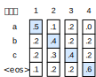
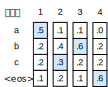
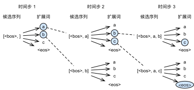

# 束搜索

上一节介绍了如何训练输入和输出均为不定长序列的编码器—解码器。本节我们介绍如何使用编码器—解码器来预测不定长的序列。

上一节里已经提到，在准备训练数据集时，我们通常会在样本的输入序列和输出序列后面分别附上一个特殊符号“&lt;eos&gt;”表示序列的终止。我们在接下来的讨论中也将沿用上一节的全部数学符号。为了便于讨论，假设解码器的输出是一段文本序列。设输出文本词典$\mathcal{Y}$（包含特殊符号“&lt;eos&gt;”）的大小为$\left|\mathcal{Y}\right|$，输出序列的最大长度为$T'$。所有可能的输出序列一共有$\mathcal{O}(\left|\mathcal{Y}\right|^{T'})$种。这些输出序列中所有特殊符号“&lt;eos&gt;”后面的子序列将被舍弃。

## 贪婪搜索

让我们先来看一个简单的解决方案：贪婪搜索（greedy search）。对于输出序列任一时间步$t'$，我们从$|\mathcal{Y}|$个词中搜索出条件概率最大的词

$$y_{t'} = \operatorname*{argmax}_{y \in \mathcal{Y}} P(y \mid y_1, \ldots, y_{t'-1}, \boldsymbol{c})$$

作为输出。一旦搜索出“&lt;eos&gt;”符号，或者输出序列长度已经达到了最大长度$T'$，便完成输出。

我们在描述解码器时提到，基于输入序列生成输出序列的条件概率是$\prod_{t'=1}^{T'} P(y_{t'} \mid y_1, \ldots, y_{t'-1}, \boldsymbol{c})$。我们将该条件概率最大的输出序列称为最优输出序列。而贪婪搜索的主要问题是不能保证得到最优输出序列。

下面来看一个例子。假设输出词典里面有“A”“B”“C”和“&lt;eos&gt;”这4个词。图10.9中每个时间步下的4个数字分别代表了该时间步生成“A”“B”“C”和“&lt;eos&gt;”这4个词的条件概率。在每个时间步，贪婪搜索选取条件概率最大的词。因此，图10.9中将生成输出序列“A”“B”“C”“&lt;eos&gt;”。该输出序列的条件概率是$0.5\times0.4\times0.4\times0.6 = 0.048$。

接下来，观察图10.10演示的例子。与图10.9中不同，图10.10在时间步2中选取了条件概率第二大的词“C”。由于时间步3所基于的时间步1和2的输出子序列由图10.9中的“A”“B”变为了图10.10中的“A”“C”，图10.10中时间步3生成各个词的条件概率发生了变化。我们选取条件概率最大的词“B”。此时时间步4所基于的前3个时间步的输出子序列为“A”“C”“B”，与图10.9中的“A”“B”“C”不同。因此，图10.10中时间步4生成各个词的条件概率也与图10.9中的不同。我们发现，此时的输出序列“A”“C”“B”“&lt;eos&gt;”的条件概率是$0.5\times0.3\times0.6\times0.6=0.054$，大于贪婪搜索得到的输出序列的条件概率。因此，贪婪搜索得到的输出序列“A”“B”“C”“&lt;eos&gt;”并非最优输出序列。

## 穷举搜索

如果目标是得到最优输出序列，我们可以考虑穷举搜索（exhaustive search）：穷举所有可能的输出序列，输出条件概率最大的序列。

虽然穷举搜索可以得到最优输出序列，但它的计算开销$\mathcal{O}(\left|\mathcal{Y}\right|^{T'})$很容易过大。例如，当$|\mathcal{Y}|=10000$且$T'=10$时，我们将评估$10000^{10} = 10^{40}$个序列：这几乎不可能完成。而贪婪搜索的计算开销是$\mathcal{O}(\left|\mathcal{Y}\right|T')$，通常显著小于穷举搜索的计算开销。例如，当$|\mathcal{Y}|=10000$且$T'=10$时，我们只需评估$10000\times10=10^5$个序列。

## 束搜索

束搜索（beam search）是对贪婪搜索的一个改进算法。它有一个束宽（beam size）超参数。我们将它设为$k$。在时间步1时，选取当前时间步条件概率最大的$k$个词，分别组成$k$个候选输出序列的首词。在之后的每个时间步，基于上个时间步的$k$个候选输出序列，从$k\left|\mathcal{Y}\right|$个可能的输出序列中选取条件概率最大的$k$个，作为该时间步的候选输出序列。最终，我们从各个时间步的候选输出序列中筛选出包含特殊符号“&lt;eos&gt;”的序列，并将它们中所有特殊符号“&lt;eos&gt;”后面的子序列舍弃，得到最终候选输出序列的集合。

图10.11通过一个例子演示了束搜索的过程。假设输出序列的词典中只包含5个元素，即$\mathcal{Y} = \{A, B, C, D, E\}$，且其中一个为特殊符号“&lt;eos&gt;”。设束搜索的束宽等于2，输出序列最大长度为3。在输出序列的时间步1时，假设条件概率$P(y_1 \mid \boldsymbol{c})$最大的2个词为$A$和$C$。我们在时间步2时将对所有的$y_2 \in \mathcal{Y}$都分别计算$P(A, y_2 \mid \boldsymbol{c}) = P(A \mid \boldsymbol{c})P(y_2 \mid A, \boldsymbol{c})$和$P(C, y_2 \mid \boldsymbol{c}) = P(C \mid \boldsymbol{c})P(y_2 \mid C, \boldsymbol{c})$，并从计算出的10个条件概率中取最大的2个，假设为$P(A, B \mid \boldsymbol{c})$和$P(C, E \mid \boldsymbol{c})$。那么，我们在时间步3时将对所有的$y_3 \in \mathcal{Y}$都分别计算$P(A, B, y_3 \mid \boldsymbol{c}) = P(A, B \mid \boldsymbol{c})P(y_3 \mid A, B, \boldsymbol{c})$和$P(C, E, y_3 \mid \boldsymbol{c}) = P(C, E \mid \boldsymbol{c})P(y_3 \mid C, E, \boldsymbol{c})$，并从计算出的10个条件概率中取最大的2个，假设为$P(A, B, D \mid \boldsymbol{c})$和$P(C, E, D \mid  \boldsymbol{c})$。如此一来，我们得到6个候选输出序列：（1）$A$；（2）$C$；（3）$A$、$B$；（4）$C$、$E$；（5）$A$、$B$、$D$和（6）$C$、$E$、$D$。接下来，我们将根据这6个序列得出最终候选输出序列的集合。

在最终候选输出序列的集合中，我们取以下分数最高的序列作为输出序列：

$$ \frac{1}{L^\alpha} \log P(y_1, \ldots, y_{L}) = \frac{1}{L^\alpha} \sum_{t'=1}^L \log P(y_{t'} \mid y_1, \ldots, y_{t'-1}, \boldsymbol{c}),$$

其中$L$为最终候选序列长度，$\alpha$一般可选为0.75。分母上的$L^\alpha$是为了惩罚较长序列在以上分数中较多的对数相加项。分析可知，束搜索的计算开销为$\mathcal{O}(k\left|\mathcal{Y}\right|T')$。这介于贪婪搜索和穷举搜索的计算开销之间。此外，贪婪搜索可看作是束宽为1的束搜索。束搜索通过灵活的束宽$k$来权衡计算开销和搜索质量。

## 小结

* 预测不定长序列的方法包括贪婪搜索、穷举搜索和束搜索。
* 束搜索通过灵活的束宽来权衡计算开销和搜索质量。

## 练习

* 穷举搜索可否看作特殊束宽的束搜索？为什么？
* 在[“循环神经网络的从零开始实现”](../chapter_recurrent-neural-networks/rnn-scratch.md)一节中，我们使用语言模型创作歌词。它的输出属于哪种搜索？你能改进它吗？

## 扫码直达[讨论区](https://discuss.gluon.ai/t/topic/6817)

