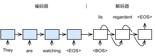

# 束搜索

上一节介绍了如何训练输入输出均为不定长序列的编码器—解码器，这一节我们介绍如何使用编码器—解码器来预测。下图演示了使用基于循环神经网络的编码器—解码器来将英文句子翻译成法语。

与上一节的区别在于解码器的输入数据。在训练时，我们可以得到输出序列，所以依次将其输入到解码器中。当在预测中，输出序列是未知的。例如机器翻译时我们只知道需要的翻译句子（They are watching），而不能事先知道目标句子（Ils regardent）。所以这里解码器的输入是使用其在上一个时刻的预测输出。

但回忆上一节我们介绍过解码器在每个时间的输出是候选词的条件概率。记输出词典为$\mathcal{Y}$，在时间$t'$，解码器对所有$y_{t'}\in\mathcal{Y}$，计算$\mathbb{P}(y_{t'}\mid y_1,\ldots, y_{t'-1}, x_1,\ldots, x_T)$，为了方便我们简写成$\mathbb{P}(y_{t'}\mid \mathrm{context})$。但解码器是输入则是特定的词，因此我们需要根据前面时间的条件概率输出来选取特定的$y_{t'}$来作为输入。

在这一小节我们讨论多个选取算法。

## 贪婪搜索

在贪婪搜索（greedy search），我们选取上一个时间步中条件概率最高的输出词，就是说时间步$t'+1$的输入词是

$$x_{t'+1} = \operatorname*{argmax}_{y_{t'} \in \mathcal{Y}} \mathbb{P}(y_{t'} \mid \mathrm{context}).$$

如果$x_{t'+1}$是结束符“&lt;eos&gt;”，那么预测完成。

假设输出词典里面有a，b，c和结束符这四个词。下图演示了贪婪搜索是如何工作的。

正如绝大部分贪婪算法不能保证最优解一样，贪婪搜索不能保证找出概率最高的输出序列。上图中我们有$\mathbb{P}(y_1,\ldots,y_4\mid x_1,\ldots,x_T)=0.5\times0.4\times0.4\times0.6=0.048$。下图中我们演示了一个情况，其在时间步2中选取了概率第二高的c作为下一步输入。这一步改变导致时间步3和4的条件概率输出跟之间不同了。这时我们选中的输出序列的条件概率为$0.5\times0.3\times0.6\times0.6=0.054$，其高于贪婪搜索得到的输出。

## 穷举搜索

如果我们想得到最优输出序列，我们可以使用穷举搜索（exhaustive search）。我们设$T'$是输出序列的最长长度，我们可以遍历所有序列可能性。记$|\mathcal{Y}|$是输出词典的大小，那么我们将产生$|\mathcal{Y}|^{T'}$个不同的序列。对每一个序列我们将其输出到解码器，然后计算它的条件概率输出。之后我们选取最大概率的那个序列作为预测输出。

虽然这样我们得到了最优预测结果，但其带来大量的计算。例如，当$|\mathcal{Y}|=10000$且${T^\prime}=10$时，那么我们将评估$10000^{10} = 10^{40}$个序列，其几乎不可能完成。

## 束搜索

让我们再来回顾下贪婪搜索和穷举搜索。它们可以概况成如下的算法。假设在每个时间步$t'$我们现在有$n$条长度为$t'$的候选输出序列（包括了开始符）。例如当$t'=0$时就是一条只含有开始符的序列。然后对输出字典里每个候选词计算条件概率，这样我们可以得到$n|\mathcal{O}|$条长度为$t'+1$的候选输出序列和它们的条件概率，然后我们在其中筛选出进入下一个时间步的候选序列。

前面两个搜索算法不同的地方就在于筛选这一步。贪婪搜索只保留概率最高的序列进入下一时间步，而穷举搜索则保留所有。前者计算简单，其计算复杂度为$\mathcal{O}(|T'|)$，但难以保证输出质量。后者保证最优输出，但计算复杂度高达$\mathcal{O}(|\mathcal{Y}|^{T'})$，其实际中几乎不可能完成。

束搜索（beam search）介于两者之间，在筛选时它只保留条件概率最高的$k$条序列，这里$k$叫做束宽（beam size），是一个超参数。当$k=1$时其等价于贪婪搜索，而$k=\infty$时其等价于穷举搜索。束搜索的算法复杂度为$\mathcal{O}(kT'|\mathcal{Y}|)$。实际使用中，我们通过$k$来权衡输出序列质量和计算复杂度。下图演示了束搜索的工作原理。

束搜索的停止条件有多种，例如找到一条有终止符的序列，或者找到一条条件概率高于某个阈值的序列，或者到达了最大输出长度。停止时束搜索输出最多$k$个候选输出序列。如果某个序列中含有终止符，那么去掉终止符后面的子序列。通常我们保留最佳的一个或数个序列作为最终输出。

由于输出序列可能长度不一样，较短的序列通常条件概率比较大。在比较时经常将长度信息考虑在内。例如对于长为$L$的序列$y_1,\ldots,y_L$，我们将其对数条件概率除以$L^\alpha$作为分数，然后选取分数高的作为最终输出。这里分数的计算为

$$ \frac{1}{L^\alpha} \log \mathbb{P}(y_1, \ldots, y_{L}\mid \mathrm{context}) = \frac{1}{L^\alpha} \sum_{t^\prime=1}^L \log \mathbb{P}(y_{t^\prime} \mid y_1, \ldots, y_{t^\prime-1}, \mathrm{context}),$$

常数$\alpha$一般可选为0.75。

## 小结

* 预测不定长序列的方法包括穷举搜索、贪婪搜索和束搜索。
* 束搜索通过更灵活的束宽来权衡计算开销和搜索质量。

## 练习

* 在[“循环神经网络”](../chapter_recurrent-neural-networks/rnn.md)一节中，我们使用语言模型创作歌词。它的输出属于哪种搜索？你能改进它吗？

## 扫码直达[讨论区](https://discuss.gluon.ai/t/topic/6817)

## 参考文献

[1] Sutskever, I., Vinyals, O., & Le, Q. V. (2014). Sequence to sequence learning with neural networks. In Advances in neural information processing systems (pp. 3104-3112).
