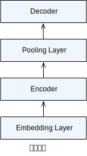

# 文本分类：情感分析

情感分析是非常重要的一项自然语言处理的任务。例如对于Amazon会对网站所销售的每个产品的评论进行情感分类，Netflix或者IMDb会对每部电影的评论进行情感分类，从而帮助各个平台改进产品，提升用户体验。本节介绍如何使用Gluon来创建一个情感分类模型，目标是给定一句话，判断这句话包含的是“正面”还是“负面”的情绪。为此，我们构造了一个简单的神经网络，其中包括`embedding`层，`encoder`（双向LSTM），`decoder`，来判断IMDb上电影评论蕴含的情感。下面就让我们一起来构造这个情感分析模型吧。


## 准备工作

在开始构造情感分析模型之前，我们需要进行下面的一些准备工作。

### 加载MXNet和Gluon

首先，我们当然需要加载MXNet和Gluon。

```{.python .input  n=1}
from collections import Counter
import os
import random
import time
import zipfile

import mxnet as mx
from mxnet import autograd, gluon, init, nd
from mxnet.contrib import text
```

### 读取IMDb数据集

接着需要下载情感分析时需要用的数据集。我们使用Stanford's Large Movie Review Dataset[1] 作为数据集。

* 下载地址：http://ai.stanford.edu/~amaas/data/sentiment/aclImdb_v1.tar.gz 。

这个数据集分为训练（train）和测试（test）数据集，分别都有25,000条从IMDb下载的关于电影的评论，其中12,500条被标注成“正面”的评论，
另外12,500条被标注成“负面”的评论。我们使用1表示'正面'评论，0表示'负面'评论。

下载好之后，将数据解压，放在教程的'../data/'文件夹之下，最后文件位置如下:

> '../data/aclImdb'

注意，如果读者已经下载了上述数据集，请略过此步，请设置`demo = False`。

否则，如果读者想快速上手，并没有下载上述数据集，我们提供了上述数据集的一个小的采样'../data/aclImdb_tiny.zip'，
运行下面的代码解压这个小数据集。

```{.python .input  n=2}
# 如果训练下载的 IMDb 的完整数据集，把下面改 False。
demo = True
if demo:
    with zipfile.ZipFile('../data/aclImdb_tiny.zip', 'r') as zin:
        zin.extractall('../data/')
```

```{.python .input}
def readIMDB(dir_url, seg = 'train'):
    pos_or_neg = ['pos','neg']
    dataset = []
    for lb in pos_or_neg:
        files = os.listdir('../data/' + dir_url + '/' + seg + '/' + lb + '/')
        for file in files:
            with open('../data/' + dir_url + '/' + seg + '/' + lb + '/' 
                      + file, 'r', encoding='utf8') as rf:
                review = rf.read().replace('\n','')
                if lb == 'pos':
                    dataset.append([review, 1])
                elif lb == 'neg':
                    dataset.append([review, 0])
    return dataset

if demo:
    train_dataset = readIMDB('aclImdb_tiny/', 'train')
    test_dataset = readIMDB('aclImdb_tiny/', 'test')
else:
    train_dataset = readIMDB('aclImdb/', 'train')
    test_dataset = readIMDB('aclImdb/', 'test')

# shuffle 数据集。
random.shuffle(train_dataset)
random.shuffle(test_dataset)
```

### 指定分词方式并且分词

接下来我们对每条评论分词，得到分好词的评论。我们使用最简单的基于空格进行分词（更好的分词工具我们留作练习）。
运行下面的代码进行分词。

```{.python .input  n=4}
def tokenizer(text):
    return [tok.lower() for tok in text.split(' ')]
```

通过执行下面的代码，我们能够获得训练和测试数据集的分好词的评论，并且得到相应的情感标签（1代表‘正面’，0代表‘负面’情绪）。

```{.python .input  n=5}
train_tokenized = []
train_labels = []
for review, score in train_dataset:
    train_tokenized.append(tokenizer(review))
    train_labels.append(score)
test_tokenized = []
test_labels = []
for review, score in test_dataset:
    test_tokenized.append(tokenizer(review))
    test_labels.append(score)
```

### 创建词典

现在，先根据分好词的训练数据创建counter，然后使用mxnet.contrib中的`vocab`创建词典。
这里我们特别设置训练数据中没有的单词对应的符号'<unk\>'，所有不存在在词典中的词，未来都将对应到这个符号。

```{.python .input  n=6}
token_counter = Counter()
def count_token(train_tokenized):
    for sample in train_tokenized:
        for token in sample:
            if token not in token_counter:
                token_counter[token] = 1
            else:
                token_counter[token] += 1

count_token(train_tokenized)
vocab = text.vocab.Vocabulary(token_counter, unknown_token='<unk>',
                              reserved_tokens=None)
```

### 将分好词的数据转化成NDArray

这小节我们介绍如果将数据转化成为NDArray。

```{.python .input  n=7}
# 根据词典，将数据转换成特征向量。
def encode_samples(x_raw_samples, vocab):
    x_encoded_samples = []
    for sample in x_raw_samples:
        x_encoded_sample = []
        for token in sample:
            if token in vocab.token_to_idx:
                x_encoded_sample.append(vocab.token_to_idx[token])
            else:
                x_encoded_sample.append(0)
        x_encoded_samples.append(x_encoded_sample)         
    return x_encoded_samples

# 将特征向量补成定长。
def pad_samples(x_encoded_samples, maxlen=500, val=0):
    x_samples = []
    for sample in x_encoded_samples:
        if len(sample) > maxlen:
            new_sample = sample[:maxlen]
        else:
            num_padding = maxlen - len(sample)
            new_sample = sample
            for i in range(num_padding):
                new_sample.append(val)
        x_samples.append(new_sample)
    return x_samples
```

运行下面的代码将分好词的训练和测试数据转化成特征向量。

```{.python .input  n=8}
x_encoded_train = encode_samples(train_tokenized, vocab)
x_encoded_test = encode_samples(test_tokenized, vocab)
```

通过执行下面的代码将特征向量补成定长（我们使用500），然后将特征向量转化为指定context上的NDArray。
这里我们假定我们有至少一块gpu，context被设置成gpu。当然，也可以使用cpu，运行速度可能稍微慢一点点。

```{.python .input  n=9}
# 指定 context。
context = mx.gpu(0)
x_train = nd.array(pad_samples(x_encoded_train, 500, 0), ctx=context)
x_test = nd.array(pad_samples(x_encoded_test, 500, 0), ctx=context)
```

这里，我们将情感标签也转化成为了NDArray。

```{.python .input  n=10}
y_train = nd.array([score for text, score in train_dataset], ctx=context)
y_test = nd.array([score for text, score in test_dataset], ctx=context)
```

### 加载预训练的词向量

这里我们使用之前创建的词典`vocab`以及GloVe词向量创建词典中每个词所对应的词向量。词向量将在后续的模型中作为每个词的初始权重加入模型，
这样做有助于提升模型的结果。我们在这里使用'glove.6B.100d.txt'作为预训练的词向量。

```{.python .input  n=11}
glove_embedding = text.embedding.create(
    'glove', pretrained_file_name='glove.6B.100d.txt', vocabulary=vocab)
```

## 创建情感分析模型

情感分类模型是一种比较经典的能使用LSTM模型的应用。我们特别的使用预训练的词向量来初始化`embedding layer`的权重，然后使用双向LSTM抽取特征。具体地，输入的是一个句子即不定长的序列，然后通过`embedding layer`，利用预训练的词向量表示句子，通过LSTM抽取句子的特征，然后输出是一个长度为1的标签。根据上述原理，我们设计如下神经网络结构，其结构比较简单，如下图所示。



模型包含四部分：
1. `embedding layer`: 其将输入数据转化成为TNC的NDArray，并且使用预先加载词向量作为该层的权重。
2. `encoder`: 我们将重点介绍这一部分。decoder是由一个两层的双向LSTM构成。
这样做的好处是，我们能够利用LSTM的输出作为输入样本的特征，之后用于预测。
3. `pooling layer`: 我们使用这个encoder在时刻0的输出，以及时刻最后一步的输出作为每个batch中examples的特征。
4. `decoder`: 最后，我们利用上一步所生成的特征，通过一个dense层做预测。

```{.python .input  n=12}
nclass = 2
lr = 0.1
num_epochs = 1
batch_size = 10
emsize = 100
num_hiddens = 100
nlayers = 2
bidirectional = True
```

```{.python .input}
class SentimentNet(gluon.Block):
    def __init__(self, vocab, emsize, num_hiddens, nlayers, bidirectional,
                 **kwargs):
        super(SentimentNet, self).__init__(**kwargs)
        with self.name_scope():
            self.embedding = gluon.nn.Embedding(
                len(vocab), emsize, weight_initializer=init.Uniform(0.1))
            self.encoder = gluon.rnn.LSTM(num_hiddens, num_layers=nlayers, 
                                          bidirectional=bidirectional,
                                          input_size=emsize)
            self.decoder = gluon.nn.Dense(nclass, flatten=False)
    def forward(self, inputs, begin_state=None):
        outputs = self.embedding(inputs)
        outputs = self.encoder(outputs)
        outputs = nd.concat(outputs[0], outputs[-1])
        outputs = self.decoder(outputs)
        return outputs
    
net = SentimentNet(vocab, emsize, num_hiddens, nlayers, bidirectional)
net.initialize(mx.init.Xavier(), ctx=context)
# 设置 embedding 层的 weight 为词向量。
net.embedding.weight.set_data(
    glove_embedding.idx_to_vec.as_in_context(context))
# 对 embedding 层不进行优化。
net.embedding.collect_params().setattr('grad_req', 'null')
trainer = gluon.Trainer(net.collect_params(), 'sgd',
                       {'learning_rate': lr})
loss = gluon.loss.SoftmaxCrossEntropyLoss()
```

## 训练模型

这里我们训练模型。我们使用预先设置好的迭代次数和`batch_size`训练模型。可以看到，Gluon能极大的简化训练的代码量，
使得训练过程看起来非常简洁。另外，我们使用交叉熵作为损失函数，使用准确率来评价模型。

```{.python .input  n=13}
# 使用准确率作为评价指标。
def eval(x_samples, y_samples):
    total_L = 0
    ntotal = 0
    accuracy = mx.metric.Accuracy()
    for i in range(x_samples.shape[0] // batch_size):
        data = x_samples[i * batch_size : (i+1) * batch_size]
        target = y_samples[i * batch_size :(i+1) * batch_size]
        data = data.as_in_context(context).T
        target = target.as_in_context(context).T
        output = net(data)
        L = loss(output, target)
        total_L += nd.sum(L).asscalar()
        ntotal += L.size
        predicts = nd.argmax(output, axis=1)
        accuracy.update(preds=predicts, labels=target)
    return total_L / ntotal, accuracy.get()[1]
```

运行下面的代码开始训练模型。我们每800个batch，会输出一次当前的`loss`。

```{.python .input  n=14}
start_train_time = time.time()
for epoch in range(num_epochs):
    start_epoch_time = time.time()
    total_L = 0
    ntotal = 0
    for i in range(x_train.shape[0] // batch_size):
        data = x_train[i * batch_size : (i+1) * batch_size]
        target = y_train[i * batch_size : (i+1) * batch_size]
        data = data.as_in_context(context).T
        target = target.as_in_context(context).T
        with autograd.record():
            output = net(data)
            L = loss(output, target)
        L.backward()
        trainer.step(batch_size)
        total_L += nd.sum(L).asscalar()
        ntotal += L.size
        if i % 800 == 0 and i != 0:
            print('[epoch %d] batch %d. loss %.6f' % (epoch, i,
                                                      total_L / ntotal))
            total_L = 0
            ntotal = 0
            
    print('performing testing:')
    train_loss, train_acc = eval(x_train, y_train)
    test_loss, test_acc = eval(x_test, y_test)
        
    print('[epoch %d] train loss %.6f, train accuracy %.2f' 
          % (epoch, train_loss, train_acc))
    print('[epoch %d] test loss %.6f, test accuracy %.2f' 
          % (epoch, test_loss, test_acc))
    print('[epoch %d] throughput %.2f samples/s' 
          % (epoch, (batch_size * len(x_train)) 
             / (time.time() - start_epoch_time)))
    print('[epoch %d] total time %.2f s' 
          % (epoch, (time.time() - start_epoch_time)))

print('total training throughput %.2f samples/s'
      % ((batch_size * len(x_train) * num_epochs) 
         / (time.time() - start_train_time)))
print('total training time %.2f s' % ((time.time() - start_train_time)))
```

到这里，我们已经成功使用Gluon创建了一个情感分类模型。下面我们举了一个例子，来看看我们情感分类模型的效果。

```{.python .input  n=15}
review = ['this', 'movie', 'is', 'great']
print(review)
```

上面这个句子的情感是（1代表正面，0代表负面）:

```{.python .input}
nd.argmax(net(nd.reshape(
    nd.array([vocab.token_to_idx[token] for token in review], ctx=context), 
    shape=(-1, 1))), axis=1).asscalar()
```

## 小结

这节，我们使用了之前学到的预训练的词向量以及双向LSTM来构建情感分类模型，通过使用Gluon，我们可以很简单的就构造出一个还不错的情感模型。

## 练习

大家可以尝试下面几个方向来得到更好的情感分类模型：

* 想要提高最后的准确率，有一个小方法，就是把迭代次数(`num_epochs`)改成3。最后在训练和测试数据上准确率大概能达到0.82；
* 可以尝试使用更好的分词工具得到更好的分词效果，会对最终结果有帮助。例如可以使用spacy分词工具，先pip安装spacy：
    * ```
    pip install spacy  
    python -m spacy download en  
    然后运行下面的代码分词：  
    import spacy  
    spacy_en = spacy.load('en')  
    def tokenizer(text):  
        return [tok.text for tok in spacy_en.tokenizer(text)]          
    注意，GloVe的向量对于名词词组的存储方式是用'-'连接独立单词，例如'new york'为'new-york'。而使用spacy分词之后'new york'的存储可能是'new york'。所以为了得到更好的embedding效果，可以对于词组进行简单的后续处理。  ```

* 使用更大的预训练词向量，例如300维的GloVe向量；
* 使用更加深层的`encoder`，即使用更多数量的layer；
* 使用更加有意思的`decoder`，例如可以加上LSTM，之后再加上dense layer。

## 扫码直达[讨论区](https://discuss.gluon.ai/t/topic/6155)


## 参考文献

[1] Andrew L. Maas, Raymond E. Daly, Peter T. Pham, Dan Huang, Andrew Y. Ng, and Christopher Potts. (2011). Learning Word Vectors for Sentiment Analysis. The 49th Annual Meeting of the Association for Computational Linguistics (ACL 2011).
