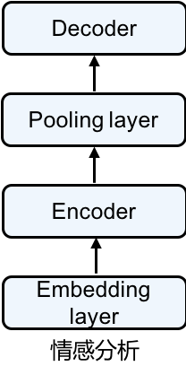

# 情感分析

情感分析是非常重要的一项自然语言处理的任务。例如对于Amazon会对网站所销售的每个产品的评论进行情感分类，Netflix或者IMDb会对每部电影的评论进行情感分类，从而帮助各个平台提供更好的改进产品，提升用户体验。本节介绍如何使用gluon来创建一个情感分类模型，目标是给定一句话，判断这句话包含的是“正面”还是“负面”的情绪。为此，我们构造了一个简单的神经网络，其中包括embedding层，encoder（bidirectional LSTM），decoder，来判断IMDb上电影评论蕴含的情感。下面就让我们一起来构造这个情感分析模型吧。


## 准备工作

在开始构造情感分析模型之前，我们需要进行下面的一些准备工作。

### 加载mxnet和gluon

首先，我们当然需要加载mxnet和gluon。

```{.python .input  n=1}
import mxnet as mx
from mxnet import init, gluon, autograd
from collections import Counter
```

### 读取IMDB

接着需要下载情感分析时需要用的数据集。我们使用Stanford's Large Movie Review Dataset[1]作为数据集，下载地址：http://ai.stanford.edu/~amaas/data/sentiment/ 。这个数据集分为训练（train）和测试（test）数据集，分别都有25,000条从IMDb下载的关于电影的评论，其中12,500条被标注成“正面”的评论，另外12,500条被标注成“负面”的评论。我们使用1表示'正面'评论，0表示'负面'评论。下载好之后，将数据解压，放在教程的'data/'文件夹之下。

```{.python .input  n=2}
def readIMDB(dir_url, seg = 'train'):
    import os
    pos_or_neg = ['pos','neg']
    dataset = []
    for lb in pos_or_neg:
        files = os.listdir('../data/' + dir_url + '/' + seg + '/' + lb + '/')
        for file in files:
            with open('../data/' + dir_url + '/' + seg + '/' + lb + '/' + file,'r',encoding='utf8') as rf:
                review = rf.read().replace('\n','')
                if lb == 'pos':
                    dataset.append([review, 1])
                elif lb == 'neg':
                    dataset.append([review, 0])
    return dataset

train_dataset = readIMDB('aclImdb/', 'train')
test_dataset = readIMDB('aclImdb/', 'test')
```

下面这步是可选的，如果您迫不急待的想查看情感分析的结果，那么下面这步会帮您采样1/25的数据，快速训练模型并得到结果。否则，请忽略下面这步，使用原始的数据集进行训练和预测。

```{.python .input  n=3}
#随机采样1000个样本用于训练和预测

def sample_dataset(dataset, selected_sample_idxs):
    sampled_dataset = []
    for idx in selected_sample_idxs:
        sampled_dataset.append(dataset[idx])
    return sampled_dataset
sampler = gluon.contrib.data.IntervalSampler(len(train_dataset), interval=2500, rollover=False)

train_dataset = sample_dataset(train_dataset, list(sampler))
test_dataset = sample_dataset(test_dataset, list(sampler))
```

### 指定分词工具并且分词

接下来我们对每条评论分词，得到分好词的评论。我们选用spacy进行分词，记得先pip安装spacy：
'pip install spacy'
'python -m spacy download en'
然后运行下面的代码。

```{.python .input  n=5}
import spacy
spacy_en = spacy.load('en')

def tokenizer(text):
    return [tok.text for tok in spacy_en.tokenizer(text)]
```

通过执行下面的代码，我们能够获得训练和测试数据集的分好词的评论，并且得到相应的情感标签（1代表‘正面’，0代表‘负面’情绪）。

```{.python .input  n=6}
train_tokenized = []
train_labels = []
for review, score in train_dataset:
    train_tokenized.append(tokenizer(review))
    train_labels.append(score)
test_tokenized = []
test_labels = []
for review, score in test_dataset:
    test_tokenized.append(tokenizer(review))
    test_labels.append(score)
```

### 创建词典

现在，先根据分好词的训练数据创建counter，然后使用mxnet.contrib中的vocab创建词典。这里我们特别设置训练数据中没有的单词对应的符号'<unk\>'，所有不存在在词典中的词，未来都将对应到这个符号。

```{.python .input  n=7}
from mxnet.contrib import text

token_counter = Counter()
def count_token(train_tokenized):
    for sample in train_tokenized:
        for token in sample:
            if token not in token_counter:
                token_counter[token] = 1
            else:
                token_counter[token] += 1

count_token(train_tokenized)
vocab = text.vocab.Vocabulary(token_counter, unknown_token='<unk>', reserved_tokens=None)
```

### 将分好词的数据转化成ndarray

```{.python .input  n=8}
#根据词典，将数据转换成特征向量
def encode_samples(x_raw_samples, vocab):
    x_encoded_samples = []
    for sample in x_raw_samples:
        x_encoded_sample = []
        for token in sample:
            if token in vocab.token_to_idx:
                x_encoded_sample.append(vocab.token_to_idx[token])
            else:
                x_encoded_sample.append(0)
        x_encoded_samples.append(x_encoded_sample)         
    return x_encoded_samples

#将特征向量补成定长
def pad_samples(x_encoded_samples, maxlen = 500, val = 0):
    x_samples = []
    for sample in x_encoded_samples:
        if len(sample) > maxlen:
            new_sample = sample[:maxlen]
        else:
            num_padding = maxlen - len(sample)
            new_sample = sample
            for i in range(num_padding):
                new_sample.append(val)
        x_samples.append(new_sample)
    return x_samples
```

运行下面的代码将分好词的训练和测试数据转化成特征向量。

```{.python .input  n=9}
x_encoded_train = encode_samples(train_tokenized, vocab)
x_encoded_test = encode_samples(test_tokenized, vocab)
```

通过执行下面的代码将特征向量补成定长（我们使用500），然后将特征向量转化为指定context上的ndarray。这里我们假定您有至少一块gpu，context被设置成gpu。当然，也可以使用cpu，运行速度可能稍微慢一点点。

```{.python .input  n=10}
#指定context
context = mx.gpu(0)
x_train = mx.nd.array(pad_samples(x_encoded_train, 500, 0), ctx=context)
x_test = mx.nd.array(pad_samples(x_encoded_test, 500, 0), ctx=context)
```

这里，我们将情感标签也转化成为了ndarray。

```{.python .input  n=12}
y_train = mx.nd.array([score for text, score in train_dataset], ctx=context)
y_test = mx.nd.array([score for text, score in test_dataset], ctx=context)
```

### 加载预训练的词向量

这里我们使用之前创建的词典vocab以及Glove词向量创建词典中每个词所对应的词向量。词向量将在后续的模型中作为每个词的初始权重加入模型，这样做有助于提升模型的结果。我们在这里使用"glove.6B.100d.txt"作为预训练的词向量。

```{.python .input  n=17}
glove_embedding = text.embedding.create('glove', pretrained_file_name='glove.6B.100d.txt', vocabulary=vocab)
```

## 创建情感分析模型

情感分类模型是一种比较经典的能使用seq2seq模型的应用。具体的，情感分类输入many-to-one的seq2seq。这种模型一个比较经典的结构为encoder-decoder结构。其中第一个seq是一个不定长的序列，encoder的作用是对于这个序列生成一种表示。第二个seq是一个长度为1的标签，decoder的作用就是利用encoder生成的表示，生成预测，判断类别。基于这种结构，我们设计如下神经网络结构，其结构比较简单，如下图所示。



模型包含四部分：
1，embedding layer: 其将输入数据转化成为TNC的ndarray，并且使用预先加载词向量作为该层的权重。
2，encoder: 我们将重点介绍这一部分。decoder是由一个两层的bidirectional LSTM构成。这样做的好处是，我们能够利用LSTM的输出作为输入样本的特征，之后用于预测。
3，pooling layer: 我们使用这个encoder的time step第0步的输出，以及time step最后一步的输出作为每个batch中examples的特征。
4，decoder: 最后，我们利用上一步所生成的特征，通过一个dense层做预测。

```{.python .input  n=18}
nclass = 2
lr = 0.1
epochs = 3
batch_size = 10
emsize = 100
nhid = 100
nlayers = 1
bidirectional = True

class SentimentNet(gluon.Block):
    def __init__(self, vocab, emsize, nhid, nlayers, bidirectional, **kwargs):
        super(SentimentNet, self).__init__(**kwargs)
        with self.name_scope():
            self.embedding = gluon.nn.Embedding(len(vocab), emsize, weight_initializer=init.Uniform(0.1))
            self.encoder = gluon.rnn.LSTM(nhid, num_layers=nlayers, bidirectional=bidirectional, input_size=emsize)
            self.decoder = gluon.nn.Dense(nclass)
    def forward(self, inputs, begin_state=None):
        outputs = self.embedding(inputs)
        outputs = self.encoder(outputs)
        outputs = mx.nd.concat(outputs[0], outputs[-1])
        outputs = self.decoder(outputs)
        return outputs
    
net = SentimentNet(vocab, emsize, nhid, nlayers, bidirectional)
net.initialize(mx.init.Xavier(), ctx=context)
#设置embedding层的weight为词向量
net.embedding.weight.set_data(glove_embedding.idx_to_vec.as_in_context(context))
#对embedding层不进行优化
net.embedding.collect_params().setattr('grad_req', 'null')
trainer = gluon.Trainer(net.collect_params(), 'sgd',
                       {'learning_rate': lr})
loss = gluon.loss.SoftmaxCrossEntropyLoss()
```

## 训练模型

这里我们训练模型。我们使用预先设置好的epoch数量和batch_size训练模型。可以看到，gluon能极大的简化训练的代码量，使得训练过程看起来非常简洁。另外，我们使用cross entropy作为loss，使用accuracy来评价模型。

```{.python .input  n=29}
#使用accuracy作为评价指标
def eval(x_samples, y_samples):
    total_L = 0
    ntotal = 0
    accuracy = mx.metric.Accuracy()
    for i in range(x_samples.shape[0]//batch_size):
        data = x_train[i*batch_size:(i+1)*batch_size]
        target = y_train[i*batch_size:(i+1)*batch_size]
        data = data.as_in_context(context).T
        target = target.as_in_context(context).T
        output = net(data)
        L = loss(output, target)
        total_L += mx.nd.sum(L).asscalar()
        ntotal += L.size
        predicts = mx.nd.argmax(output, axis=1)
        accuracy.update(preds=predicts, labels=target)
    return total_L/ntotal, accuracy.get()[1]
```

```{.python .input  n=30}
import time

start_train_time = time.time()
for epoch in range(epochs):
    start_epoch_time = time.time()
    total_L = 0
    ntotal = 0
    for i in range(x_train.shape[0] // batch_size):
        data = x_train[i * batch_size : (i+1) * batch_size]
        target = y_train[i * batch_size : (i+1) * batch_size]
        data = data.as_in_context(context).T
        target = target.as_in_context(context).T
        with autograd.record():
            output = net(data)
            L = loss(output, target)
        L.backward()
        trainer.step(batch_size)
        total_L += mx.nd.sum(L).asscalar()
        ntotal += L.size
        if i % 200 == 0 and i != 0:
            print("[Epoch %d] Batch %d. loss %.2f"%(epoch, i, total_L/ntotal))
            total_L = 0
            ntotal = 0
    train_loss, train_accuracy = eval(x_train, y_train)
    test_loss, test_accuracy = eval(x_test, y_test)
    print("[Epoch %d] Train loss %.2f, Train accuracy %.2f"%(epoch, train_loss, train_accuracy))
    print("[Epoch %d] Test loss %.2f, Test accuracy %.2f"%(epoch, test_loss, test_accuracy))
    print('[Epoch %d] throughput %.2f samples/s'%(epoch, (batch_size * len(x_train)) / (time.time() - start_epoch_time)))
    print('[Epoch %d] total time %.2f s'%(epoch, (time.time() - start_epoch_time)))
print('Total training throughput %.2f samples/s'
      %((batch_size * len(x_train) * epochs) / (time.time() - start_train_time)))
print('Total training time %.2f s'%((time.time() - start_train_time)))
```

到这里，您已经成功使用gluon创建了一个情感分类模型。下面我们举了一个例子，来看看我们情感分类模型的效果。

```{.python .input  n=89}
review = ['This', 'movie', 'is', 'great']
net(mx.nd.reshape(mx.nd.array([vocab.token_to_idx[token] for token in review], ctx=context), shape=(-1, 1))).sigmoid()
```

## 总结

这节，我们使用了之前学到的预训练的词向量以及bidirectional的LSTM来构建情感分类模型，通过使用gluon，我们可以很简单的就构造出一个还不错的情感模型。大家可以尝试下面几个方面来得到更好的情感分类模型：
1，使用更大的预训练词向量，例如300维的glove向量；
2，使用更加deep的encoder，即使用更多数量的layer；
3，使用更加有意思的decoder，例如可以加上LSTM，之后再加上dense layer。

[1] Andrew L. Maas, Raymond E. Daly, Peter T. Pham, Dan Huang, Andrew Y. Ng, and Christopher Potts. (2011). Learning Word Vectors for Sentiment Analysis. The 49th Annual Meeting of the Association for Computational Linguistics (ACL 2011).
