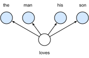
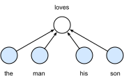

# 词嵌入（word2vec）

自然语言是一套用来表达含义的复杂系统。在这套系统中，词是表义的基本单元。顾名思义，词向量是用来表示词的向量，也可被认为是词的特征向量或表征。把词映射为实数域向量的技术也叫词嵌入（word embedding）。近年来，词嵌入已逐渐成为自然语言处理的基础知识。

## 为何不采用one-hot向量

我们在[“循环神经网络的从零开始实现”](../chapter_recurrent-neural-networks/rnn-scratch.md)一节中使用one-hot向量表示词（字符为词）。回忆一下，假设词典中不同词的数量（词典大小）为$N$，每个词可以和从0到$N-1$的连续整数一一对应。这些与词对应的整数叫作词的索引。
假设一个词的索引为$i$，为了得到该词的one-hot向量表示，我们创建一个全0的长为$N$的向量，并将其第$i$位设成1。这样一来，每个词就表示成了一个长度为$N$的向量，可以直接被神经网络使用。

虽然one-hot词向量构造起来很容易，但通常并不是一个好选择。一个主要的原因是，one-hot词向量无法准确表达不同词之间的相似度，如我们常常使用的余弦相似度。对于向量$\boldsymbol{x}, \boldsymbol{y} \in \mathbb{R}^d$，它们的余弦相似度是它们之间夹角的余弦值

$$\frac{\boldsymbol{x}^\top \boldsymbol{y}}{\|\boldsymbol{x}\| \|\boldsymbol{y}\|} \in [-1, 1].$$

由于任何两个不同词的one-hot向量的余弦相似度都为0，多个不同词之间的相似度难以通过one-hot向量准确地体现出来。

word2vec工具的提出正是为了解决上面这个问题 [1]。它将每个词表示成一个定长的向量，并使得这些向量能较好地表达不同词之间的相似和类比关系。word2vec工具包含了两个模型，即跳字模型（skip-gram）[2] 和连续词袋模型（continuous bag of words，CBOW）[3]。接下来让我们分别介绍这两个模型以及它们的训练方法。

## 跳字模型

跳字模型假设基于某个词来生成它在文本序列周围的词。举个例子，假设文本序列是“the”“man”“loves”“his”“son”。以“loves”作为中心词，设背景窗口大小为2。如图10.1所示，跳字模型所关心的是，给定中心词“loves”，生成与它距离不超过2个词的背景词“the”“man”“his”“son”的条件概率，即

$$P(\textrm{``the"},\textrm{``man"},\textrm{``his"},\textrm{``son"}\mid\textrm{``loves"}).$$

假设给定中心词的情况下，背景词的生成是相互独立的，那么上式可以改写成

$$P(\textrm{``the"}\mid\textrm{``loves"})\cdot P(\textrm{``man"}\mid\textrm{``loves"})\cdot P(\textrm{``his"}\mid\textrm{``loves"})\cdot P(\textrm{``son"}\mid\textrm{``loves"}).$$

在跳字模型中，每个词被表示成两个$d$维向量，用来计算条件概率。假设这个词在词典中索引为$i$，当它为中心词时向量表示为$\boldsymbol{v}_i\in\mathbb{R}^d$，而为背景词时向量表示为$\boldsymbol{u}_i\in\mathbb{R}^d$。设中心词$w_c$在词典中索引为$c$，背景词$w_o$在词典中索引为$o$，给定中心词生成背景词的条件概率可以通过对向量内积做softmax运算而得到：

$$P(w_o \mid w_c) = \frac{\text{exp}(\boldsymbol{u}_o^\top \boldsymbol{v}_c)}{ \sum_{i \in \mathcal{V}} \text{exp}(\boldsymbol{u}_i^\top \boldsymbol{v}_c)},$$

其中词典索引集$\mathcal{V} = \{0, 1, \ldots, |\mathcal{V}|-1\}$。假设给定一个长度为$T$的文本序列，设时间步$t$的词为$w^{(t)}$。假设给定中心词的情况下背景词的生成相互独立，当背景窗口大小为$m$时，跳字模型的似然函数即给定任一中心词生成所有背景词的概率

$$ \prod_{t=1}^{T} \prod_{-m \leq j \leq m,\ j \neq 0} P(w^{(t+j)} \mid w^{(t)}),$$

这里小于1和大于$T$的时间步可以忽略。

### 训练跳字模型

跳字模型的参数是每个词所对应的中心词向量和背景词向量。训练中我们通过最大化似然函数来学习模型参数，即最大似然估计。这等价于最小化以下损失函数：

$$ - \sum_{t=1}^{T} \sum_{-m \leq j \leq m,\ j \neq 0} \text{log}\, P(w^{(t+j)} \mid w^{(t)}).$$

如果使用随机梯度下降，那么在每一次迭代里我们随机采样一个较短的子序列来计算有关该子序列的损失，然后计算梯度来更新模型参数。梯度计算的关键是条件概率的对数有关中心词向量和背景词向量的梯度。根据定义，首先看到

$$\log P(w_o \mid w_c) =
\boldsymbol{u}_o^\top \boldsymbol{v}_c - \log\left(\sum_{i \in \mathcal{V}} \text{exp}(\boldsymbol{u}_i^\top \boldsymbol{v}_c)\right)$$

通过微分，我们可以得到上式中$\boldsymbol{v}_c$的梯度

$$
\begin{aligned}
\frac{\partial \text{log}\, P(w_o \mid w_c)}{\partial \boldsymbol{v}_c} 
&= \boldsymbol{u}_o - \frac{\sum_{j \in \mathcal{V}} \exp(\boldsymbol{u}_j^\top \boldsymbol{v}_c)\boldsymbol{u}_j}{\sum_{i \in \mathcal{V}} \exp(\boldsymbol{u}_i^\top \boldsymbol{v}_c)}\\
&= \boldsymbol{u}_o - \sum_{j \in \mathcal{V}} \left(\frac{\text{exp}(\boldsymbol{u}_j^\top \boldsymbol{v}_c)}{ \sum_{i \in \mathcal{V}} \text{exp}(\boldsymbol{u}_i^\top \boldsymbol{v}_c)}\right) \boldsymbol{u}_j\\ 
&= \boldsymbol{u}_o - \sum_{j \in \mathcal{V}} P(w_j \mid w_c) \boldsymbol{u}_j.
\end{aligned}
$$

它的计算需要词典中所有词以$w_c$为中心词的条件概率。有关其他词向量的梯度同理可得。

训练结束后，对于词典中的任一索引为$i$的词，我们均得到该词作为中心词和背景词的两组词向量$\boldsymbol{v}_i$和$\boldsymbol{u}_i$。在自然语言处理应用中，一般使用跳字模型的中心词向量作为词的表征向量。

## 连续词袋模型

连续词袋模型与跳字模型类似。与跳字模型最大的不同在于，连续词袋模型假设基于某中心词在文本序列前后的背景词来生成该中心词。在同样的文本序列“the”“man”“loves”“his”“son”里，以“loves”作为中心词，且背景窗口大小为2时，连续词袋模型关心的是，给定背景词“the”“man”“his”“son”生成中心词“loves”的条件概率（如图10.2所示），也就是

$$P(\textrm{``loves"}\mid\textrm{``the"},\textrm{``man"},\textrm{``his"},\textrm{``son"}).$$

因为连续词袋模型的背景词有多个，我们将这些背景词向量取平均，然后使用和跳字模型一样的方法来计算条件概率。设$\boldsymbol{v_i}\in\mathbb{R}^d$和$\boldsymbol{u_i}\in\mathbb{R}^d$分别表示词典中索引为$i$的词作为背景词和中心词的向量（注意符号的含义与跳字模型中的相反）。设中心词$w_c$在词典中索引为$c$，背景词$w_{o_1}, \ldots, w_{o_{2m}}$在词典中索引为$o_1, \ldots, o_{2m}$，那么给定背景词生成中心词的条件概率

$$P(w_c \mid w_{o_1}, \ldots, w_{o_{2m}}) = \frac{\text{exp}\left(\frac{1}{2m}\boldsymbol{u}_c^\top (\boldsymbol{v}_{o_1} + \ldots + \boldsymbol{v}_{o_{2m}}) \right)}{ \sum_{i \in \mathcal{V}} \text{exp}\left(\frac{1}{2m}\boldsymbol{u}_i^\top (\boldsymbol{v}_{o_1} + \ldots + \boldsymbol{v}_{o_{2m}}) \right)}.$$

为了让符号更加简单，我们记$\mathcal{W}_o= \{w_{o_1}, \ldots, w_{o_{2m}}\}$，且$\bar{\boldsymbol{v}}_o = \left(\boldsymbol{v}_{o_1} + \ldots + \boldsymbol{v}_{o_{2m}} \right)/(2m)$，那么上式可以简写成

$$P(w_c \mid \mathcal{W}_o) = \frac{\exp\left(\boldsymbol{u}_c^\top \bar{\boldsymbol{v}}_o\right)}{\sum_{i \in \mathcal{V}} \exp\left(\boldsymbol{u}_i^\top \bar{\boldsymbol{v}}_o\right)}.$$

给定一个长度为$T$的文本序列，设时间步$t$的词为$w^{(t)}$，背景窗口大小为$m$。连续词袋模型的似然函数是由背景词生成任一中心词的概率

$$ \prod_{t=1}^{T}  P(w^{(t)} \mid  w^{(t-m)}, \ldots,  w^{(t-1)},  w^{(t+1)}, \ldots,  w^{(t+m)}).$$

### 训练连续词袋模型

训练连续词袋模型同训练跳字模型基本一致。连续词袋模型的最大似然估计等价于最小化损失函数

$$  -\sum_{t=1}^T  \text{log}\, P(w^{(t)} \mid  w^{(t-m)}, \ldots,  w^{(t-1)},  w^{(t+1)}, \ldots,  w^{(t+m)}).$$

注意到

$$\log\,P(w_c \mid \mathcal{W}_o) = \boldsymbol{u}_c^\top \bar{\boldsymbol{v}}_o - \log\,\left(\sum_{i \in \mathcal{V}} \exp\left(\boldsymbol{u}_i^\top \bar{\boldsymbol{v}}_o\right)\right).$$

通过微分，我们可以计算出上式中条件概率的对数有关任一背景词向量$\boldsymbol{v}_{o_i}$（$i = 1, \ldots, 2m$）的梯度

$$\frac{\partial \log\, P(w_c \mid \mathcal{W}_o)}{\partial \boldsymbol{v}_{o_i}} = \frac{1}{2m} \left(\boldsymbol{u}_c - \sum_{j \in \mathcal{V}} \frac{\exp(\boldsymbol{u}_j^\top \bar{\boldsymbol{v}}_o)\boldsymbol{u}_j}{ \sum_{i \in \mathcal{V}} \text{exp}(\boldsymbol{u}_i^\top \bar{\boldsymbol{v}}_o)} \right) = \frac{1}{2m}\left(\boldsymbol{u}_c - \sum_{j \in \mathcal{V}} P(w_j \mid \mathcal{W}_o) \boldsymbol{u}_j \right).$$

有关其他词向量的梯度同理可得。同跳字模型不一样的一点在于，我们一般使用连续词袋模型的背景词向量作为词的表征向量。

## 小结

* 词向量是用来表示词的向量。把词映射为实数域向量的技术也叫词嵌入。
* word2vec包含跳字模型和连续词袋模型。跳字模型假设基于中心词来生成背景词。连续词袋模型假设基于背景词来生成中心词。

## 练习

* 每次梯度的计算复杂度是多少？当词典很大时，会有什么问题？
* 英语中有些固定短语由多个词组成，如“new york”。如何训练它们的词向量？提示：可参考word2vec论文第4节 [2]。
* 让我们以跳字模型为例思考word2vec模型的设计。跳字模型中两个词向量的内积与余弦相似度有什么关系？对语义相近的一对词来说，为什么它们的词向量的余弦相似度可能会高？

## 参考文献

[1] word2vec工具。https://code.google.com/archive/p/word2vec/

[2] Mikolov, T., Sutskever, I., Chen, K., Corrado, G. S., & Dean, J. (2013). Distributed representations of words and phrases and their compositionality. In Advances in neural information processing systems (pp. 3111-3119).

[3] Mikolov, T., Chen, K., Corrado, G., & Dean, J. (2013). Efficient estimation of word representations in vector space. arXiv preprint arXiv:1301.3781.

## 扫码直达[讨论区](https://discuss.gluon.ai/t/topic/4203)

