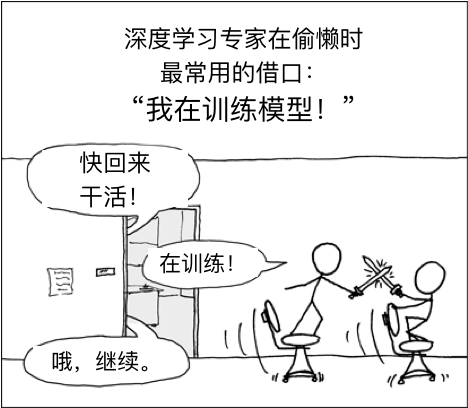

# 优化算法

如果你一直按照本书的顺序读到这里，很可能已经使用了优化算法来训练深度学习模型。具体来说，在训练模型时，我们会使用优化算法不断迭代模型参数以最小化模型的损失函数。当迭代终止时，模型的训练随之终止。此时的模型参数就是模型通过训练所学习到的参数。

优化算法对于深度学习十分重要。一方面，如图7.1所表现的那样，训练一个复杂的深度学习模型可能需要数小时、数日、甚至数周时间。而优化算法的表现直接影响模型训练效率。另一方面，理解各种优化算法的原理以及其中各参数的意义将有助于我们更有针对性地调参，从而使深度学习模型表现地更好。

本章将详细介绍深度学习中的常用优化算法。



```eval_rst

.. toctree::
   :maxdepth: 2

   optimization-intro
   gd-sgd-scratch
   gd-sgd-gluon
   momentum-scratch
   momentum-gluon
   adagrad-scratch
   adagrad-gluon
   rmsprop-scratch
   rmsprop-gluon
   adadelta-scratch
   adadelta-gluon
   adam-scratch
   adam-gluon
```
