# Preface

Just a few years ago, there were no legions of deep learning scientists
developing intelligent products and services at major companies and startups.
When the youngest among us (the authors) entered the field,
machine learning did not command headlines in daily newspapers.
Our parents had no idea what machine learning was,
let alone why we might prefer it to a career in medicine or law.
Machine learning was a forward-looking academic discipline
with a narrow set of real-world applications.
And those applications, e.g., speech recognition and computer vision,
required so much domain knowledge that they were often regarded
as separate areas entirely for which machine learning was one small component.
Neural networks then, the antecedents of the deep learning models
that we focus on in this book, were regarded as outmoded tools.


In just the past five years, deep learning has taken the world by surprise,
driving rapid progress in fields as diverse as computer vision,
natural language processing, automatic speech recognition,
reinforcement learning, and statistical modeling.
With these advances in hand, we can now build cars that drive themselves
with more autonomy than ever before (and less autonomy
than some companies might have you believe),
smart reply systems that automatically draft the most mundane emails,
helping people dig out from oppressively large inboxes,
and software agents that dominate the world's best humans
at board games like Go, a feat once thought to be decades away.
Already, these tools exert ever-wider impacts on industry and society,
changing the way movies are made, diseases are diagnosed,
and playing a growing role in basic sciences---from astrophysics to biology.


## About This Book

This book represents our attempt to make deep learning approachable,
teaching you the *concepts*, the *context*, and the *code*.

### One Medium Combining Code, Math, and HTML

For any computing technology to reach its full impact,
it must be well-understood, well-documented, and supported by
mature, well-maintained tools.
The key ideas should be clearly distilled,
minimizing the onboarding time needing to bring new practitioners up to date.
Mature libraries should automate common tasks,
and exemplar code should make it easy for practitioners
to modify, apply, and extend common applications to suit their needs.
Take dynamic web applications as an example.
Despite a large number of companies, like Amazon,
developing successful database-driven web applications in the 1990s,
the potential of this technology to aid creative entrepreneurs
has been realized to a far greater degree in the past ten years,
owing in part to the development of powerful, well-documented frameworks.


Testing the potential of deep learning presents unique challenges
because any single application brings together various disciplines.
Applying deep learning requires simultaneously understanding
(i) the motivations for casting a problem in a particular way;
(ii) the mathematics of a given modeling approach;
(iii) the optimization algorithms for fitting the models to data;
and (iv) and the engineering required to train models efficiently,
navigating the pitfalls of numerical computing
and getting the most out of available hardware.
Teaching both the critical thinking skills required to formulate problems,
the mathematics to solve them, and the software tools to implement those
solutions all in one place presents formidable challenges.
Our goal in this book is to present a unified resource
to bring would-be practitioners up to speed.

At the time we started this book project,
there were no resources that simultaneously
(i) were up to date; (ii) covered the full breadth
of modern machine learning with substantial technical depth;
and (iii) interleaved exposition of the quality one expects
from an engaging textbook with the clean runnable code
that one expects to find in hands-on tutorials.
We found plenty of code examples for
how to use a given deep learning framework
(e.g., how to do basic numerical computing with matrices in TensorFlow)
or for implementing particular techniques
(e.g., code snippets for LeNet, AlexNet, ResNets, etc)
scattered across various blog posts and GitHub repositories.
However, these examples typically focused on
*how* to implement a given approach,
but left out the discussion of *why* certain algorithmic decisions are made.
While some interactive resources have popped up sporadically
to address a particular topic, e.g., the engaging blog posts
published on the website [Distill](http://distill.pub), or personal blogs,
they only covered selected topics in deep learning,
and often lacked associated code.
On the other hand, while several textbooks have emerged,
most notably :cite:`Goodfellow.Bengio.Courville.2016`,
which offers a comprehensive survey of the concepts behind deep learning,
these resources do not marry the descriptions
to realizations of the concepts in code,
sometimes leaving readers clueless as to how to implement them.
Moreover, too many resources are hidden behind the paywalls
of commercial course providers.

We set out to create a resource that could
(i) be freely available for everyone;
(ii) offer sufficient technical depth to provide a starting point on the path
to actually becoming an applied machine learning scientist;
(iii) include runnable code, showing readers *how* to solve problems in practice;
(iv) allow for rapid updates, both by us
and also by the community at large;
and (v) be complemented by a [forum](http://discuss.d2l.ai)
for interactive discussion of technical details and to answer questions.

These goals were often in conflict.
Equations, theorems, and citations are best managed and laid out in LaTeX.
Code is best described in Python.
And webpages are native in HTML and JavaScript.
Furthermore, we want the content to be
accessible both as executable code, as a physical book,
as a downloadable PDF, and on the Internet as a website.
At present there exist no tools and no workflow
perfectly suited to these demands, so we had to assemble our own.
We describe our approach in detail in :numref:`sec_how_to_contribute`.
We settled on GitHub to share the source and to allow for edits,
Jupyter notebooks for mixing code, equations and text,
Sphinx as a rendering engine to generate multiple outputs,
and Discourse for the forum.
While our system is not yet perfect,
these choices provide a good compromise among the competing concerns.
We believe that this might be the first book published
using such an integrated workflow.


### Learning by Doing

Many textbooks teach a series of topics, each in exhaustive detail.
For example, Chris Bishop's excellent textbook :cite:`Bishop.2006`,
teaches each topic so thoroughly, that getting to the chapter
on linear regression requires a non-trivial amount of work.
While experts love this book precisely for its thoroughness,
for beginners, this property limits its usefulness as an introductory text.

In this book, we will teach most concepts *just in time*.
In other words, you will learn concepts at the very moment
that they are needed to accomplish some practical end.
While we take some time at the outset to teach
fundamental preliminaries, like linear algebra and probability,
we want you to taste the satisfaction of training your first model
before worrying about more esoteric probability distributions.

Aside from a few preliminary notebooks that provide a crash course
in the basic mathematical background,
each subsequent chapter introduces both a reasonable number of new concepts
and provides single self-contained working examples---using real datasets.
This presents an organizational challenge.
Some models might logically be grouped together in a single notebook.
And some ideas might be best taught by executing several models in succession.
On the other hand, there is a big advantage to adhering
to a policy of *1 working example, 1 notebook*:
This makes it as easy as possible for you to
start your own research projects by leveraging our code.
Just copy a notebook and start modifying it.

We will interleave the runnable code with background material as needed.
In general, we will often err on the side of making tools
available before explaining them fully (and we will follow up by
explaining the background later).
For instance, we might use *stochastic gradient descent*
before fully explaining why it is useful or why it works.
This helps to give practitioners the necessary
ammunition to solve problems quickly,
at the expense of requiring the reader
to trust us with some curatorial decisions.

This book will teach deep learning concepts from scratch.
Sometimes, we want to delve into fine details about the models
that would typically be hidden from the user
by deep learning frameworks' advanced abstractions.
This comes up especially in the basic tutorials,
where we want you to understand everything
that happens in a given layer or optimizer.
In these cases, we will often present two versions of the example:
one where we implement everything from scratch,
relying only on the NumPy interface and automatic differentiation,
and another, more practical example,
where we write succinct code using Gluon.
Once we have taught you how some component works,
we can just use the Gluon version in subsequent tutorials.


### Content and Structure

The book can be roughly divided into three parts,
which are presented by different colors in :numref:`fig_book_org`:


:label:`fig_book_org`


* The first part covers basics and preliminaries.
:numref:`chap_introduction` offers an introduction to deep learning.
Then, in :numref:`chap_preliminaries`,
we quickly bring you up to speed on the prerequisites required
for hands-on deep learning, such as how to store and manipulate data,
and how to apply various numerical operations based on basic concepts
from linear algebra, calculus, and probability.
:numref:`chap_linear` and :numref:`chap_perceptrons`
cover the most basic concepts and techniques of deep learning,
such as linear regression, multilayer perceptrons and regularization.

* The next five chapters focus on modern deep learning techniques.
:numref:`chap_computation` describes the various key components of deep
learning calculations and lays the groundwork
for us to subsequently implement more complex models.
Next, in :numref:`chap_cnn` and :numref:`chap_modern_cnn`,
we introduce convolutional neural networks (CNNs), powerful tools
that form the backbone of most modern computer vision systems.
Subsequently, in :numref:`chap_rnn` and :numref:`chap_modern_rnn`, we introduce
recurrent neural networks (RNNs), models that exploit
temporal or sequential structure in data, and are commonly used
for natural language processing and time series prediction.
In :numref:`chap_attention`, we introduce a new class of models
that employ a technique called attention mechanisms
and they have recently begun to displace RNNs in natural language processing.
These sections will get you up to speed on the basic tools
behind most modern applications of deep learning.

* Part three discusses scalability, efficiency, and applications.
First, in :numref:`chap_optimization`,
we discuss several common optimization algorithms
used to train deep learning models.
The next chapter, :numref:`chap_performance` examines several key factors
that influence the computational performance of your deep learning code.
In :numref:`chap_cv`,
we illustrate
major applications of deep learning in computer vision.
In :numref:`chap_nlp_pretrain` and :numref:`chap_nlp_app`,
we show how to pretrain language representation models and apply
them to natural language processing tasks.


### Code
:label:`sec_code`

Most sections of this book feature executable code because of our belief
in the importance of an interactive learning experience in deep learning.
At present, certain intuitions can only be developed through trial and error,
tweaking the code in small ways and observing the results.
Ideally, an elegant mathematical theory might tell us
precisely how to tweak our code to achieve a desired result.
Unfortunately, at present, such elegant theories elude us.
Despite our best attempts, formal explanations for various techniques
are still lacking, both because the mathematics to characterize these models
can be so difficult and also because serious inquiry on these topics
has only just recently kicked into high gear.
We are hopeful that as the theory of deep learning progresses,
future editions of this book will be able to provide insights
in places the present edition cannot.

At times, to avoid unnecessary repetition, we encapsulate
the frequently-imported and referred-to functions, classes, etc.
in this book in the `d2l` package.
For any block such as a function, a class, or multiple imports
to be saved in the package, we will mark it with
`#@save`. We offer a detailed overview of these functions and classes in :numref:`sec_d2l`.
The `d2l` package is light-weight and only requires
the following packages and modules as dependencies:

```{.python .input  n=1}
#@tab all
#@save
import collections
from collections import defaultdict
from IPython import display
import math
from matplotlib import pyplot as plt
import os
import pandas as pd
import random
import re
import shutil
import sys
import tarfile
import time
import requests
import zipfile
import hashlib
d2l = sys.modules[__name__]
```

:begin_tab:`mxnet`

Most of the code in this book is based on Apache MXNet.
MXNet is an open-source framework for deep learning
and the preferred choice of AWS (Amazon Web Services),
as well as many colleges and companies.
All of the code in this book has passed tests under the newest MXNet version.
However, due to the rapid development of deep learning, some code
*in the print edition* may not work properly in future versions of MXNet.
However, we plan to keep the online version up-to-date.
In case you encounter any such problems,
please consult :ref:`chap_installation`
to update your code and runtime environment.

Here is how we import modules from MXNet.
:end_tab:

:begin_tab:`pytorch`

Most of the code in this book is based on PyTorch.
PyTorch is an open-source framework for deep learning, which is extremely
popular in the research community.
All of the code in this book has passed tests under the newest PyTorch.
However, due to the rapid development of deep learning, some code
*in the print edition* may not work properly in future versions of PyTorch.
However, we plan to keep the online version up-to-date.
In case you encounter any such problems,
please consult :ref:`chap_installation`
to update your code and runtime environment.

Here is how we import modules from PyTorch.
:end_tab:

:begin_tab:`tensorflow`

Most of the code in this book is based on TensorFlow.
TensorFlow is an open-source framework for deep learning, which is extremely
popular in both the research community and industrial.
All of the code in this book has passed tests under the newest TensorFlow.
However, due to the rapid development of deep learning, some code
*in the print edition* may not work properly in future versions of TensorFlow.
However, we plan to keep the online version up-to-date.
In case you encounter any such problems,
please consult :ref:`chap_installation`
to update your code and runtime environment.

Here is how we import modules from TensorFlow.
:end_tab:

```{.python .input  n=1}
#@save
from mxnet import autograd, context, gluon, image, init, np, npx
from mxnet.gluon import nn, rnn
```

```{.python .input  n=1}
#@tab pytorch
#@save
import numpy as np
import torch
import torchvision
from torch import nn
from torch.nn import functional as F
from torch.utils import data
from torchvision import transforms
```

```{.python .input  n=1}
#@tab tensorflow
#@save
import numpy as np
import tensorflow as tf
```

### Target Audience

This book is for students (undergraduate or graduate),
engineers, and researchers, who seek a solid grasp
of the practical techniques of deep learning.
Because we explain every concept from scratch,
no previous background in deep learning or machine learning is required.
Fully explaining the methods of deep learning
requires some mathematics and programming,
but we will only assume that you come in with some basics,
including (the very basics of) linear algebra, calculus, probability,
and Python programming.
Moreover, in the Appendix, we provide a refresher
on most of the mathematics covered in this book.
Most of the time, we will prioritize intuition and ideas
over mathematical rigor.
There are many terrific books which can lead the interested reader further.
For instance, Linear Analysis by Bela Bollobas :cite:`Bollobas.1999`
covers linear algebra and functional analysis in great depth.
All of Statistics :cite:`Wasserman.2013` is a terrific guide to statistics.
And if you have not used Python before,
you may want to peruse this [Python tutorial](http://learnpython.org/).


### Forum

Associated with this book, we have launched a discussion forum,
located at [discuss.d2l.ai](https://discuss.d2l.ai/).
When you have questions on any section of the book,
you can find the associated discussion page link at the end of each chapter.


## Acknowledgments

We are indebted to the hundreds of contributors for both
the English and the Chinese drafts.
They helped improve the content and offered valuable feedback.
Specifically, we thank every contributor of this English draft
for making it better for everyone.
Their GitHub IDs or names are (in no particular order):
alxnorden, avinashingit, bowen0701, brettkoonce, Chaitanya Prakash Bapat,
cryptonaut, Davide Fiocco, edgarroman, gkutiel, John Mitro, Liang Pu,
Rahul Agarwal, Mohamed Ali Jamaoui, Michael (Stu) Stewart, Mike Müller,
NRauschmayr, Prakhar Srivastav, sad-, sfermigier, Sheng Zha, sundeepteki,
topecongiro, tpdi, vermicelli, Vishaal Kapoor, Vishwesh Ravi Shrimali, YaYaB, Yuhong Chen,
Evgeniy Smirnov, lgov, Simon Corston-Oliver, Igor Dzreyev, Ha Nguyen, pmuens,
Andrei Lukovenko, senorcinco, vfdev-5, dsweet, Mohammad Mahdi Rahimi, Abhishek Gupta,
uwsd, DomKM, Lisa Oakley, Bowen Li, Aarush Ahuja, Prasanth Buddareddygari, brianhendee,
mani2106, mtn, lkevinzc, caojilin, Lakshya, Fiete Lüer, Surbhi Vijayvargeeya,
Muhyun Kim, dennismalmgren, adursun, Anirudh Dagar, liqingnz, Pedro Larroy,
lgov, ati-ozgur, Jun Wu, Matthias Blume, Lin Yuan, geogunow, Josh Gardner,
Maximilian Böther, Rakib Islam, Leonard Lausen, Abhinav Upadhyay, rongruosong,
Steve Sedlmeyer, Ruslan Baratov, Rafael Schlatter, liusy182, Giannis Pappas,
ati-ozgur, qbaza, dchoi77, Adam Gerson, Phuc Le, Mark Atwood, christabella, vn09,
Haibin Lin, jjangga0214, RichyChen, noelo, hansent, Giel Dops, dvincent1337, WhiteD3vil,
Peter Kulits, codypenta, joseppinilla, ahmaurya, karolszk, heytitle, Peter Goetz, rigtorp,
tiepvupsu, sfilip, mlxd, Kale-ab Tessera, Sanjar Adilov, MatteoFerrara, hsneto,
Katarzyna Biesialska, Gregory Bruss, duythanhvn, paulaurel, graytowne, minhduc0711,
sl7423, Jaedong Hwang, Yida Wang, cys4, clhm, Jean Kaddour, austinmw, trebeljahr, tbaums,
cuongvng, pavelkomarov, vzlamal, NotAnotherSystem, J-Arun-Mani, jancio, eldarkurtic,
the-great-shazbot, doctorcolossus, gducharme, cclauss, Daniel-Mietchen, hoonose, biagiom,
abhinavsp0730, jonathanhrandall, ysraell, Nodar Okroshiashvili, UgurKap, Jiyang Kang,
StevenJokes, Tomer Kaftan, liweiwp, netyster, ypandya, NishantTharani, heiligerl.

We thank Amazon Web Services, especially Swami Sivasubramanian,
Raju Gulabani, Charlie Bell, and Andrew Jassy for their generous support in writing this book. Without the available time, resources, discussions with colleagues, and continuous encouragement this book would not have happened.


## Summary

* Deep learning has revolutionized pattern recognition, introducing technology that now powers a wide range of  technologies, including computer vision, natural language processing, automatic speech recognition.
* To successfully apply deep learning, you must understand how to cast a problem, the mathematics of modeling, the algorithms for fitting your models to data, and the engineering techniques to implement it all.
* This book presents a comprehensive resource, including prose, figures, mathematics, and code, all in one place.
* To answer questions related to this book, visit our forum at https://discuss.d2l.ai/.
* All notebooks are available for download on GitHub.


## Exercises

1. Register an account on the discussion forum of this book [discuss.d2l.ai](https://discuss.d2l.ai/).
1. Install Python on your computer.
1. Follow the links at the bottom of the section to the forum, where you will be able to seek out help and discuss the book and find answers to your questions by engaging the authors and broader community.

:begin_tab:`mxnet`
[Discussions](https://discuss.d2l.ai/t/18)
:end_tab:

:begin_tab:`pytorch`
[Discussions](https://discuss.d2l.ai/t/20)
:end_tab:

:begin_tab:`tensorflow`
[Discussions](https://discuss.d2l.ai/t/186)
:end_tab:
