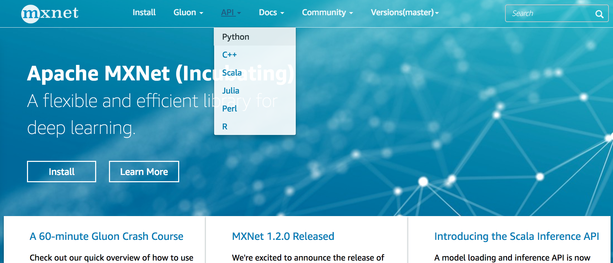

# 查阅MXNet文档

受篇幅所限，本书无法对所有用到的MXNet函数一一详细介绍。你可以主动查找相关文档来做更深入的了解。

## 查找模块里的所有函数和类

当我们想知道一个模块里面提供了哪些可以调用的函数和类的时候，我们可以使用`dir`函数。例如打印`nd.random`模块中所有的成员或属性。

```{.python .input  n=1}
from mxnet import nd
print(dir(nd.random))
```

通常我们可以忽略掉由`__`做开头和结尾的函数（其为Python的特别物体）或者由单`_`开头的函数（一般是内部函数）。通过其余的名字我们大致猜测出这个模块提供了各种随机数生产方法，包括从均匀分布采样（`uniform`），从正态分布采样（`normal`），从泊松分布采样（`poisson`），等等。

## 查找特定函数和类的使用

当我们想了解某个函数或者类的具体用法时，可以使用`help`函数。让我们以NDArray中的`ones_like`函数为例，查阅它的用法。

```{.python .input}
from mxnet import nd
help(nd.ones_like) 
```

从文档信息我们了解到，`ones_like`函数会创建和输入NDArray形状相同且元素为1的新的NDArray。我们可以验证一下：

```{.python .input}
x = nd.array([[0,0,0], [2,2,2]])
y = x.ones_like()
y
```

在Jupyter notebook里，我们可以使用`?`来将文档显示在另外一个窗口中。例如`nd.ones_like?`将得到跟`help(nd.ones_like)`几乎一样的内容，但会显示在额外窗口里。此外，如果使用两个`?`，那么会额外显示实现代码。

## 在MXNet网站上查阅

我们也可以在MXNet的网站上查阅相关文档。访问MXNet网站 [http://mxnet.apache.org/](http://mxnet.apache.org/) （如图2.1所示），点击网页顶部的下拉菜单“API”可查阅各个前端语言的接口。此外，我们也可以在网页右上方含“Search”字样的搜索框中直接搜索函数或类名称。



图2.2展示了MXNet网站上有关`ones_like`函数的文档。


## 小结

* 每当遇到不熟悉的MXNet API时，我们可以主动查阅它的相关文档。
* 查阅MXNet文档可以使用`dir`和`help`函数，或访问MXNet官网。


## 练习

* 查阅NDArray支持的其他操作。


## 扫码直达[讨论区](https://discuss.gluon.ai/t/topic/7116)


