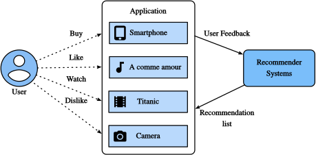

# 推荐系统概述

在过去的十年里，互联网已经发展成为一个大规模在线服务的平台，它深刻地改变了我们交流、阅读新闻、购买产品和观看电影的方式。与此同时，前所未有的商品数量(我们用项目item这个词来指代电影、新闻、书籍和产品)需要一个系统来帮助我们发现我们喜欢的商品。所以，推荐系统是一种强大的信息过滤工具，可以促进个性化服务，为个人用户提供量身定制的体验。简而言之，推荐系统在利用丰富的可用数据使得选择易于管理中起着关键作用。如今，推荐系统是许多在线服务提供商的核心，如亚马逊、Netflix和YouTube。回想一下[图1.3.3](http://preview.d2l.ai/d2l-en/PR-1080/chapter_introduction/index.html#subsec-recommender-systems)中Amazon推荐的深度学习书籍的例子。使用推荐系统的好处有两方面:一方面，它可以极大地减少用户查找信息的工作量，缓解信息过载的问题。另一方面，它可以增加在线服务提供商的商业价值，是一个重要的收入来源。本章将介绍推荐系统领域的基本概念、经典模型和深度学习的最新进展，以及实现的例子。

总的来说，CF技术可以分为:基于内存的CF、基于模型的CF和它们的混合[Su & Khoshgoftaar, 2009]。代表性的基于内存的CF技术是基于最近邻居的CF，如基于用户的CF和基于项目的CF [Sarwar等，2001]。

## 协同过滤（CF）

本文从推荐系统的重要概念——协同过滤(collaborative filtering，CF)入手，该概念最早由 Tapestry 系统提出[Goldberg et al., 1992](http://preview.d2l.ai/d2l-en/PR-1080/chapter_references/zreferences.html#goldberg-nichols-oki-ea-1992)，指的是“人们相互协作，帮助彼此执行过滤过程，以处理发布到新闻组的大量邮件和消息”。 这个术语增加了更多的意义。从广义上讲，它是使用涉及多个用户、代理和数据源之间协作的技术筛选信息或模式的过程。自CF诞生以来，它有许多形式和许多CF方法。

总的来说，CF技术可以分为:基于内存的CF、基于模型的CF和它们的混合体 [Su & Khoshgoftaar, 2009](http://preview.d2l.ai/d2l-en/PR-1080/chapter_references/zreferences.html#su-khoshgoftaar-2009)。代表性的基于内存的CF技术是基于最近邻居的CF，如基于用户的CF和基于项目的CF [Sarwar等，2001](http://preview.d2l.ai/d2l-en/PR-1080/chapter_references/zreferences.html#sarwar-karypis-konstan-ea-2001)。基于内存的CF在处理稀疏和大规模数据时具有局限性，因为它根据公共项计算相似度值。基于模型的方法由于具有较好的处理稀疏性和可扩展性的能力而越来越受到欢迎。 许多基于模型的 CF 方法可以用神经网络进行扩展，通过深度学习中的计算加速，使模型更加灵活和可扩展[ Zhang et al. 2019](http://preview.d2l.ai/d2l-en/PR-1080/chapter_references/zreferences.html#zhang-yao-sun-ea-2019)。 一般来说，CF 只使用用户项交互数据来进行预测和推荐。 除了 CF，基于内容和基于上下文的推荐系统在合并项目 / 用户的内容描述和上下文信号如时间戳和位置方面也很有用。 显然，当不同的输入数据可用时，我们可能需要调整模型类型 / 结构。

## 显性反馈与隐性反馈

为了了解用户的偏好，系统需要收集用户的反馈信息。反馈可以是显性的，也可以是隐性的[Hu et al.， 2008]。例如，IMDB为电影收集从1星到10星的评级。YouTube为用户提供了大拇指向上和向下的按钮来显示他们的喜好。显然，收集明确的反馈需要用户主动表明自己的兴趣。尽管如此，明确的反馈并不总是容易得到，因为许多用户可能不愿意评价产品。相对而言，隐式反馈通常是很容易获得的，因为它主要涉及建模隐式行为，比如用户点击。 因此，许多推荐系统都以隐式反馈为中心，通过观察用户的行为间接反映用户的意见。 隐式反馈的形式多种多样，包括购买记录、浏览历史、手表，甚至鼠标移动。 例如，购买了同一作者的许多书的用户可能喜欢该作者。 请注意，隐式反馈本质上是嘈杂的。 我们只能猜测他们的喜好和真正的动机。 一个用户看了一部电影并不一定表明他对这部电影有积极的看法。

## 推荐任务

在过去的几十年里，人们研究了许多推荐任务。基于应用领域，有电影推荐、新闻推荐、兴趣点推荐[Ye et al.， 2011](http://preview.d2l.ai/d2l-en/PR-1080/chapter_references/zreferences.html#ye-yin-lee-ea-2011)等。还可以根据反馈和输入数据的类型来区分任务，例如，评级预测任务旨在预测明确的评级。Top- n推荐(项目排名)根据隐含的反馈对每个用户的所有item进行个人排序。如果还包括时间戳信息，我们就可以构建可感知序列的推荐 [Quadrana et al., 2018](http://preview.d2l.ai/d2l-en/PR-1080/chapter_references/zreferences.html#quadrana-cremonesi-jannach-2018)
另一个流行的任务是点击率预测，它也是基于隐性反馈，但可以利用各种分类特征。向新用户推荐和向现有用户推荐新产品称为冷启动推荐[Schein et al.， 2002](http://preview.d2l.ai/d2l-en/PR-1080/chapter_references/zreferences.html#schein-popescul-ungar-ea-2002)。

## 摘要

- 推荐系统对个人用户和行业都很重要。协同过滤是推荐中的一个重要概念。
- 反馈有两种类型:隐性反馈和显性反馈。在过去的十年中，研究了许多推荐任务。

## 练习

1. 你能解释一下推荐系统是如何影响你的日常生活的吗?
1. 你认为哪些有趣的推荐任务可以去研究?
