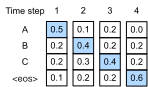
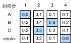
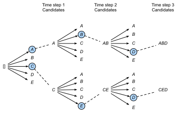

# Beam Search
:label:`sec_beam-search`

In :numref:`sec_seq2seq`,
we predicted the output sequence token by token
until the special end-of-sequence "&lt;eos&gt;" token
is predicted.
In this section,
we will begin with formalizing this *greedy search* strategy
and exploring issues with it,
then compare this strategy with other alternatives:
*exhaustive search* and *beam search*.

Before a formal introduction to greedy search,
let us formalize the search problem
using
the same mathematical notation from :numref:`sec_seq2seq`.
At any time step $t'$, 
the probability of the decoder output $y_{t'}$ 
is conditional 
on the output subsequence
$y_1, \ldots, y_{t'-1}$ before $t'$ and 
the context variable $\mathbf{c}$ that
encodes the information of the input sequence.
To quantify computational cost,
denote by 
$\mathcal{Y}$ (it contains "&lt;eos&gt;")
the output vocabulary.
So the cardinality $\left|\mathcal{Y}\right|$ of this vocabulary set
is the vocabulary size.
Let us also specify the maximum number of tokens
of an output sequence as $T'$.
As a result,
our goal is to search for an ideal output
from all the 
$\mathcal{O}(\left|\mathcal{Y}\right|^{T'})$
possible output sequences.
Of course, 
for all these output sequences,
portions including and after "&lt;eos&gt;" will be discarded
in the actual output.

## Greedy Search

First, let us take a look at 
a simple strategy: *greedy search*.
This strategy has been used to predict sequences in :numref:`sec_seq2seq`.
In greedy search,
at any time step $t'$ of the output sequence, 
we search for the token 
with the highest conditional probability from $\mathcal{Y}$, i.e., 

$$y_{t'} = \operatorname*{argmax}_{y \in \mathcal{Y}} P(y \mid y_1, \ldots, y_{t'-1}, \mathbf{c}),$$

as the output. 
Once "&lt;eos&gt;" is outputted or the output sequence has reached its maximum length $T'$, the output sequence is completed.

So what can go wrong with greedy search?
In fact,
the *optimal sequence*
should be the output sequence
with the maximum 
$\prod_{t'=1}^{T'} P(y_{t'} \mid y_1, \ldots, y_{t'-1}, \mathbf{c})$,
which is
the conditional probability of generating an output sequence based on the input sequence.
Unfortunately, there is no guarantee
that the optimal sequence will be obtained
by greedy search.

:label:`fig_s2s-prob1`

Let us illustrate it with an example.
Suppose that there are four tokens 
"A", "B", "C", and "&lt;eos&gt;" in the output dictionary.
In :numref:`fig_s2s-prob1`,
the four numbers under each time step represent the conditional probabilities of generating "A", "B", "C", and "&lt;eos&gt;" at that time step, respectively.  
At each time step, 
greedy search selects the token with the highest conditional probability. 
Therefore, the output sequence "A", "B", "C", and "&lt;eos&gt;" will be predicted 
in :numref:`fig_s2s-prob1`. 
The conditional probability of this output sequence is $0.5\times0.4\times0.4\times0.6 = 0.048$.

:label:`fig_s2s-prob2`

Next, let us look at another example 
in :numref:`fig_s2s-prob2`. 
Unlike in :numref:`fig_s2s-prob1`, 
at time step 2
we select the token "C"
in :numref:`fig_s2s-prob2`, 
which has the *second* highest conditional probability.
Since the output subsequences at time steps 1 and 2, 
on which time step 3 is based, 
have changed from "A" and "B" in :numref:`fig_s2s-prob1` to "A" and "C" in :numref:`fig_s2s-prob2`, 
the conditional probability of each token 
at time step 3 has also changed in :numref:`fig_s2s-prob2`. 
Suppose that we choose the token "B" at time step 3. 
Now time step 4 is conditional on
the output subsequence at the first three time steps
"A", "C", and "B", 
which is different from "A", "B", and "C" in :numref:`fig_s2s-prob1`. 
Therefore, the conditional probability of generating each token at time step 4 in :numref:`fig_s2s-prob2` is also different from that in :numref:`fig_s2s-prob1`. 
As a result, 
the conditional probability of the output sequence "A", "C", "B", and "&lt;eos&gt;" 
in :numref:`fig_s2s-prob2`
is $0.5\times0.3 \times0.6\times0.6=0.054$, 
which is greater than that of greedy search in :numref:`fig_s2s-prob1`. 
In this example, 
the output sequence "A", "B", "C", and "&lt;eos&gt;" obtained by the greedy search is not an optimal sequence.

## Exhaustive Search

If the goal is to obtain the optimal sequence, we may consider using *exhaustive search*: 
exhaustively enumerate all the possible output sequences with their conditional probabilities,
then output the one 
with the highest conditional probability.

Although we can use exhaustive search to obtain the optimal sequence, 
its computational cost $\mathcal{O}(\left|\mathcal{Y}\right|^{T'})$ is likely to be excessively high. 
For example, when $|\mathcal{Y}|=10000$ and $T'=10$, we will need to evaluate $10000^{10} = 10^{40}$ sequences. This is next to impossible!
On the other hand,
the computational cost of greedy search is 
$\mathcal{O}(\left|\mathcal{Y}\right|T')$: 
it is usually significantly smaller than
that of exhaustive search. For example, when $|\mathcal{Y}|=10000$ and $T'=10$, we only need to evaluate $10000\times10=10^5$ sequences.

## Beam Search

Decisions about sequence searching strategies
lie on a spectrum,
with easy questions at either extreme.
What if only accuracy matters?
Obviously, exhaustive search.
What if only computational cost matters?
Clearly, greedy search.
A real-world application usually asks
a complicated question,
somewhere in between those two extremes.

*Beam search* is an improved version of greedy search. It has a hyperparameter named *beam size*, $k$. 
At time step 1, 
we select $k$ tokens with the highest conditional probabilities.
Each of them will be the first token of 
$k$ candidate output sequences, respectively.
At each subsequent time step, 
based on the $k$ candidate output sequences
at the previous time step,
we continue to select $k$ candidate output sequences 
with the highest conditional probabilities 
from $k\left|\mathcal{Y}\right|$ possible choices.

:label:`fig_beam-search`

:numref:`fig_beam-search` demonstrates the 
process of beam search with an example. 
Suppose that the output vocabulary
contains only five elements: 
$\mathcal{Y} = \{A, B, C, D, E\}$, 
where one of them is “&lt;eos&gt;”. 
Let the beam size be 2 and 
the maximum length of an output sequence be 3. 
At time step 1, 
suppose that the tokens with the highest conditional probabilities $P(y_1 \mid \mathbf{c})$ are $A$ and $C$. At time step 2, for all $y_2 \in \mathcal{Y},$ we compute 

$$\begin{aligned}P(A, y_2 \mid \mathbf{c}) = P(A \mid \mathbf{c})P(y_2 \mid A, \mathbf{c}),\\ P(C, y_2 \mid \mathbf{c}) = P(C \mid \mathbf{c})P(y_2 \mid C, \mathbf{c}),\end{aligned}$$  

and pick the largest two among these ten values, say
$P(A, B \mid \mathbf{c})$ and $P(C, E \mid \mathbf{c})$.
Then at time step 3, for all $y_3 \in \mathcal{Y}$, we compute 

$$\begin{aligned}P(A, B, y_3 \mid \mathbf{c}) = P(A, B \mid \mathbf{c})P(y_3 \mid A, B, \mathbf{c}),\\P(C, E, y_3 \mid \mathbf{c}) = P(C, E \mid \mathbf{c})P(y_3 \mid C, E, \mathbf{c}),\end{aligned}$$ 

and pick the largest two among these ten values, say 
$P(A, B, D \mid \mathbf{c})$   and  $P(C, E, D \mid  \mathbf{c}).$
As a result, we get six candidates output sequences: (i) $A$; (ii) $C$; (iii) $A$, $B$; (iv) $C$, $E$; (v) $A$, $B$, $D$; and (vi) $C$, $E$, $D$. 

In the end, we obtain the set of final candidate output sequences based on these six sequences (e.g., discard portions including and after “&lt;eos&gt;”).
Then
we choose the sequence with the highest of the following score as the output sequence:

$$ \frac{1}{L^\alpha} \log P(y_1, \ldots, y_{L}) = \frac{1}{L^\alpha} \sum_{t'=1}^L \log P(y_{t'} \mid y_1, \ldots, y_{t'-1}, \mathbf{c}),$$
:eqlabel:`eq_beam-search-score`

where $L$ is the length of the final candidate sequence and $\alpha$ is usually set to 0.75. 
Since a longer sequence has more logarithmic terms in the summation of :eqref:`eq_beam-search-score`,
the term $L^\alpha$ in the denominator penalizes
long sequences.

The computational cost of beam search is $\mathcal{O}(k\left|\mathcal{Y}\right|T')$. 
This result is in between that of greedy search and that of exhaustive search. In fact, greedy search can be treated as a special type of beam search with 
a beam size of 1. 
With a flexible choice of the beam size,
beam search provides a tradeoff between
accuracy versus computational cost.

## Summary

* Sequence searching strategies include greedy search, exhaustive search, and beam search.
* Beam search provides a tradeoff between accuracy versus computational cost via its flexible choice of the beam size.

## Exercises

1. Can we treat exhaustive search as a special type of beam search? Why or why not?
1. Apply beam search in the machine translation problem in :numref:`sec_seq2seq`. How does the beam size affect the translation results and the prediction speed?
1. We used language modeling for generating text following  user-provided prefixes in :numref:`sec_rnn_scratch`. Which kind of search strategy does it use? Can you improve it?

[Discussions](https://discuss.d2l.ai/t/338)
