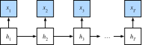
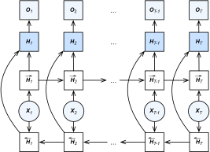

# 双向循环神经网络
:label:`sec_bi_rnn`

在序列学习中，我们以往假设的目标是：到目前为止，在给定所观测的情况下对下一个输出进行建模。例如，在时间序列的上下文中或在语言模型的上下文中。虽然这是一个典型的情况，但这并不是我们可能遇到的唯一情况。为了说明这个问题，考虑以下三个在文本序列中填空的任务：

* 我 `___`。
* 我 `___` 饿了。
* 我 `___` 饿了，我可以吃半头猪。

根据可获得的信息量，我们可以用不同的词填空，如“很高兴”（"happy"）、“不”（"not"）和“非常”（"very"）。很明显，短语的结尾（如果有的话）传达了重要信息。这些信息关乎到选择哪个词来填空。不能利用这一点的序列模型将在相关任务上表现不佳。例如，如果要做好命名实体识别（例如，识别“Green”指的是“格林先生”还是绿色），更长的范围上下文同样重要。为了获得一些解决问题的灵感，让我们绕道看看概率图模型。

## 隐马尔可夫模型中的动态规划

这一小节用来说明动态规划问题。具体的技术细节对于理解深度学习模型并不重要，但它们有助于人们思考为什么要使用深度学习，以及为什么要选择特定的结构。

如果我们想用概率图模型来解决这个问题，我们可以设计一个隐变量模型，如下所示。在任意时间步$t$，我们假设存在某个隐变量$h_t$，通过$P(x_t \mid h_t)$控制我们观测到的发射概率$x_t$。此外，任何转移$h_t \to h_{t+1}$由某个状态转移概率$P(h_{t+1} \mid h_{t})$给出。这个概率图模型就是一个隐马尔可夫模型，如 :numref:`fig_hmm` 所示。


:label:`fig_hmm`

因此，对于$T$个观测值的序列，我们在观测状态和隐藏状态上具有以下联合概率分布：

$$P(x_1, \ldots, x_T, h_1, \ldots, h_T) = \prod_{t=1}^T P(h_t \mid h_{t-1}) P(x_t \mid h_t), \text{ where } P(h_1 \mid h_0) = P(h_1).$$
:eqlabel:`eq_hmm_jointP`

现在假设我们观测所有$x_i$，除了$x_j$，我们的目标是计算$P(x_j \mid x_{-j})$，其中$x_{-j} = (x_1, \ldots, x_{j-1}, x_{j+1}, \ldots, x_{T})$。由于$P(x_j \mid x_{-j})$中没有隐变量，我们考虑对$h_1, \ldots, h_T$的所有可能选择组合求和。如果任何$h_i$可以接受$k$个不同的值（有限的状态数），这意味着我们需要求$k^T$项的和。而这这通常是不可能的！幸运的是，有一个优雅的解决方案——*动态规划*。

要了解它是如何工作的，请依次考虑对隐变量$h_1, \ldots, h_T$求和。根据:eqref:`eq_hmm_jointP`，将得出：

$$\begin{aligned}
    &P(x_1, \ldots, x_T) \\
    =& \sum_{h_1, \ldots, h_T} P(x_1, \ldots, x_T, h_1, \ldots, h_T) \\
    =& \sum_{h_1, \ldots, h_T} \prod_{t=1}^T P(h_t \mid h_{t-1}) P(x_t \mid h_t) \\
    =& \sum_{h_2, \ldots, h_T} \underbrace{\left[\sum_{h_1} P(h_1) P(x_1 \mid h_1) P(h_2 \mid h_1)\right]}_{\pi_2(h_2) \stackrel{\mathrm{def}}{=}}
    P(x_2 \mid h_2) \prod_{t=3}^T P(h_t \mid h_{t-1}) P(x_t \mid h_t) \\
    =& \sum_{h_3, \ldots, h_T} \underbrace{\left[\sum_{h_2} \pi_2(h_2) P(x_2 \mid h_2) P(h_3 \mid h_2)\right]}_{\pi_3(h_3)\stackrel{\mathrm{def}}{=}}
    P(x_3 \mid h_3) \prod_{t=4}^T P(h_t \mid h_{t-1}) P(x_t \mid h_t)\\
    =& \dots \\
    =& \sum_{h_T} \pi_T(h_T) P(x_T \mid h_T).
\end{aligned}$$

一般来说，我们将“前向递归”写为：

$$\pi_{t+1}(h_{t+1}) = \sum_{h_t} \pi_t(h_t) P(x_t \mid h_t) P(h_{t+1} \mid h_t).$$

递归被初始化为$\pi_1(h_1) = P(h_1)$。抽象地说，这可以写成$\pi_{t+1} = f(\pi_t, x_t)$，其中$f$是一些可学习的函数。这看起来非常像我们到目前为止在循环神经网络中讨论的隐变量模型中的更新方程。

完全类似于前向递归，我们也可以用后向递归对同一组隐变量求和。这将得到：

$$\begin{aligned}
    & P(x_1, \ldots, x_T) \\
     =& \sum_{h_1, \ldots, h_T} P(x_1, \ldots, x_T, h_1, \ldots, h_T) \\
    =& \sum_{h_1, \ldots, h_T} \prod_{t=1}^{T-1} P(h_t \mid h_{t-1}) P(x_t \mid h_t) \cdot P(h_T \mid h_{T-1}) P(x_T \mid h_T) \\
    =& \sum_{h_1, \ldots, h_{T-1}} \prod_{t=1}^{T-1} P(h_t \mid h_{t-1}) P(x_t \mid h_t) \cdot
    \underbrace{\left[\sum_{h_T} P(h_T \mid h_{T-1}) P(x_T \mid h_T)\right]}_{\rho_{T-1}(h_{T-1})\stackrel{\mathrm{def}}{=}} \\
    =& \sum_{h_1, \ldots, h_{T-2}} \prod_{t=1}^{T-2} P(h_t \mid h_{t-1}) P(x_t \mid h_t) \cdot
    \underbrace{\left[\sum_{h_{T-1}} P(h_{T-1} \mid h_{T-2}) P(x_{T-1} \mid h_{T-1}) \rho_{T-1}(h_{T-1}) \right]}_{\rho_{T-2}(h_{T-2})\stackrel{\mathrm{def}}{=}} \\
    =& \ldots \\
    =& \sum_{h_1} P(h_1) P(x_1 \mid h_1)\rho_{1}(h_{1}).
\end{aligned}$$

因此，我们可以将“后向递归”写为：

$$\rho_{t-1}(h_{t-1})= \sum_{h_{t}} P(h_{t} \mid h_{t-1}) P(x_{t} \mid h_{t}) \rho_{t}(h_{t}),$$

初始化$\rho_T(h_T) = 1$。前向和后向递归都允许我们在$\mathcal{O}(kT)$（线性）时间内对$(h_1, \ldots, h_T)$的所有值（而不是指数时间）求和$T$个隐变量。这是使用图模型进行概率推理的最大好处之一。它也是通用消息传递算法 :cite:`Aji.McEliece.2000` 的一个非常特殊的例子。结合前向和后向递归，我们能够计算

$$P(x_j \mid x_{-j}) \propto \sum_{h_j} \pi_j(h_j) \rho_j(h_j) P(x_j \mid h_j).$$

作为一个抽象，可以写在递归中。同样，这看起来非常像一个更新方程，只是后向运行，不像我们在循环神经网络中看到的那样。实际上，隐马尔可夫模型受益于知道未来数据何时可用。信号处理科学家将知道和不知道未来观测的两种情况区分为插值和外推。有关更多详细信息，请参阅一本书:cite:`Doucet.De-Freitas.Gordon.2001`。

## 双向模型

如果我们想在循环神经网络中有一种机制，提供与隐马尔可夫模型类似的前瞻能力，我们需要修改循环神经网络设计。幸运的是，这在概念上很容易。我们从最后一个标记开始从后向前运行循环神经网络，而不是只在前向模式下从第一个标记开始运行循环神经网络。
*双向循环神经网络*添加了反向传递信息的隐藏层，以更灵活地处理此类信息。:numref:`fig_birnn`具有单个隐藏层的双向循环神经网络的结构。


:label:`fig_birnn`

事实上，这与隐马尔可夫模型动态规划中的前向和后向递归没有太大区别。主要区别在于，在隐马尔可夫模型中的方程具有特定的统计意义。双向循环神经网络没有这样容易理解的解释，我们只能把它们当作通用的、可学习的函数。这一转变集中体现了指导现代深度网络设计的一些原则：首先，使用经典统计模型的函数依赖类型，然后将其参数化为通用形式。

### 定义

双向循环神经网络由 :cite:`Schuster.Paliwal.1997` 提出。有关各种结构的详细讨论，请参阅:cite:`Graves.Schmidhuber.2005`。让我们看看这样一个网络的具体情况。

对于任意时间步$t$，给定一个小批量输入$\mathbf{X}_t \in \mathbb{R}^{n \times d}$（样本数：$n$，每个示例中的输入数：$d$），并且使隐藏层激活函数为$\phi$。在双向结构中，我们设该时间步的前向和反向隐藏状态分别为$\overrightarrow{\mathbf{H}}_t  \in \mathbb{R}^{n \times h}$和$\overleftarrow{\mathbf{H}}_t  \in \mathbb{R}^{n \times h}$，其中$h$是隐藏单元的数目。前向和反向隐藏状态更新如下：

$$
\begin{aligned}
\overrightarrow{\mathbf{H}}_t &= \phi(\mathbf{X}_t \mathbf{W}_{xh}^{(f)} + \overrightarrow{\mathbf{H}}_{t-1} \mathbf{W}_{hh}^{(f)}  + \mathbf{b}_h^{(f)}),\\
\overleftarrow{\mathbf{H}}_t &= \phi(\mathbf{X}_t \mathbf{W}_{xh}^{(b)} + \overleftarrow{\mathbf{H}}_{t+1} \mathbf{W}_{hh}^{(b)}  + \mathbf{b}_h^{(b)}),
\end{aligned}
$$

其中，权重$\mathbf{W}_{xh}^{(f)} \in \mathbb{R}^{d \times h}, \mathbf{W}_{hh}^{(f)} \in \mathbb{R}^{h \times h}, \mathbf{W}_{xh}^{(b)} \in \mathbb{R}^{d \times h}, \text{ and } \mathbf{W}_{hh}^{(b)} \in \mathbb{R}^{h \times h}$和偏置$\mathbf{b}_h^{(f)} \in \mathbb{R}^{1 \times h} \text{ and } \mathbf{b}_h^{(b)} \in \mathbb{R}^{1 \times h}$都是模型参数。

接下来，我们连结前向和反向隐藏状态$\overrightarrow{\mathbf{H}}_t$和$\overleftarrow{\mathbf{H}}_t$以获得要送入输出层的隐藏状态$\mathbf{H}_t \in \mathbb{R}^{n \times 2h}$。在具有多个隐藏层的深层双向循环神经网络中，该信息作为输入传递到下一个双向层。最后，输出层计算输出$\mathbf{O}_t \in \mathbb{R}^{n \times q}$（输出数：$q$）：

$$\mathbf{O}_t = \mathbf{H}_t \mathbf{W}_{hq} + \mathbf{b}_q.$$

这里，权重矩阵$\mathbf{W}_{hq} \in \mathbb{R}^{2h \times q}$和偏置$\mathbf{b}_q \in \mathbb{R}^{1 \times q}$是输出层的模型参数。实际上，这两个方向可以有不同数量的隐藏单元。

### 计算成本及其应用

双向循环神经网络的一个关键特性是，使用来自序列两端的信息来估计输出。也就是说，我们使用来自未来和过去观测的信息来预测当前的观测。在预测下一个标记的情况下，这并不是我们想要的。毕竟，在预测下一个标记时，我们无法知道下一个标记。因此，如果我们天真地使用双向循环神经网络，我们将不会得到很好的准确性：在训练期间，我们利用了过去和未来的数据来估计现在。而在测试期间，我们只有过去的数据，因此准确性较差。我们将在下面的实验中说明这一点。

另一个严重问题是，双向循环神经网络非常慢。其主要原因是前向传播需要在双向层中进行前向和后向递归，并且反向传播依赖于前向传播的结果。因此，梯度将有一个非常长的依赖链。

实际上，双向层的使用非常少，并且应用于部分场合。例如，填充缺失的单词、标记注释（例如，用于命名实体识别）以及作为序列处理工作流中的一个步骤对序列进行编码（例如，用于机器翻译）。在 :numref:`sec_bert` 和 :numref:`sec_sentiment_rnn` 中，我们将介绍如何使用双向循环神经网络编码文本序列。

## 错误的应用

如果我们忽略了所有关于双向循环神经网络使用过去和未来数据的建议，而只是将其应用于语言模型，我们将得到具有可接受困惑度的估计。尽管如此，该模型预测未来标记的能力仍受到严重影响，如下面的实验所示。尽管存在合理的困惑度。但即使经过多次迭代，它也只会产生乱码。我们将下面的代码作为警告的例子，以防在错误的环境中使用它们。

```{.python .input}
from d2l import mxnet as d2l
from mxnet import npx
from mxnet.gluon import rnn
npx.set_np()

# 加载数据
batch_size, num_steps, device = 32, 35, d2l.try_gpu()
train_iter, vocab = d2l.load_data_time_machine(batch_size, num_steps)
# 通过设置'bidirective=True'来定义双向LSTM模型
vocab_size, num_hiddens, num_layers = len(vocab), 256, 2
lstm_layer = rnn.LSTM(num_hiddens, num_layers, bidirectional=True)
model = d2l.RNNModel(lstm_layer, len(vocab))
# 训练模型
num_epochs, lr = 500, 1
d2l.train_ch8(model, train_iter, vocab, lr, num_epochs, device)
```

```{.python .input}
#@tab pytorch
from d2l import torch as d2l
import torch
from torch import nn

# 加载数据
batch_size, num_steps, device = 32, 35, d2l.try_gpu()
train_iter, vocab = d2l.load_data_time_machine(batch_size, num_steps)
# 通过设置'bidirective=True'来定义双向LSTM模型
vocab_size, num_hiddens, num_layers = len(vocab), 256, 2
num_inputs = vocab_size
lstm_layer = nn.LSTM(num_inputs, num_hiddens, num_layers, bidirectional=True)
model = d2l.RNNModel(lstm_layer, len(vocab))
model = model.to(device)
# 训练模型
num_epochs, lr = 500, 1
d2l.train_ch8(model, train_iter, vocab, lr, num_epochs, device)
```

由于上述原因，结果显然不令人满意。有关更有效地使用双向循环神经网络的讨论，请参阅 :numref:`sec_sentiment_rnn` 中的情感分类应用。

## 小结

* 在双向循环神经网络中，每个时间步的隐藏状态由当前时间步前后信息同时决定。
* 双向循环神经网络与概率图形模型中的“前向-后向”算法有着惊人的相似性。
* 双向循环神经网络主要用于序列编码和给定双向上下文的观测估计。
* 由于梯度链更长，双向循环神经网络的训练成本非常高。

## 练习

1. 如果不同方向使用不同数量的隐藏单位，$\mathbf{H_t}$的形状会发生怎样的变化？
1. 设计一个具有多个隐藏层的双向循环神经网络。
1. 一词多义在自然语言中很常见。例如，“bank”一词在“i went to the bank to deposit cash”和“i went to the bank to sit down”中有不同的含义。我们如何设计一个神经网络模型，使其在给定上下文序列和单词的情况下，返回该单词在上下文中的向量表示？哪种类型的神经结构更适合处理一词多义？

:begin_tab:`mxnet`
[Discussions](https://discuss.d2l.ai/t/339)
:end_tab:

:begin_tab:`pytorch`
[Discussions](https://discuss.d2l.ai/t/1059)
:end_tab:
