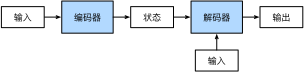

# Encoder-Decoder Architecture
:label:`sec_encoder-decoder`

As we have discussed in 
:numref:`sec_machine_translation`,
machine translation
is a major problem domain for sequence transduction models,
whose input and output are
both variable-length sequences.
To handle this type of inputs and outputs,
we can design an architecture with two major components.
The first component is an *encoder*:
it takes a variable-length sequence as the input and transforms it into a state with a fixed shape.
The second component is a *decoder*:
it maps the encoded state of a fixed shape
to a variable-length sequence.
This is called an *encoder-decoder* architecture,
which is depicted in :numref:`fig_encoder_decoder`.


:label:`fig_encoder_decoder`

Let us take machine translation from English to French
as an example.
Given an input sequence in English:
"They", "are", "watching", ".",
this encoder-decoder architecture
first encodes the variable-length input into a state,
then decodes the state 
to generate the translated sequence token by token
as the output:
"Ils", "regardent", ".".
Since the encoder-decoder architecture
forms the basis
of different sequence transduction models
in subsequent sections,
this section will convert this architecture
into an interface that will be implemented later.

## Encoder

In the encoder interface,
we just specify that
the encoder takes variable-length sequences as the input `X`.
The implementation will be provided 
by any model that inherits this base `Encoder` class.

```{.python .input}
from mxnet.gluon import nn

#@save
class Encoder(nn.Block):
    """The base encoder interface for the encoder-decoder architecture."""
    def __init__(self, **kwargs):
        super(Encoder, self).__init__(**kwargs)

    def forward(self, X, *args):
        raise NotImplementedError
```

```{.python .input}
#@tab pytorch
from torch import nn

#@save
class Encoder(nn.Module):
    """The base encoder interface for the encoder-decoder architecture."""
    def __init__(self, **kwargs):
        super(Encoder, self).__init__(**kwargs)

    def forward(self, X, *args):
        raise NotImplementedError
```

## Decoder

In the following decoder interface,
we add an additional `init_state` function
to convert the encoder output (`enc_outputs`)
into the encoded state.
Note that this step
may need extra inputs such as 
the valid length of the input,
which was explained
in :numref:`subsec_mt_data_loading`.
To generate a variable-length sequence token by token,
every time the decoder
may map an input (e.g., the generated token at the previous time step)
and the encoded state
into an output token at the current time step.

```{.python .input}
#@save
class Decoder(nn.Block):
    """The base decoder interface for the encoder-decoder architecture."""
    def __init__(self, **kwargs):
        super(Decoder, self).__init__(**kwargs)

    def init_state(self, enc_outputs, *args):
        raise NotImplementedError

    def forward(self, X, state):
        raise NotImplementedError
```

```{.python .input}
#@tab pytorch
#@save
class Decoder(nn.Module):
    """The base decoder interface for the encoder-decoder architecture."""
    def __init__(self, **kwargs):
        super(Decoder, self).__init__(**kwargs)

    def init_state(self, enc_outputs, *args):
        raise NotImplementedError

    def forward(self, X, state):
        raise NotImplementedError
```

## Putting the Encoder and Decoder Together

In the end,
the encoder-decoder architecture
contains both an encoder and a decoder,
with optionally extra arguments.
In the forward propagation,
the output of the encoder
is used to produce the encoded state,
and this state
will be further used by the decoder as one of its input.

```{.python .input}
#@save
class EncoderDecoder(nn.Block):
    """The base class for the encoder-decoder architecture."""
    def __init__(self, encoder, decoder, **kwargs):
        super(EncoderDecoder, self).__init__(**kwargs)
        self.encoder = encoder
        self.decoder = decoder

    def forward(self, enc_X, dec_X, *args):
        enc_outputs = self.encoder(enc_X, *args)
        dec_state = self.decoder.init_state(enc_outputs, *args)
        return self.decoder(dec_X, dec_state)
```

```{.python .input}
#@tab pytorch
#@save
class EncoderDecoder(nn.Module):
    """The base class for the encoder-decoder architecture."""
    def __init__(self, encoder, decoder, **kwargs):
        super(EncoderDecoder, self).__init__(**kwargs)
        self.encoder = encoder
        self.decoder = decoder

    def forward(self, enc_X, dec_X, *args):
        enc_outputs = self.encoder(enc_X, *args)
        dec_state = self.decoder.init_state(enc_outputs, *args)
        return self.decoder(dec_X, dec_state)
```

The term "state" in the encoder-decoder architecture
has probably inspired you to implement this
architecture using neural networks with states.
In the next section,
we will see how to apply RNNs to design 
sequence transduction models based on 
this encoder-decoder architecture.


## Summary

* The encoder-decoder architecture can handle inputs and outputs that are both variable-length sequences, thus is suitable for sequence transduction problems such as machine translation.
* The encoder takes a variable-length sequence as the input and transforms it into a state with a fixed shape.
* The decoder maps the encoded state of a fixed shape to a variable-length sequence.


## Exercises

1. Suppose that we use neural networks to implement the encoder-decoder architecture. Do the encoder and the decoder have to be the same type of neural network?  
1. Besides machine translation, can you think of another application where the encoder-decoder architecture can be applied?

:begin_tab:`mxnet`
[Discussions](https://discuss.d2l.ai/t/341)
:end_tab:

:begin_tab:`pytorch`
[Discussions](https://discuss.d2l.ai/t/1061)
:end_tab:
