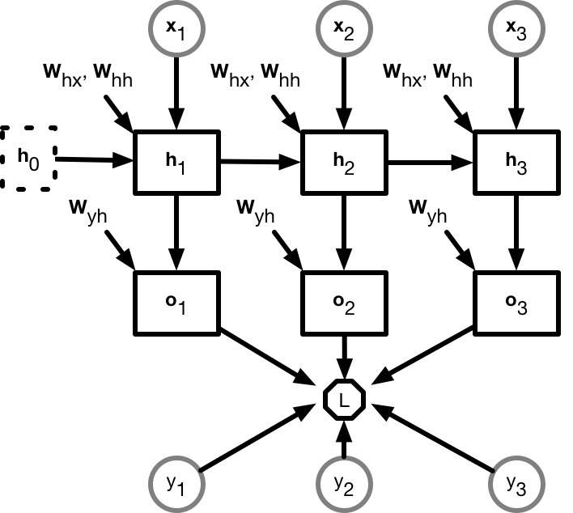

# 通过时间反向传播

在上一章[循环神经网络](rnn-scratch.md)的示例代码中，如果不使用梯度裁剪，模型将无法正常训练。为了深刻理解这一现象，并激发改进循环神经网络的灵感，本章我们将介绍循环神经网络中模型梯度的计算和存储。这个方法叫做**通过时间反向传播**（back-propagation through time）。

我们在[正向传播和反向传播](../chapter_supervised-learning/backprop.md)中以[$L_2$范数正则化]((../chapter_supervised-learning/reg-scratch.md)的[多层感知机]((../chapter_supervised-learning/mlp-scratch.md)为例，介绍了深度学习模型梯度的计算和存储。事实上，所谓通过时间反向传播只是反向传播在循环神经网络的具体应用。

为了解释通过时间反向传播，我们以一个简单的循环神经网络为例。

## 模型图

为了更清楚的表达模型变量和参数之间的依赖关系，我们可以绘制模型图来可视化数学表达式。

(TODO: @astonzhang)

**吐槽和讨论欢迎点**[这里](https://discuss.gluon.ai/t/topic/3711)
