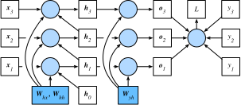

# 通过时间反向传播
:label:`sec_bptt`

到目前为止，我们已经反复提到像*梯度爆炸*、*梯度消失*，以及需要对循环神经网络*分离梯度*。
例如，在 :numref:`sec_rnn_scratch` 中，我们在序列上调用了 `detach` 函数。为了能够快速构建模型并了解其工作原理，上面所说的这些都没有得到充分的解释。在本节中，我们将更深入地探讨序列模型反向传播的细节，以及相关数学原理。

当我们首次实现循环神经网络（ :numref:`sec_rnn_scratch` ）时，我们遇到了梯度爆炸的一些影响。特别是，如果你做了练习题，你会看到梯度裁剪对于确保收敛至关重要。为了更好地理解此问题，本节将回顾如何计算序列模型的梯度。请注意，它的工作原理上没有什么新概念。毕竟，我们仍然只是应用链式法则来计算梯度。尽管如此，还是值得重新思考反向传播（ :numref:`sec_backprop`）。

我们在 :numref:`sec_backprop` 中描述了多层感知机中的前向和反向传播和计算图。循环神经网络中的前向传播相对简单。
*通过时间反向传播*（Backpropagation through time，BPTT） :cite:`Werbos.1990` 实际上是在循环神经网络中应用的一个特定的反向传播技术。它要求我们将循环神经网络的计算图一次展开一个时间步，以获得模型变量和参数之间的依赖关系。然后，根据链式法则，我们应用反向传播来计算和存储梯度。由于序列可能相当长，因此依赖关系可能相当冗长。例如，对于 1000 个字符的序列，第一个标记可能会对最后位置的标记产生重大影响。这在计算上并不是真正可行的（它需要太长时间，需要太多的内存），并且它需要超过1000个矩阵乘积才能得到非常难以捉摸的梯度。这是一个充满计算与统计不确定性的过程。在下文中，我们将阐明会发生什么情况以及如何在实践中解决这一问题。

## 循环神经网络的梯度分析
:label:`subsec_bptt_analysis`

我们从循环神经网络工作原理的简化模型开始。此模型忽略有关隐藏状态的细节及其更新方式的细节。这里的数学表示没有像过去那样明确区分标量，向量和矩阵。因为这些细节对于分析并不重要，只会使本小节中的符号变得混乱。

在此简化模型中，我们将时间步$t$的隐藏状态表示为$h_t$，输入表示为$x_t$，输出表示为$o_t$。回想一下我们在 :numref:`subsec_rnn_w_hidden_states` 中的讨论，即输入和隐藏状态可以连结为隐藏图层中的一个权重变量。因此，我们分别使用 $w_h$ 和 $w_o$ 来表示隐藏层和输出层的权重。因此，每个时间步的隐藏状态和输出可以写为：

$$\begin{aligned}h_t &= f(x_t, h_{t-1}, w_h),\\o_t &= g(h_t, w_o),\end{aligned}$$
:eqlabel:`eq_bptt_ht_ot`

其中 $f$ 和 $g$ 分别是隐藏层和输出层的变换。因此，我们有一个链 $\{\ldots, (x_{t-1}, h_{t-1}, o_{t-1}), (x_{t}, h_{t}, o_t), \ldots\}$，它们通过循环计算彼此依赖。正向传播相当简单。一次一个时间步的遍历三元组$(x_t, h_t, o_t)$。然后通过一个目标函数在所有 $T$个时间步中评估输出 $o_t$ 和所对应标签 $y_t$ 之间的差异：

$$L(x_1, \ldots, x_T, y_1, \ldots, y_T, w_h, w_o) = \frac{1}{T}\sum_{t=1}^T l(y_t, o_t).$$

对于反向传播，问题有点棘手，特别是当我们计算参数$w_h$关于目标函数$L$的梯度时。具体来说，按照链式法则：

$$\begin{aligned}\frac{\partial L}{\partial w_h}  & = \frac{1}{T}\sum_{t=1}^T \frac{\partial l(y_t, o_t)}{\partial w_h}  \\& = \frac{1}{T}\sum_{t=1}^T \frac{\partial l(y_t, o_t)}{\partial o_t} \frac{\partial g(h_t, w_o)}{\partial h_t}  \frac{\partial h_t}{\partial w_h}.\end{aligned}$$
:eqlabel:`eq_bptt_partial_L_wh`

:eqref:`eq_bptt_partial_L_wh` 中乘积的第一项和第二个项很容易计算。第三个项 $\partial h_t/\partial w_h$ 是事情变得棘手的地方，因为我们需要重复计算参数 $w_h$ 对 $h_t$ 的影响。根据 :eqref:`eq_bptt_ht_ot` 中的递归计算，$h_t$既依赖于$h_{t-1}$又依赖于$w_h$，其中$h_{t-1}$的计算也依赖于$w_h$。因此，使用链式法则产生：

$$\frac{\partial h_t}{\partial w_h}= \frac{\partial f(x_{t},h_{t-1},w_h)}{\partial w_h} +\frac{\partial f(x_{t},h_{t-1},w_h)}{\partial h_{t-1}} \frac{\partial h_{t-1}}{\partial w_h}.$$
:eqlabel:`eq_bptt_partial_ht_wh_recur`

为了得出上述梯度，假设我们有三个序列$\{a_{t}\},\{b_{t}\},\{c_{t}\}$满足$a_{0}=0$ 且 $a_{t}=b_{t}+c_{t}a_{t-1}$。然后对于 $t\geq 1$，它很容易写出：

$$a_{t}=b_{t}+\sum_{i=1}^{t-1}\left(\prod_{j=i+1}^{t}c_{j}\right)b_{i}.$$
:eqlabel:`eq_bptt_at`

通过将$a_t$、$b_t$和$c_t$替换：

$$\begin{aligned}a_t &= \frac{\partial h_t}{\partial w_h},\\
b_t &= \frac{\partial f(x_{t},h_{t-1},w_h)}{\partial w_h}, \\
c_t &= \frac{\partial f(x_{t},h_{t-1},w_h)}{\partial h_{t-1}},\end{aligned}$$

:eqref:`eq_bptt_partial_ht_wh_recur`中的梯度计算满足$a_{t}=b_{t}+c_{t}a_{t-1}$。因此，对于每个 :eqref:`eq_bptt_at`，我们可以使用以下式子去掉 :eqref:`eq_bptt_partial_ht_wh_recur` 中的递归计算

$$\frac{\partial h_t}{\partial w_h}=\frac{\partial f(x_{t},h_{t-1},w_h)}{\partial w_h}+\sum_{i=1}^{t-1}\left(\prod_{j=i+1}^{t} \frac{\partial f(x_{j},h_{j-1},w_h)}{\partial h_{j-1}} \right) \frac{\partial f(x_{i},h_{i-1},w_h)}{\partial w_h}.$$
:eqlabel:`eq_bptt_partial_ht_wh_gen`

虽然我们可以使用链式法则递归地计算 $\partial h_t/\partial w_h$，但当 $t$ 很大，这个链就会变得很长。让我们讨论处理这一问题的若干方法.

### 完整计算 ##

显然，我们可以计算 :eqref:`eq_bptt_partial_ht_wh_gen` 中的全部总和。然而，这非常缓慢，梯度可能会爆炸，因为初始条件的微妙变化可能会对结果产生很大影响。也就是说，我们可以看到类似于蝴蝶效应的东西，初始条件的很小变化导致结果的不成比例变化。就我们要估计的模型而言，这实际上是相当不可取的。毕竟，我们正在寻找能够很好地概括出来的可靠估计数。因此，这种方法几乎从未在实践中使用过。

### 截断时间步 ##

或者，我们可以在 $\tau$ 步后截断求和。这就是我们到目前为止一直在讨论的内容，例如当我们在 :numref:`sec_rnn_scratch` 中分离梯度时。这会带来真实梯度的*近似*，只需将求和终止为$\partial h_{t-\tau}/\partial w_h$。在实践中，这工作得很好。它通常被称为通过时间截断反向传播 :cite:`Jaeger.2002`。这样做的后果之一是，该模型主要侧重于短期影响，而不是长期影响。这实际上是可取的，因为它会将估计值偏向更简单和更稳定的模型。

### 随机截断 ##

最后，我们可以用一个随机变量替换$\partial h_t/\partial w_h$，该随机变量在预期中是正确的，但是会截断序列。这是通过使用预定义的$0 \leq \pi_t \leq 1$序列$\xi_t$来实现的，其中$P(\xi_t = 0) = 1-\pi_t$ 且$P(\xi_t = \pi_t^{-1}) = \pi_t$，因此 $E[\xi_t] = 1$。我们使用它来替换 :eqref:`eq_bptt_partial_ht_wh_recur` 中的梯度 $\partial h_t/\partial w_h$：

$$z_t= \frac{\partial f(x_{t},h_{t-1},w_h)}{\partial w_h} +\xi_t \frac{\partial f(x_{t},h_{t-1},w_h)}{\partial h_{t-1}} \frac{\partial h_{t-1}}{\partial w_h}.$$

它是从$\xi_t$的定义推导出来的，那就是$E[z_t] = \partial h_t/\partial w_h$。每当$\xi_t = 0$递归计算在该时间步$t$终止时。这导致不同长度序列的加权和，其中长序列很少但适当地加大权重。这个想法是由塔莱克和奥利维尔 :cite:`Tallec.Ollivier.2017`提出的。

### 比较策略

:label:`fig_truncated_bptt`

:numref:`fig_truncated_bptt` 说明了使用循环神经网络的通过时间反向传播的三种策略：

* 第一行是将文本划分为不同长度的段的随机截断。
* 第二行是将文本分解为相同长度的子序列的常规截断。这就是我们在 RNN 实验中一直在做的。
* 第三行是通过时间的完全反向传播，导致计算上不可行的表达式。

遗憾的是，虽然理论上具有吸引力，但随机截断并不比常规截断更好，很可能是由于多种因素。首先，经过一系列反向传播步后的观测结果足以捕获实际依赖关系。其次，增加的方差抵消了步长越多梯度越精确的事实。第三，我们实际上想要只有短范围交互的模型。因此，通过时间的规则截断的反向传播具有轻微的正则化效果。

## 通过时间反向传播细节

在讨论一般原则之后，让我们详细讨论反向传播问题。与 :numref:`subsec_bptt_analysis` 中的分析不同，下面我们将展示如何计算目标函数相对于所有分解模型参数的梯度。为了保持简单，我们考虑一个没有偏置参数的循环神经网络，其在隐藏层中的激活函数使用恒等映射 ($\phi(x)=x$)。对于时间步$t$，设单个样本输入和标签分别为$\mathbf{x}_t \in \mathbb{R}^d$和$y_t$。隐藏状态$\mathbf{h}_t \in \mathbb{R}^h$和输出$\mathbf{o}_t \in \mathbb{R}^q$被计算为：

$$\begin{aligned}\mathbf{h}_t &= \mathbf{W}_{hx} \mathbf{x}_t + \mathbf{W}_{hh} \mathbf{h}_{t-1},\\
\mathbf{o}_t &= \mathbf{W}_{qh} \mathbf{h}_{t},\end{aligned}$$

其中权重参数为 $\mathbf{W}_{hx} \in \mathbb{R}^{h \times d}$、$\mathbf{W}_{hh} \in \mathbb{R}^{h \times h}$和
$\mathbf{W}_{qh} \in \mathbb{R}^{q \times h}$。用$l(\mathbf{o}_t, y_t)$表示时间步$t$处的损失。我们的目标函数，从序列开始起的超过$T$个时间步的损失是这样的

$$L = \frac{1}{T} \sum_{t=1}^T l(\mathbf{o}_t, y_t).$$

为了在循环神经网络计算过程中可视化模型变量和参数之间的依赖关系，我们可以为模型绘制一个计算图，如 :numref:`fig_rnn_bptt` 所示。例如，时间步3的隐藏状态$\mathbf{h}_3$的计算取决于模型参数$\mathbf{W}_{hx}$和$\mathbf{W}_{hh}$，以及最终时间步的隐藏状态$\mathbf{h}_2$以及当前时间步的输入$\mathbf{x}_3$。

:label:`fig_rnn_bptt`

正如刚才提到的， :numref:`fig_rnn_bptt` 中的模型参数是$\mathbf{W}_{hx}$、$\mathbf{W}_{hh}$和$\mathbf{W}_{qh}$。通常，训练该模型需要对这些参数 $\partial L/\partial \mathbf{W}_{hx}$ 、 $\partial L/\partial \mathbf{W}_{hh}$ 和 $\partial L/\partial \mathbf{W}_{qh}$ 进行梯度计算。根据 :numref:`fig_rnn_bptt` 中的依赖关系，我们可以沿箭头的相反方向遍历，依次计算和存储梯度。为了灵活地表示链式法则中不同形状的矩阵、向量和标量的乘法，我们继续使用 $\text{prod}$ 运算符，如 :numref:`sec_backprop` 中所述。

首先，目标函数有关任意时间步$t$的模型输出的梯度很容易计算：

$$\frac{\partial L}{\partial \mathbf{o}_t} =  \frac{\partial l (\mathbf{o}_t, y_t)}{T \cdot \partial \mathbf{o}_t} \in \mathbb{R}^q.$$
:eqlabel:`eq_bptt_partial_L_ot`

现在，我们可以计算目标函数有关输出层中的参数$\mathbf{W}_{qh}$的梯度：$\partial L/\partial \mathbf{W}_{qh} \in \mathbb{R}^{q \times h}$。根据 :numref:`fig_rnn_bptt` ，目标函数$L$通过$\mathbf{o}_1, \ldots, \mathbf{o}_T$依赖于$\mathbf{W}_{qh}$。依据链式法则，

$$
\frac{\partial L}{\partial \mathbf{W}_{qh}}
= \sum_{t=1}^T \text{prod}\left(\frac{\partial L}{\partial \mathbf{o}_t}, \frac{\partial \mathbf{o}_t}{\partial \mathbf{W}_{qh}}\right)
= \sum_{t=1}^T \frac{\partial L}{\partial \mathbf{o}_t} \mathbf{h}_t^\top,
$$

其中$\partial L/\partial \mathbf{o}_t$是由 :eqref:`eq_bptt_partial_L_ot` 给出的。

接下来，如 :numref:`fig_rnn_bptt` 所示，在最后的时间步$T$，目标函数$L$仅通过$\mathbf{o}_T$依赖隐藏状态$\mathbf{h}_T$。因此，我们可以使用链式法则容易地得到梯度$\partial L/\partial \mathbf{h}_T \in \mathbb{R}^h$：

$$\frac{\partial L}{\partial \mathbf{h}_T} = \text{prod}\left(\frac{\partial L}{\partial \mathbf{o}_T}, \frac{\partial \mathbf{o}_T}{\partial \mathbf{h}_T} \right) = \mathbf{W}_{qh}^\top \frac{\partial L}{\partial \mathbf{o}_T}.$$
:eqlabel:`eq_bptt_partial_L_hT_final_step`

对于任意时间步$t < T$来说都变得更加棘手，其中目标函数$L$通过$\mathbf{h}_{t+1}$和$\mathbf{o}_t$依赖$\mathbf{h}_t$。根据链式法则，隐藏状态在任何时间步骤$t < T$的梯度$\partial L/\partial \mathbf{h}_t \in \mathbb{R}^h$可以递归地计算为：

$$\frac{\partial L}{\partial \mathbf{h}_t} = \text{prod}\left(\frac{\partial L}{\partial \mathbf{h}_{t+1}}, \frac{\partial \mathbf{h}_{t+1}}{\partial \mathbf{h}_t} \right) + \text{prod}\left(\frac{\partial L}{\partial \mathbf{o}_t}, \frac{\partial \mathbf{o}_t}{\partial \mathbf{h}_t} \right) = \mathbf{W}_{hh}^\top \frac{\partial L}{\partial \mathbf{h}_{t+1}} + \mathbf{W}_{qh}^\top \frac{\partial L}{\partial \mathbf{o}_t}.$$
:eqlabel:`eq_bptt_partial_L_ht_recur`

为了进行分析，展开任何时间步 $1 \leq t \leq T$ 的递归计算

$$\frac{\partial L}{\partial \mathbf{h}_t}= \sum_{i=t}^T {\left(\mathbf{W}_{hh}^\top\right)}^{T-i} \mathbf{W}_{qh}^\top \frac{\partial L}{\partial \mathbf{o}_{T+t-i}}.$$
:eqlabel:`eq_bptt_partial_L_ht`

我们可以从 :eqref:`eq_bptt_partial_L_ht` 中看到，这个简单的线性例子已经展现了长序列模型的一些关键问题：它涉及到 $\mathbf{W}_{hh}^\top$ 的潜在非常大的指数。其中，小于1的特征值消失，大于1的特征值发散。这在数值上是不稳定的，表现为梯度消失或梯度爆炸。解决此问题的一种方法是按照计算方便的大小截断时间步长，如 :numref:`subsec_bptt_analysis` 中所述。实际上，这种截断是通过在给定数量的时间步长之后分离梯度来实现的。稍后，我们将看到更复杂的序列模型（如长短期记忆）如何进一步缓解这一问题。

最后， :numref:`fig_rnn_bptt` 表明了，目标函数$L$通过隐藏状态$\mathbf{h}_1, \ldots, \mathbf{h}_T$依赖隐藏层中的模型参数$\mathbf{W}_{hx}$和$\mathbf{W}_{hh}$。为了计算有关这些参数的梯度$\partial L / \partial \mathbf{W}_{hx} \in \mathbb{R}^{h \times d}$和$\partial L / \partial \mathbf{W}_{hh} \in \mathbb{R}^{h \times h}$，我们应用链式规则：

$$
\begin{aligned}
\frac{\partial L}{\partial \mathbf{W}_{hx}}
&= \sum_{t=1}^T \text{prod}\left(\frac{\partial L}{\partial \mathbf{h}_t}, \frac{\partial \mathbf{h}_t}{\partial \mathbf{W}_{hx}}\right)
= \sum_{t=1}^T \frac{\partial L}{\partial \mathbf{h}_t} \mathbf{x}_t^\top,\\
\frac{\partial L}{\partial \mathbf{W}_{hh}}
&= \sum_{t=1}^T \text{prod}\left(\frac{\partial L}{\partial \mathbf{h}_t}, \frac{\partial \mathbf{h}_t}{\partial \mathbf{W}_{hh}}\right)
= \sum_{t=1}^T \frac{\partial L}{\partial \mathbf{h}_t} \mathbf{h}_{t-1}^\top,
\end{aligned}
$$

其中$\partial L/\partial \mathbf{h}_t$是由 :eqref:`eq_bptt_partial_L_hT_final_step` 和 :eqref:`eq_bptt_partial_L_ht_recur` 递归计算的，是影响数值稳定性的关键量。

正如我们在 :numref:`sec_backprop` 中所解释的那样，通过时间反向传播是反向传播在循环神经网络中的应用，训练循环神经网络交替使用通过时间前向传播和反向传播。通过时间的反向传播依次计算并存储上述梯度。具体而言，存储的中间值会被重复使用，以避免重复计算，例如存储 $\partial L/\partial \mathbf{h}_t$，以便在计算 $\partial L / \partial \mathbf{W}_{hx}$ 和 $\partial L / \partial \mathbf{W}_{hh}$ 时使用。

## 小结

* 通过时间反向传播仅仅是反向传播对具有隐藏状态的序列模型的应用。
* 为了计算方便和数值稳定，需要截断，如规则截断和随机截断。
* 矩阵的高次方可能导致特征值发散或消失。这以梯度爆炸或梯度消失的形式表现出来。
* 为了高效计算，在通过时间反向传播期间缓存中间值。

## 练习

1. 假设我们具有对称矩阵$\mathbf{M} \in \mathbb{R}^{n \times n}$，该对称矩阵具有特征值$\lambda_i$，其对应的特征向量是$\mathbf{v}_i$($i = 1, \ldots, n$)。在不丧失泛化性的情况下，假设它们是按顺序$|\lambda_i| \geq |\lambda_{i+1}|$排序的。
   1. 表明$\mathbf{M}^k$具有特征值$\lambda_i^k$。
   1. 证明对于随机向量$\mathbf{x} \in \mathbb{R}^n$，有较高概率$\mathbf{M}^k \mathbf{x}$将与$\mathbf{M}$的特征向量$\mathbf{v}_1$对应。
   1. 上述结果对于循环神经网络中的梯度意味着什么？
1. 除了梯度裁剪，你还能想到其他方法来应对循环神经网络中的梯度爆炸吗？

[Discussions](https://discuss.d2l.ai/t/2107)
