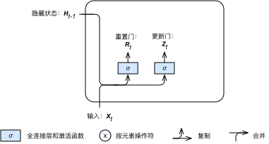
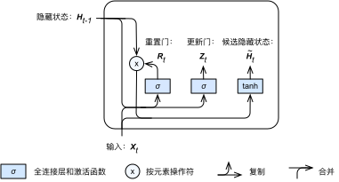
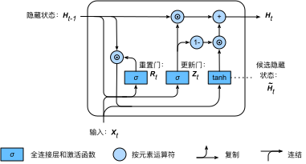

# 门控循环单元（GRU）

上一节介绍了循环神经网络中的梯度计算方法。我们发现，循环神经网络的梯度可能会衰减或爆炸。虽然裁剪梯度可以应对梯度爆炸，但无法解决梯度衰减的问题。给定一个时间序列，例如文本序列，循环神经网络在实际中较难捕捉时间步距离较大的词之间的依赖关系。

门控循环神经网络（gated recurrent neural network）的提出，是为了更好地捕捉时间序列中时间步距离较大的依赖关系。其中，门控循环单元（gated recurrent unit，简称GRU）是一种常用的门控循环神经网络 [1, 2]。我们将在下一节介绍另一种门控循环神经网络：长短期记忆。


## 门控循环单元

下面将介绍门控循环单元的设计。它引入了门的概念，从而修改了循环神经网络中隐藏状态的计算方式。输出层的设计不变。


### 重置门和更新门

门控循环单元引入了重置门（reset gate）和更新门（update gate）。如图6.4所示，重置门和更新门均由输入为当前时间步输入$\boldsymbol{X}_t$与上一时间步隐藏状态$\boldsymbol{H}_{t-1}$，且激活函数为sigmoid函数的全连接层计算得出。





具体来说，假设隐藏单元个数为$h$，给定时间步$t$的小批量输入$\boldsymbol{X}_t \in \mathbb{R}^{n \times d}$（样本数为$n$，输入个数为$d$）和上一时间步隐藏状态$\boldsymbol{H}_{t-1} \in \mathbb{R}^{n \times h}$。重置门$\boldsymbol{R}_t \in \mathbb{R}^{n \times h}$和更新门$\boldsymbol{Z}_t \in \mathbb{R}^{n \times h}$的计算如下：

$$
\begin{aligned}
\boldsymbol{R}_t = \sigma(\boldsymbol{X}_t \boldsymbol{W}_{xr} + \boldsymbol{H}_{t-1} \boldsymbol{W}_{hr} + \boldsymbol{b}_r),\\
\boldsymbol{Z}_t = \sigma(\boldsymbol{X}_t \boldsymbol{W}_{xz} + \boldsymbol{H}_{t-1} \boldsymbol{W}_{hz} + \boldsymbol{b}_z),
\end{aligned}
$$

其中$\boldsymbol{W}_{xr}, \boldsymbol{W}_{xz} \in \mathbb{R}^{d \times h}$和$\boldsymbol{W}_{hr}, \boldsymbol{W}_{hz} \in \mathbb{R}^{h \times h}$是权重参数，$\boldsymbol{b}_r, \boldsymbol{b}_z \in \mathbb{R}^{1 \times h}$是偏移参数。激活函数$\sigma$是sigmoid函数。[“多层感知机”](../chapter_deep-learning-basics/mlp.md)一节中介绍过，sigmoid函数可以将元素的值变换到0和1之间。因此，重置门$\boldsymbol{R}_t$和更新门$\boldsymbol{Z}_t$中每个元素的值域都是$[0, 1]$。

我们可以通过元素值域在$[0, 1]$的更新门和重置门来控制隐藏状态中信息的流动：这一般通过使用按元素乘法（$\odot$）来实现。


### 候选隐藏状态

接下来，门控循环单元将计算候选隐藏状态来辅助稍后的隐藏状态计算。如图6.5所示，我们将当前时间步重置门的输出与上一时间步隐藏状态做按元素乘法。如果重置门中元素值接近0，那么意味着重置对应隐藏状态元素为0，即丢弃来自上一时间步的历史信息。然后，将重置后的上一时间步的隐藏状态与当前时间步的输入合并，再通过含tanh激活函数的全连接层计算出候选隐藏状态，其所有元素的值域为$[-1, 1]$。



具体来说，时间步$t$的候选隐藏状态$\tilde{\boldsymbol{H}}_t \in \mathbb{R}^{n \times h}$的计算为

$$\tilde{\boldsymbol{H}}_t = \text{tanh}(\boldsymbol{X}_t \boldsymbol{W}_{xh} + \boldsymbol{R}_t \odot \boldsymbol{H}_{t-1} \boldsymbol{W}_{hh} + \boldsymbol{b}_h),$$

其中$\boldsymbol{W}_{xh} \in \mathbb{R}^{d \times h}$和$\boldsymbol{W}_{hh} \in \mathbb{R}^{h \times h}$是权重参数，$\boldsymbol{b}_h \in \mathbb{R}^{1 \times h}$是偏移参数。从上面这个公式可以看出，重置门控制了包含时间序列历史信息的上一个时间步的隐藏状态如何流入当前时间步的候选隐藏状态。如果重置门近似0，上一个隐藏状态几乎被丢弃。因此，重置门可以丢弃与预测未来无关的历史信息。

### 隐藏状态

最后，时间步$t$的隐藏状态$\boldsymbol{H}_t \in \mathbb{R}^{n \times h}$的计算使用当前时间步的更新门$\boldsymbol{Z}_t$来对上一时间步的隐藏状态$\boldsymbol{H}_{t-1}$和当前时间步的候选隐藏状态$\tilde{\boldsymbol{H}}_t$做组合：

$$\boldsymbol{H}_t = \boldsymbol{Z}_t \odot \boldsymbol{H}_{t-1}  + (1 - \boldsymbol{Z}_t) \odot \tilde{\boldsymbol{H}}_t.$$





值得注意的是，更新门可以控制隐藏状态应该如何被包含当前时间步信息的候选隐藏状态所更新，如图6.6所示。假设更新门在时间步$t'$到$t$（$t' < t$）之间一直近似1。那么，在时间步$t'$到$t$之间的输入信息几乎没有流入时间步$t$的隐藏状态$\boldsymbol{H}_t$。实际上，这可以看作是较早时刻的隐藏状态$\boldsymbol{H}_{t'-1}$一直通过时间保存并传递至当前时间步$t$。这个设计可以应对循环神经网络中的梯度衰减问题，并更好地捕捉时间序列中时间步距离较大的依赖关系。

我们对门控循环单元的设计稍作总结：

* 重置门有助于捕捉时间序列里短期的依赖关系。
* 更新门有助于捕捉时间序列里长期的依赖关系。

## 实验


为了实现并展示门控循环单元，我们依然使用周杰伦歌词数据集来训练模型作词。这里除门控循环单元以外的实现已在[“循环神经网络”](rnn.md)一节中介绍。


### 处理数据

我们先读取并简单处理数据集。

```{.python .input  n=2}
import sys
sys.path.insert(0, '..')

import gluonbook as gb
from mxnet import nd
import zipfile

with zipfile.ZipFile('../data/jaychou_lyrics.txt.zip', 'r') as zin:
    zin.extractall('../data/')
with open('../data/jaychou_lyrics.txt', encoding='utf-8') as f:
    corpus_chars = f.read()

corpus_chars = corpus_chars.replace('\n', ' ').replace('\r', ' ')
corpus_chars = corpus_chars[0:20000]
idx_to_char = list(set(corpus_chars))
char_to_idx = dict([(char, i) for i, char in enumerate(idx_to_char)])
corpus_indices = [char_to_idx[char] for char in corpus_chars]
vocab_size = len(char_to_idx)
```

### 初始化模型参数

以下部分对模型参数进行初始化。超参数`num_hiddens`定义了隐藏单元的个数。

```{.python .input  n=3}
ctx = gb.try_gpu()
num_inputs = vocab_size
num_hiddens = 256
num_outputs = vocab_size

def get_params():
    # 更新门参数。
    W_xz = nd.random_normal(scale=0.01, shape=(num_inputs, num_hiddens),
                            ctx=ctx)
    W_hz = nd.random_normal(scale=0.01, shape=(num_hiddens, num_hiddens),
                            ctx=ctx)
    b_z = nd.zeros(num_hiddens, ctx=ctx)
    # 重置门参数。
    W_xr = nd.random_normal(scale=0.01, shape=(num_inputs, num_hiddens),
                            ctx=ctx)
    W_hr = nd.random_normal(scale=0.01, shape=(num_hiddens, num_hiddens),
                            ctx=ctx)
    b_r = nd.zeros(num_hiddens, ctx=ctx)
    # 候选隐藏状态参数。
    W_xh = nd.random_normal(scale=0.01, shape=(num_inputs, num_hiddens),
                            ctx=ctx)
    W_hh = nd.random_normal(scale=0.01, shape=(num_hiddens, num_hiddens),
                            ctx=ctx)
    b_h = nd.zeros(num_hiddens, ctx=ctx)
    # 输出层参数。
    W_hy = nd.random_normal(scale=0.01, shape=(num_hiddens, num_outputs),
                            ctx=ctx)
    b_y = nd.zeros(num_outputs, ctx=ctx)

    params = [W_xz, W_hz, b_z, W_xr, W_hr, b_r, W_xh, W_hh, b_h, W_hy, b_y]
    for param in params:
        param.attach_grad()
    return params
```

## 定义模型

下面根据门控循环单元的计算表达式定义模型。

```{.python .input  n=4}
def gru_rnn(inputs, H, *params):
    W_xz, W_hz, b_z, W_xr, W_hr, b_r, W_xh, W_hh, b_h, W_hy, b_y = params
    outputs = []
    for X in inputs:        
        Z = nd.sigmoid(nd.dot(X, W_xz) + nd.dot(H, W_hz) + b_z)
        R = nd.sigmoid(nd.dot(X, W_xr) + nd.dot(H, W_hr) + b_r)
        H_tilda = nd.tanh(nd.dot(X, W_xh) + R * nd.dot(H, W_hh) + b_h)
        H = Z * H + (1 - Z) * H_tilda
        Y = nd.dot(H, W_hy) + b_y
        outputs.append(Y)
    return (outputs, H)
```

### 训练模型并创作歌词

设置好超参数后，我们将训练模型并跟据前缀“分开”和“不分开”分别创作长度为100个字符的一段歌词。我们每过30个迭代周期便根据当前训练的模型创作一段歌词。训练模型时采用了相邻采样。

```{.python .input  n=5}
get_inputs = gb.to_onehot
num_epochs = 150
num_steps = 35
batch_size = 32
lr = 0.25
clipping_theta = 5
prefixes = ['分开', '不分开']
pred_period = 30
pred_len = 100

gb.train_and_predict_rnn(gru_rnn, False, num_epochs, num_steps, num_hiddens,
                         lr, clipping_theta, batch_size, vocab_size,
                         pred_period, pred_len, prefixes, get_params,
                         get_inputs, ctx, corpus_indices, idx_to_char,
                         char_to_idx)
```

## 小结

* 门控循环神经网络可以更好地捕捉时间序列中时间步距离较大的依赖关系，它包括门控循环单元和长短期记忆。
* 门控循环单元引入了门的概念，从而修改了循环神经网络中隐藏状态的计算方式。它包括重置门、更新门、候选隐藏状态和隐藏状态。
* 重置门有助于捕捉时间序列里短期的依赖关系。
* 更新门有助于捕捉时间序列里长期的依赖关系。


## 练习

* 假设时间步$t' < t$。如果我们只希望用时间步$t'$的输入来预测时间步$t$的输出，每个时间步的重置门和更新门的值最好是多少？
* 调调超参数，观察并分析对运行时间、困惑度以及创作歌词的结果造成的影响。
* 在相同条件下，比较门控循环单元和循环神经网络的运行时间。


## 扫码直达[讨论区](https://discuss.gluon.ai/t/topic/4042)


## 参考文献

[1] Cho, K., Van Merriënboer, B., Bahdanau, D., & Bengio, Y. (2014). On the properties of neural machine translation: Encoder-decoder approaches. arXiv preprint arXiv:1409.1259.

[2] Chung, J., Gulcehre, C., Cho, K., & Bengio, Y. (2014). Empirical evaluation of gated recurrent neural networks on sequence modeling. arXiv preprint arXiv:1412.3555.
