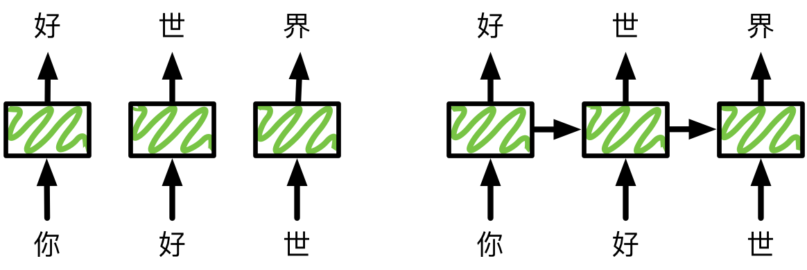
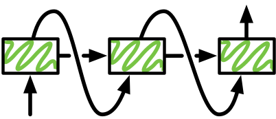

# 循环神经网络 --- 从0开始

前面的教程里我们使用的网络都属于**前馈神经网络**。之所以叫前馈，是因为整个网络是一条链（回想下`gluon.nn.Sequential`），每一层的结果都是反馈给下一层。这一节我们介绍**循环神经网络**，这里每一层不仅输出给下一层，同时还输出一个**隐含状态**，给当前层在处理下一个样本时使用。下图展示这两种网络的区别。


循环神经网络的这种结构使得它适合处理前后有依赖关系数据样本。我们拿语言模型举个例子来解释这个是怎么工作的。语言模型的任务是给定句子的前*t*个字符，然后预测第*t+1*个字符。假设我们的句子是“你好世界”，使用前馈神经网络来预测的一个做法是，在时间1输入“你”，预测”好“，时间2向同一个网络输入“好”预测“世”。下图左边展示了这个过程。



注意到一个问题是，当我们预测“世”的时候只给了“好”这个输入，而完全忽略了“你”。直觉上“你”这个词应该对这次的预测比较重要。虽然这个问题通常可以通过**n-gram**来缓解，就是说预测第*t+1*个字符的时候，我们输入前*n*个字符。如果*n=1*，那就是我们这里用的。我们可以增大*n*来使得输入含有更多信息。但我们不能任意增大*n*，因为这样通常带来模型复杂度的增加从而导致需要大量数据和计算来训练模型。

循环神经网络使用一个隐含状态来记录前面看到的数据来帮助当前预测。上图右边展示了这个过程。在预测“好”的时候，我们输出一个隐含状态。我们用这个状态和新的输入“好”来一起预测“世”，然后同时输出一个更新过的隐含状态。我们希望前面的信息能够保存在这个隐含状态里，从而提升预测效果。

## 循环神经网络

在对输入输出数据有了解后，我们来正式介绍循环神经网络。

首先回忆一下单隐含层的前馈神经网络的定义，例如[多层感知机](../chapter_supervised-learning/mlp-scratch.md)。假设隐含层的激活函数是$\phi$，对于一个样本数为$n$特征向量维度为$x$的批量数据$\mathbf{X} \in \mathbb{R}^{n \times x}$（$\mathbf{X}$是一个$n$行$x$列的实数矩阵）来说，那么这个隐含层的输出就是

$$\mathbf{H} = \phi(\mathbf{X} \mathbf{W}_{xh} + \mathbf{b}_h)$$

假定隐含层长度为$h$，其中的$\mathbf{W}_{xh} \in \mathbb{R}^{x \times h}$是权重参数。偏移参数 $\mathbf{b}_h \in \mathbb{R}^{1 \times h}$在与前一项$\mathbf{X} \mathbf{W}_{xh} \in \mathbb{R}^{n \times h}$ 相加时使用了[广播](../chapter_crashcourse/ndarray.md)。这个隐含层的输出的尺寸为$\mathbf{H} \in \mathbb{R}^{n \times h}$。

把隐含层的输出$\mathbf{H}$作为输出层的输入，最终的输出

$$\hat{\mathbf{Y}} = \text{softmax}(\mathbf{H} \mathbf{W}_{hy} + \mathbf{b}_y)$$

假定每个样本对应的输出向量维度为$y$，其中 $\hat{\mathbf{Y}} \in \mathbb{R}^{n \times y}, \mathbf{W}_{hy} \in \mathbb{R}^{h \times y}, \mathbf{b}_y \in \mathbb{R}^{1 \times y}$且两项相加使用了[广播](../chapter_crashcourse/ndarray.md)。


将上面网络改成循环神经网络，我们首先对输入输出加上时间戳$t$。假设$\mathbf{X}_t \in \mathbb{R}^{n \times x}$是序列中的第$t$个批量输入（样本数为$n$，每个样本的特征向量维度为$x$），对应的隐含层输出是隐含状态$\mathbf{H}_t  \in \mathbb{R}^{n \times h}$（隐含层长度为$h$），而对应的最终输出是$\hat{\mathbf{Y}}_t \in \mathbb{R}^{n \times y}$（每个样本对应的输出向量维度为$y$）。在计算隐含层的输出的时候，循环神经网络只需要在前馈神经网络基础上加上跟前一时间$t-1$输入隐含层$\mathbf{H}_{t-1} \in \mathbb{R}^{n \times h}$的加权和。为此，我们引入一个新的可学习的权重$\mathbf{W}_{hh} \in \mathbb{R}^{h \times h}$：

$$\mathbf{H}_t = \phi(\mathbf{X}_t \mathbf{W}_{xh} + \mathbf{H}_{t-1} \mathbf{W}_{hh}  + \mathbf{b}_h)$$

输出的计算跟前面一致：

$$\hat{\mathbf{Y}}_t = \text{softmax}(\mathbf{H}_t \mathbf{W}_{hy}  + \mathbf{b}_y)$$

一开始我们提到过，隐含状态可以认为是这个网络的记忆。该网络中，时刻$t$的隐含状态就是该时刻的隐含层变量$\mathbf{H}_t$。它存储前面时间里面的信息。我们的输出是只基于这个状态。最开始的隐含状态里的元素通常会被初始化为0。


## 周杰伦歌词数据集


为了实现并展示循环神经网络，我们使用周杰伦歌词数据集来训练模型作词。该数据集里包含了著名创作型歌手周杰伦从第一张专辑《Jay》到第十张专辑《跨时代》所有歌曲的歌词。


下面我们读取这个数据并看看前面49个字符（char）是什么样的：

```{.python .input  n=1}
import zipfile
with zipfile.ZipFile('../data/jaychou_lyrics.txt.zip', 'r') as zin:
    zin.extractall('../data/')

with open('../data/jaychou_lyrics.txt') as f:
    corpus_chars = f.read()
print(corpus_chars[0:49])
```

我们看一下数据集里的字符数。

```{.python .input  n=2}
len(corpus_chars)
```

接着我们稍微处理下数据集。为了打印方便，我们把换行符替换成空格，然后截去后面一段使得接下来的训练会快一点。

```{.python .input  n=3}
corpus_chars = corpus_chars.replace('\n', ' ').replace('\r', ' ')
corpus_chars = corpus_chars[0:20000]
```

## 字符的数值表示

先把数据里面所有不同的字符拿出来做成一个字典：

```{.python .input  n=4}
idx_to_char = list(set(corpus_chars))
char_to_idx = dict([(char, i) for i, char in enumerate(idx_to_char)])

vocab_size = len(char_to_idx)

print('vocab size:', vocab_size)
```

然后可以把每个字符转成从0开始的索引(index)来方便之后的使用。

```{.python .input  n=5}
corpus_indices = [char_to_idx[char] for char in corpus_chars]

sample = corpus_indices[:40]

print('chars: \n', ''.join([idx_to_char[idx] for idx in sample]))
print('\nindices: \n', sample)
```

## 时序数据的批量采样

同之前一样我们需要每次随机读取一些（`batch_size`个）样本和其对用的标号。这里的样本跟前面有点不一样，这里一个样本通常包含一系列连续的字符（前馈神经网络里可能每个字符作为一个样本）。

如果我们把序列长度（`num_steps`）设成5，那么一个可能的样本是“想要有直升”。其对应的标号仍然是长为5的序列，每个字符是对应的样本里字符的后面那个。例如前面样本的标号就是“要有直升机”。


### 随机批量采样

下面代码每次从数据里随机采样一个批量。

```{.python .input  n=6}
import random
from mxnet import nd

def data_iter_random(corpus_indices, batch_size, num_steps, ctx=None):
    # 减一是因为label的索引是相应data的索引加一
    num_examples = (len(corpus_indices) - 1) // num_steps
    epoch_size = num_examples // batch_size
    # 随机化样本
    example_indices = list(range(num_examples))
    random.shuffle(example_indices)

    # 返回num_steps个数据
    def _data(pos):
        return corpus_indices[pos: pos + num_steps]

    for i in range(epoch_size):
        # 每次读取batch_size个随机样本
        i = i * batch_size
        batch_indices = example_indices[i: i + batch_size]
        data = nd.array(
            [_data(j * num_steps) for j in batch_indices], ctx=ctx)
        label = nd.array(
            [_data(j * num_steps + 1) for j in batch_indices], ctx=ctx)
        yield data, label
```

为了便于理解时序数据上的随机批量采样，让我们输入一个从0到29的人工序列，看下读出来长什么样：

```{.python .input  n=7}
my_seq = list(range(30))

for data, label in data_iter_random(my_seq, batch_size=2, num_steps=3):
    print('data: ', data, '\nlabel:', label, '\n')
```

由于各个采样在原始序列上的位置是随机的时序长度为`num_steps`的连续数据点，相邻的两个随机批量在原始序列上的位置不一定相毗邻。因此，在训练模型时，读取每个随机时序批量前需要重新初始化隐含状态。


### 相邻批量采样

除了对原序列做随机批量采样之外，我们还可以使相邻的两个随机批量在原始序列上的位置相毗邻。

```{.python .input  n=8}
def data_iter_consecutive(corpus_indices, batch_size, num_steps, ctx=None):
    corpus_indices = nd.array(corpus_indices, ctx=ctx)
    data_len = len(corpus_indices)
    batch_len = data_len // batch_size

    indices = corpus_indices[0: batch_size * batch_len].reshape((
        batch_size, batch_len))
    # 减一是因为label的索引是相应data的索引加一
    epoch_size = (batch_len - 1) // num_steps
    
    for i in range(epoch_size):
        i = i * num_steps
        data = indices[:, i: i + num_steps]
        label = indices[:, i + 1: i + num_steps + 1]
        yield data, label
```

相同地，为了便于理解时序数据上的相邻批量采样，让我们输入一个从0到29的人工序列，看下读出来长什么样：

```{.python .input  n=9}
my_seq = list(range(30))

for data, label in data_iter_consecutive(my_seq, batch_size=2, num_steps=3):
    print('data: ', data, '\nlabel:', label, '\n')
```

由于各个采样在原始序列上的位置是毗邻的时序长度为`num_steps`的连续数据点，因此，使用相邻批量采样训练模型时，读取每个时序批量前，我们需要将该批量最开始的隐含状态设为上个批量最终输出的隐含状态。在同一个epoch中，隐含状态只需要在该epoch开始的时候初始化。


## One-hot向量

注意到每个字符现在是用一个整数来表示，而输入进网络我们需要一个定长的向量。一个常用的办法是使用one-hot来将其表示成向量。也就是说，如果一个字符的整数值是$i$, 那么我们创建一个全0的长为`vocab_size`的向量，并将其第$i$位设成1。该向量就是对原字符的one-hot向量。

```{.python .input  n=10}
nd.one_hot(nd.array([0, 2]), vocab_size)
```

记得前面我们每次得到的数据是一个`batch_size * num_steps`的批量。下面这个函数将其转换成`num_steps`个可以输入进网络的`batch_size * vocab_size`的矩阵。对于一个长度为`num_steps`的序列，每个批量输入$\mathbf{X} \in \mathbb{R}^{n \times x}$，其中$n=$ `batch_size`，而$x=$`vocab_size`（onehot编码向量维度）。

```{.python .input  n=11}
def get_inputs(data):
    return [nd.one_hot(X, vocab_size) for X in data.T]

inputs = get_inputs(data)

print('input length: ', len(inputs))
print('input[0] shape: ', inputs[0].shape)
```

## 初始化模型参数

对于序列中任意一个时间戳，一个字符的输入是维度为`vocab_size`的one-hot向量，对应输出是预测下一个时间戳为词典中任意字符的概率，因而该输出是维度为`vocab_size`的向量。

当序列中某一个时间戳的输入为一个样本数为`batch_size`（对应模型定义中的$n$）的批量，每个时间戳上的输入和输出皆为尺寸`batch_size * vocab_size`（对应模型定义中的$n \times x$）的矩阵。假设每个样本对应的隐含状态的长度为`hidden_dim`（对应模型定义中隐含层长度$h$），根据矩阵乘法定义，我们可以推断出模型隐含层和输出层中各个参数的尺寸。

```{.python .input  n=12}
import mxnet as mx

# 尝试使用GPU
import sys
sys.path.append('..')
import utils
ctx = utils.try_gpu()
print('Will use', ctx)

input_dim = vocab_size
# 隐含状态长度
hidden_dim = 256
output_dim = vocab_size
std = .01

def get_params():
    # 隐含层
    W_xh = nd.random_normal(scale=std, shape=(input_dim, hidden_dim), ctx=ctx)
    W_hh = nd.random_normal(scale=std, shape=(hidden_dim, hidden_dim), ctx=ctx)
    b_h = nd.zeros(hidden_dim, ctx=ctx)

    # 输出层
    W_hy = nd.random_normal(scale=std, shape=(hidden_dim, output_dim), ctx=ctx)
    b_y = nd.zeros(output_dim, ctx=ctx)

    params = [W_xh, W_hh, b_h, W_hy, b_y]
    for param in params:
        param.attach_grad()
    return params
```

## 定义模型

当序列中某一个时间戳的输入为一个样本数为`batch_size`的批量，而整个序列长度为`num_steps`时，以下`rnn`函数的`inputs`和`outputs`皆为`num_steps` 个尺寸为`batch_size * vocab_size`的矩阵，隐含变量$\mathbf{H}$是一个尺寸为`batch_size * hidden_dim`的矩阵。该隐含变量$\mathbf{H}$也是循环神经网络的隐含状态`state`。

我们将前面的模型公式翻译成代码。这里的激活函数使用了按元素操作的双曲正切函数

$$\text{tanh}(x) = \frac{1 - e^{-2x}}{1 + e^{-2x}}$$

需要注意的是，双曲正切函数的值域是$[-1, 1]$。如果自变量均匀分布在整个实域，该激活函数输出的均值为0。

```{.python .input  n=13}
def rnn(inputs, state, *params):
    # inputs: num_steps 个尺寸为 batch_size * vocab_size 矩阵。
    # H: 尺寸为 batch_size * hidden_dim 矩阵。
    # outputs: num_steps 个尺寸为 batch_size * vocab_size 矩阵。
    H = state
    W_xh, W_hh, b_h, W_hy, b_y = params
    outputs = []
    for X in inputs:
        H = nd.tanh(nd.dot(X, W_xh) + nd.dot(H, W_hh) + b_h)
        Y = nd.dot(H, W_hy) + b_y
        outputs.append(Y)
    return (outputs, H)
```

做个简单的测试：

```{.python .input  n=14}
state = nd.zeros(shape=(data.shape[0], hidden_dim), ctx=ctx)

params = get_params()
outputs, state_new = rnn(get_inputs(data.as_in_context(ctx)), state, *params)

print('output length: ',len(outputs))
print('output[0] shape: ', outputs[0].shape)
print('state shape: ', state_new.shape)
```

## 预测序列

在做预测时我们只需要给定时间0的输入和起始隐含变量。然后我们每次将上一个时间的输出作为下一个时间的输入。



```{.python .input  n=15}
def predict_rnn(rnn, prefix, num_chars, params, hidden_dim, ctx, idx_to_char,
                char_to_idx, get_inputs, is_lstm=False):
    # 预测以 prefix 开始的接下来的 num_chars 个字符。
    prefix = prefix.lower()
    state_h = nd.zeros(shape=(1, hidden_dim), ctx=ctx)
    if is_lstm:
        # 当RNN使用LSTM时才会用到，这里可以忽略。
        state_c = nd.zeros(shape=(1, hidden_dim), ctx=ctx)
    output = [char_to_idx[prefix[0]]]
    for i in range(num_chars + len(prefix)):
        X = nd.array([output[-1]], ctx=ctx)
        # 在序列中循环迭代隐含变量。
        if is_lstm:
            # 当RNN使用LSTM时才会用到，这里可以忽略。
            Y, state_h, state_c = rnn(get_inputs(X), state_h, state_c, *params)
        else:
            Y, state_h = rnn(get_inputs(X), state_h, *params)
        if i < len(prefix)-1:
            next_input = char_to_idx[prefix[i+1]]
        else:
            next_input = int(Y[0].argmax(axis=1).asscalar())
        output.append(next_input)
    return ''.join([idx_to_char[i] for i in output])
```

## 梯度剪裁

我们在[正向传播和反向传播](../chapter_supervised-learning/backprop.md)中提到，
训练神经网络往往需要依赖梯度计算的优化算法，例如我们之前介绍的[随机梯度下降](../chapter_supervised-learning/linear-regression-scratch.md)。
而在循环神经网络的训练中，当每个时序训练数据样本的时序长度`num_steps`较大或者时刻$t$较小，目标函数有关$t$时刻的隐含层变量梯度较容易出现衰减（valishing）或爆炸（explosion）。我们会在[下一节](bptt.md)详细介绍出现该现象的原因。

为了应对梯度爆炸，一个常用的做法是如果梯度特别大，那么就投影到一个比较小的尺度上。假设我们把所有梯度接成一个向量 $\boldsymbol{g}$，假设剪裁的阈值是$\theta$，那么我们这样剪裁使得$\|\boldsymbol{g}\|$不会超过$\theta$：

$$ \boldsymbol{g} = \min\left(\frac{\theta}{\|\boldsymbol{g}\|}, 1\right)\boldsymbol{g}$$

```{.python .input  n=16}
def grad_clipping(params, theta, ctx):
    if theta is not None:
        norm = nd.array([0.0], ctx)
        for p in params:
            norm += nd.sum(p.grad ** 2)
        norm = nd.sqrt(norm).asscalar()
        if norm > theta:
            for p in params:
                p.grad[:] *= theta / norm
```

## 训练模型

下面我们可以还是训练模型。跟前面前置网络的教程比，这里有以下几个不同。

1. 通常我们使用困惑度（Perplexity）这个指标。
2. 在更新前我们对梯度做剪裁。
3. 在训练模型时，对时序数据采用不同批量采样方法将导致隐含变量初始化的不同。

### 困惑度（Perplexity）

回忆以下我们之前介绍的[交叉熵损失函数](../chapter_supervised-learning/softmax-regression-scratch.md)。在语言模型中，该损失函数即被预测字符的对数似然平均值的相反数：

$$\text{loss} = -\frac{1}{N} \sum_{i=1}^N \log p_{\text{target}_i}$$

其中$N$是预测的字符总数，$p_{\text{target}_i}$是在第$i$个预测中真实的下个字符被预测的概率。

而这里的困惑度可以简单的认为就是对交叉熵做exp运算使得数值更好读。

为了解释困惑度的意义，我们先考虑一个完美结果：模型总是把真实的下个字符的概率预测为1。也就是说，对任意的$i$来说，$p_{\text{target}_i} = 1$。这种完美情况下，困惑度值为1。

我们再考虑一个基线结果：给定不重复的字符集合$W$及其字符总数$|W|$，模型总是预测下个字符为集合$W$中任一字符的概率都相同。也就是说，对任意的$i$来说，$p_{\text{target}_i} = 1/|W|$。这种基线情况下，困惑度值为$|W|$。

最后，我们可以考虑一个最坏结果：模型总是把真实的下个字符的概率预测为0。也就是说，对任意的$i$来说，$p_{\text{target}_i} = 0$。这种最坏情况下，困惑度值为正无穷。

任何一个有效模型的困惑度值必须小于预测集中元素的数量。在本例中，困惑度必须小于字典中的字符数$|W|$。如果一个模型可以取得较低的困惑度的值（更靠近1），通常情况下，该模型预测更加准确。

```{.python .input  n=17}
from mxnet import autograd
from mxnet import gluon
from math import exp
           
def train_and_predict_rnn(rnn, is_random_iter, epochs, num_steps, hidden_dim, 
                          learning_rate, clipping_theta, batch_size,
                          pred_period, pred_len, seqs, get_params, get_inputs,
                          ctx, corpus_indices, idx_to_char, char_to_idx,
                          is_lstm=False):
    if is_random_iter:
        data_iter = data_iter_random
    else:
        data_iter = data_iter_consecutive
    params = get_params()
    
    softmax_cross_entropy = gluon.loss.SoftmaxCrossEntropyLoss()

    for e in range(1, epochs + 1):
        # 如使用相邻批量采样，在同一个epoch中，隐含变量只需要在该epoch开始的时候初始化。
        if not is_random_iter:
            state_h = nd.zeros(shape=(batch_size, hidden_dim), ctx=ctx)
            if is_lstm:
                # 当RNN使用LSTM时才会用到，这里可以忽略。
                state_c = nd.zeros(shape=(batch_size, hidden_dim), ctx=ctx)
        train_loss, num_examples = 0, 0
        for data, label in data_iter(corpus_indices, batch_size, num_steps, 
                                     ctx):
            # 如使用随机批量采样，处理每个随机小批量前都需要初始化隐含变量。
            if is_random_iter:
                state_h = nd.zeros(shape=(batch_size, hidden_dim), ctx=ctx)
                if is_lstm:
                    # 当RNN使用LSTM时才会用到，这里可以忽略。
                    state_c = nd.zeros(shape=(batch_size, hidden_dim), ctx=ctx)
            with autograd.record():
                # outputs 尺寸：(batch_size, vocab_size)
                if is_lstm:
                    # 当RNN使用LSTM时才会用到，这里可以忽略。
                    outputs, state_h, state_c = rnn(get_inputs(data), state_h,
                                                    state_c, *params) 
                else:
                    outputs, state_h = rnn(get_inputs(data), state_h, *params)
                # 设t_ib_j为i时间批量中的j元素:
                # label 尺寸：（batch_size * num_steps）
                # label = [t_0b_0, t_0b_1, ..., t_1b_0, t_1b_1, ..., ]
                label = label.T.reshape((-1,))
                # 拼接outputs，尺寸：(batch_size * num_steps, vocab_size)。
                outputs = nd.concat(*outputs, dim=0)
                # 经上述操作，outputs和label已对齐。
                loss = softmax_cross_entropy(outputs, label)
            loss.backward()

            grad_clipping(params, clipping_theta, ctx)
            utils.SGD(params, learning_rate)

            train_loss += nd.sum(loss).asscalar()
            num_examples += loss.size

        if e % pred_period == 0:
            print("Epoch %d. Perplexity %f" % (e, 
                                               exp(train_loss/num_examples)))
            for seq in seqs:
                print(' - ', predict_rnn(rnn, seq, pred_len, params,
                      hidden_dim, ctx, idx_to_char, char_to_idx, get_inputs,
                      is_lstm))
            print()
```

以下定义模型参数和预测序列前缀。

```{.python .input}
epochs = 200
num_steps = 35
learning_rate = 0.1
batch_size = 32

softmax_cross_entropy = gluon.loss.SoftmaxCrossEntropyLoss()

seq1 = '分开'
seq2 = '不分开'
seq3 = '战争中部队'
seqs = [seq1, seq2, seq3]
```

我们先采用随机批量采样实验循环神经网络谱写歌词。我们假定谱写歌词的前缀分别为“分开”、“不分开”和“战争中部队”。

```{.python .input  n=18}
train_and_predict_rnn(rnn=rnn, is_random_iter=True, epochs=200, num_steps=35,
                      hidden_dim=hidden_dim, learning_rate=0.2,
                      clipping_theta=5, batch_size=32, pred_period=20,
                      pred_len=100, seqs=seqs, get_params=get_params,
                      get_inputs=get_inputs, ctx=ctx,
                      corpus_indices=corpus_indices, idx_to_char=idx_to_char,
                      char_to_idx=char_to_idx)
```

我们再采用相邻批量采样实验循环神经网络谱写歌词。

```{.python .input  n=19}
train_and_predict_rnn(rnn=rnn, is_random_iter=False, epochs=200, num_steps=35,
                      hidden_dim=hidden_dim, learning_rate=0.2,
                      clipping_theta=5, batch_size=32, pred_period=20,
                      pred_len=100, seqs=seqs, get_params=get_params,
                      get_inputs=get_inputs, ctx=ctx,
                      corpus_indices=corpus_indices, idx_to_char=idx_to_char,
                      char_to_idx=char_to_idx)
```

可以看到一开始学到简单的字符，然后简单的词，接着是复杂点的词，然后看上去似乎像个句子了。

## 结论

* 通过隐含状态，循环神经网络适合处理前后有依赖关系时序数据样本。
* 对前后有依赖关系时序数据样本批量采样时，我们可以使用随机批量采样和相邻批量采样。
* 循环神经网络较容易出现梯度衰减和爆炸。


## 练习

* 调调参数（例如数据集大小、序列长度、隐含状态长度和学习率），看看对运行时间、perplexity和预测的结果造成的影响。
* 在随机批量采样中，如果在同一个epoch中只把隐含变量在该epoch开始的时候初始化会怎么样？

**吐槽和讨论欢迎点**[这里](https://discuss.gluon.ai/t/topic/989)
