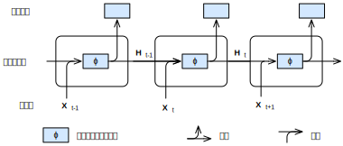
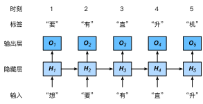

# 循环神经网络
:label:`sec_rnn`

在 :numref:`sec_language_model` 中，我们介绍了$n$元语法模型，其中单词$x_t$在时间步$t$的条件概率仅取决于前面$n-1$个单词。如果我们想将时间步$t-(n-1)$之前的单词的可能影响合并到$x_t$上，我们需要增加$n$。但是，模型参数的数量也会随之呈指数增长，因为我们需要为词表$\mathcal{V}$存储$|\mathcal{V}|^n$个数字。因此，与其建模$P(x_t \mid x_{t-1}, \ldots, x_{t-n+1})$，不如使用隐变量模型：

$$P(x_t \mid x_{t-1}, \ldots, x_1) \approx P(x_t \mid h_{t-1}),$$

其中$h_{t-1}$是*隐藏状态*（也称为隐藏变量），其存储了到时间步$t-1$的序列信息。通常，可以基于当前输入$x_{t}$和先前隐藏状态$h_{t-1}$来计算时间步$t$处的任何时间的隐藏状态：

$$h_t = f(x_{t}, h_{t-1}).$$
:eqlabel:`eq_ht_xt`

对于足够强大的函数$f$（ :eqref:`eq_ht_xt` ），隐变量模型不是近似值。毕竟，$h_t$可能只是存储到目前为止观察到的所有数据。然而，它可能会使计算和存储都变得昂贵。

回想一下，我们在 :numref:`chap_perceptrons` 中讨论过具有隐藏单元的隐藏层。值得注意的是，隐藏层和隐藏状态指的是两个截然不同的概念。如上所述，隐藏层是在从输入到输出的路径上从视图中隐藏的层。从技术上讲，隐藏状态是我们在给定步骤所做的任何事情的“输入”。隐藏状态只能通过查看先前时间点的数据来计算。

*循环神经网络*（Recurrent neural networks， RNNs）是具有隐藏状态的神经网络。在介绍RNN模型之前，我们首先回顾 :numref:`sec_mlp` 中介绍的多层感知机模型。

## 无隐藏状态的神经网络

让我们来看一看只有单隐藏层的多层感知机。设隐藏层的激活函数为$\phi$。给定小批量样本$\mathbf{X} \in \mathbb{R}^{n \times d}$，其中批量大小为$n$，输入为$d$维。隐藏层的输出$\mathbf{H} \in \mathbb{R}^{n \times h}$通过下式计算：

$$\mathbf{H} = \phi(\mathbf{X} \mathbf{W}_{xh} + \mathbf{b}_h).$$
:eqlabel:`rnn_h_without_state`

在 :eqref:`rnn_h_without_state` 中，我们有用于隐藏层的权重参数$\mathbf{W}_{xh} \in \mathbb{R}^{d \times h}$、偏置参数$\mathbf{b}_h \in \mathbb{R}^{1 \times h}$，其中隐藏单元的数目为$h$。因此，在求和期间应用广播机制（见 :numref:`subsec_broadcasting` ）。接下来，将隐藏变量$\mathbf{H}$用作输出层的输入。输出层由下式给出：

$$\mathbf{O} = \mathbf{H} \mathbf{W}_{hq} + \mathbf{b}_q,$$

其中，$\mathbf{O} \in \mathbb{R}^{n \times q}$是输出变量，$\mathbf{W}_{hq} \in \mathbb{R}^{h \times q}$是权重参数，$\mathbf{b}_q \in \mathbb{R}^{1 \times q}$是输出层的偏置参数。如果是分类问题，我们可以用$\text{softmax}(\mathbf{O})$来计算输出类别的概率分布。

这完全类似于我们之前在 :numref:`sec_sequence` 中解决的回归问题，因此我们省略了细节。可以说，我们可以随机选择特征-标签对，并通过自动微分和随机梯度下降来学习网络参数。

## 具有隐藏状态的循环神经网络
:label:`subsec_rnn_w_hidden_states`

当我们有隐藏状态时，情况就完全不同了。让我们更详细地看看这个结构。

假设我们在时间步$t$有小批量输入$\mathbf{X}_t \in \mathbb{R}^{n \times d}$。换言之，对于$n$个序列样本的小批量，$\mathbf{X}_t$的每行对应于来自该序列的时间步$t$处的一个样本。接下来，用$\mathbf{H}_t  \in \mathbb{R}^{n \times h}$表示时间步$t$的隐藏变量。与最大似然算法不同的是，这里我们保存了前一个时间步的隐藏变量$\mathbf{H}_{t-1}$，并引入了一个新的权重参数$\mathbf{W}_{hh} \in \mathbb{R}^{h \times h}$来描述如何在当前时间步中使用前一个时间步的隐藏变量。具体地，当前时间步的隐藏变量计算由当前时间步的输入与前一个时间步的隐藏变量一起确定：

$$\mathbf{H}_t = \phi(\mathbf{X}_t \mathbf{W}_{xh} + \mathbf{H}_{t-1} \mathbf{W}_{hh}  + \mathbf{b}_h).$$
:eqlabel:`rnn_h_with_state`

与 :eqref:`rnn_h_without_state` 相比， :eqref:`rnn_h_with_state` 多添加了一项$\mathbf{H}_{t-1} \mathbf{W}_{hh}$，从而实例化了 :eqref:`eq_ht_xt`。从相邻时间步的隐藏变量$\mathbf{H}_t$和$\mathbf{H}_{t-1}$之间的关系可知，这些变量捕获并保留了序列直到其当前时间步的历史信息，就像神经网络的当前时间步的状态或记忆一样。因此，这样的隐藏变量被称为“隐藏状态”（hidden state）。由于隐藏状态使用与当前时间步中的前一个时间步相同的定义，因此 :eqref:`rnn_h_with_state` 的计算是*循环的*（recurrent）。因此，基于循环计算的隐状态神经网络被命名为*循环神经网络*（recurrent neural networks）。在循环神经网络中执行 :eqref:`rnn_h_with_state` 计算的层称为“循环层”（recurrent layers）。

构建循环神经网络有许多不同的方法。具有由 :eqref:`rnn_h_with_state` 定义的隐藏状态的循环神经网络非常常见。对于时间步$t$，输出层的输出类似于多层感知机中的计算：

$$\mathbf{O}_t = \mathbf{H}_t \mathbf{W}_{hq} + \mathbf{b}_q.$$

循环神经网络的参数包括隐藏层的权重$\mathbf{W}_{xh} \in \mathbb{R}^{d \times h}, \mathbf{W}_{hh} \in \mathbb{R}^{h \times h}$和偏置$\mathbf{b}_h \in \mathbb{R}^{1 \times h}$，以及输出层的权重$\mathbf{W}_{hq} \in \mathbb{R}^{h \times q}$和偏置$\mathbf{b}_q \in \mathbb{R}^{1 \times q}$。值得一提的是，即使在不同的时间步，循环神经网络也总是使用这些模型参数。因此，循环神经网络的参数开销不会随着时间步的增加而增加。

:numref:`fig_rnn`展示了在三个相邻时间步的循环神经网络计算逻辑。在任意时间步$t$，隐藏状态的计算可以被视为：1、将当前时间步$t$的输入$\mathbf{X}_t$和前一时间步$t-1$的隐藏状态$\mathbf{H}_{t-1}$连结；2、将连结结果送入带有激活函数$\phi$的全连接层。全连接层的输出是当前时间步$t$的隐藏状态$\mathbf{H}_t$。在本例中，模型参数是$\mathbf{W}_{xh}$和$\mathbf{W}_{hh}$的连结，以及$\mathbf{b}_h$的偏置，所有这些参数都来自 :eqref:`rnn_h_with_state`。当前时间步$t$、$\mathbf{H}_t$的隐藏状态将参与计算下一时间步$t+1$的隐藏状态$\mathbf{H}_{t+1}$。此外，还将$\mathbf{H}_t$送入全连接输出层，以计算当前时间步$t$的输出$\mathbf{O}_t$。


:label:`fig_rnn`

我们刚才提到，隐藏状态的计算$\mathbf{X}_t \mathbf{W}_{xh} + \mathbf{H}_{t-1} \mathbf{W}_{hh}$，相当于$\mathbf{X}_t$和$\mathbf{H}_{t-1}$连结和$\mathbf{W}_{xh}$和$\mathbf{W}_{hh}$连结的矩阵乘法。
虽然可以在数学上证明这一点，但在下面我们只使用一个简单的代码片段来说明这一点。首先，我们定义矩阵`X`、`W_xh`、`H`和`W_hh`，它们的形状分别为(3，1)、(1，4)、(3，4)和(4，4)。分别将`X`乘以`W_xh`，将`H`乘以`W_hh`，然后将这两个乘法相加，我们得到一个形状为(3，4)的矩阵。

```{.python .input}
from d2l import mxnet as d2l
from mxnet import np, npx
npx.set_np()
```

```{.python .input}
#@tab pytorch
from d2l import torch as d2l
import torch
```

```{.python .input}
#@tab tensorflow
from d2l import tensorflow as d2l
import tensorflow as tf
```

```{.python .input}
#@tab mxnet, pytorch
X, W_xh = d2l.normal(0, 1, (3, 1)), d2l.normal(0, 1, (1, 4))
H, W_hh = d2l.normal(0, 1, (3, 4)), d2l.normal(0, 1, (4, 4))
d2l.matmul(X, W_xh) + d2l.matmul(H, W_hh)
```

```{.python .input}
#@tab tensorflow
X, W_xh = d2l.normal((3, 1), 0, 1), d2l.normal((1, 4), 0, 1)
H, W_hh = d2l.normal((3, 4), 0, 1), d2l.normal((4, 4), 0, 1)
d2l.matmul(X, W_xh) + d2l.matmul(H, W_hh)
```

现在，我们沿列（轴1）连结矩阵`X`和`H`，沿行（轴0）连结矩阵`W_xh`和`W_hh`。这两个连结分别产生形状(3, 5)和形状(5, 4)的矩阵。将这两个连结的矩阵相乘，我们得到与上面相同形状(3, 4)的输出矩阵。

```{.python .input}
#@tab all
d2l.matmul(d2l.concat((X, H), 1), d2l.concat((W_xh, W_hh), 0))
```

## 基于循环神经网络的字符级语言模型

回想一下，对于 :numref:`sec_language_model` 中的语言模型。我们的目标是根据当前和过去的标记预测下一个标记，因此我们将原始序列移位一个标记作为标签。Bengio等人 :cite:`Bengio.Ducharme.Vincent.ea.2003` 首先提出使用神经网络进行语言建模。接下来，我们将说明如何使用循环神经网络来构建语言模型。设小批量大小为1，文本序列为"machine"。为了简化后续部分的训练，我们将文本标记化为字符而不是单词，并考虑使用*字符级语言模型*（character-level language model）。 :numref:`fig_rnn_train` 演示了如何通过用于字符级语言建模的循环神经网络，基于当前字符和先前字符预测下一个字符。


:label:`fig_rnn_train`

在训练过程中，我们对每个时间步长的输出层的输出进行softmax操作，然后利用交叉熵损失计算模型输出和标签之间的误差。由于隐藏层中隐藏状态的循环计算， :numref:`fig_rnn_train` 中的时间步骤3的输出$\mathbf{O}_3$由文本序列“m”、“a”和“c”确定。由于训练数据中序列的下一个字符是“h”，因此时间步3的损失将取决于基于该时间步的特征序列“m”、“a”、“c”生成的下一个字符概率分布和标签“h”。

实际上，每个标记都由一个$d$维向量表示，我们使用批量大小$n>1$。因此，输入$\mathbf X_t$在时间步$t$将是$n\times d$矩阵，这与我们在 :numref:`subsec_rnn_w_hidden_states` 中讨论的相同。

## 困惑度（Perplexity）
:label:`subsec_perplexity`

最后，让我们讨论如何度量语言模型质量，这将在后续部分中用于评估我们基于循环神经网络的模型。一种方法是检查文本有多令人惊讶。一个好的语言模型能够用高精度的标记来预测我们接下来会看到什么。考虑一下不同语言模型对短语"It is raining"提出以下续写：

1. "It is raining outside"
1. "It is raining banana tree"
1. "It is raining piouw;kcj pwepoiut"

就质量而言，例1显然是最好的。这些词是明智的，逻辑上是连贯的。虽然这个模型可能不能很准确地反映出哪个词在语义上跟在后面（“in San Francisco”和“in winter”可能是完全合理的扩展），但该模型能够捕捉到跟在后面的是哪种单词。例2产生了一个无意义的续写，这要糟糕得多。尽管如此，至少该模型已经学会了如何拼写单词以及单词之间的某种程度的相关性。最后，例3指出训练不足的模型不能很好地拟合数据。

我们可以通过计算序列的似然概率来衡量模型的质量。不幸的是，这是一个很难理解和难以比较的数字。毕竟，较短的序列比较长的序列更有可能出现，因此在托尔斯泰的巨著《战争与和平》上对该模型进行评估
不可避免地会比圣埃克苏佩里的中篇小说《小王子》产生的可能性要小得多。缺少的相当于平均数。

信息论在这里派上了用场。。我们在引入softmax回归（ :numref:`subsec_info_theory_basics` ）时定义了熵、奇异熵和交叉熵，并在[信息论的在线附录](https://d2l.ai/chapter_appendix-mathematics-for-deep-learning/information-theory.html)中讨论了更多的信息论。如果我们想压缩文本，我们可以询问在给定当前标记集的情况下预测下一个标记。一个更好的语言模型应该能让我们更准确地预测下一个标记。因此，它应该允许我们在压缩序列时花费更少的比特。所以我们可以通过一个序列中所有$n$个标记的平均交叉熵损失来衡量：

$$\frac{1}{n} \sum_{t=1}^n -\log P(x_t \mid x_{t-1}, \ldots, x_1),$$
:eqlabel:`eq_avg_ce_for_lm`

其中$P$由语言模型给出，$x_t$是在时间步$t$从该序列观察到的实际标记。这使得在不同长度的文档上的性能具有可比性。由于历史原因，自然语言处理的科学家更喜欢使用一个叫做“困惑度”（perplexity）的量。简而言之，它是 :eqref:`eq_avg_ce_for_lm` 的指数：

$$\exp\left(-\frac{1}{n} \sum_{t=1}^n \log P(x_t \mid x_{t-1}, \ldots, x_1)\right).$$

困惑度可以最好地理解为当我们决定下一个选择哪个标记时，实际选择数的调和平均数。让我们看看一些案例：

* 在最好的情况下，模型总是完美地估计标签标记的概率为1。在这种情况下，模型的困惑度为1。
* 在最坏的情况下，模型总是预测标签标记的概率为0。在这种情况下，困惑度是正无穷大。
* 在基线上，该模型预测词汇表的所有可用标记上的均匀分布。在这种情况下，困惑程度等于词表中唯一标记的数量。事实上，如果我们在没有任何压缩的情况下存储序列，这将是我们能做的最好的编码。因此，这提供了一个重要的上限，任何实际模型都必须超越这个上限。

在接下来的几节中，我们将为字符级语言模型实现循环神经网络，并使用困惑度来评估这些模型。

## 小结

* 对隐藏状态使用循环计算的神经网络称为循环神经网络（RNN）。
* 循环神经网络的隐藏状态可以捕获直到当前时间步的序列的历史信息。
* 循环神经网络模型的参数数量不会随着时间步的增加而增加。
* 我们可以使用循环神经网络创建字符级语言模型。
* 我们可以用困惑度来评价语言模型的质量。

## 练习

1. 如果我们使用循环神经网络来预测文本序列中的下一个字符，那么任意输出所需的维度是什么？
1. 为什么循环神经网络可以基于文本序列中所有先前的标记在某个时间步表示标记的条件概率？
1. 如果你反向传播一个长序列，梯度会发生什么？
1. 与本节中描述的语言模型相关的问题有哪些？

:begin_tab:`mxnet`
[Discussions](https://discuss.d2l.ai/t/2099)
:end_tab:

:begin_tab:`pytorch`
[Discussions](https://discuss.d2l.ai/t/2100)
:end_tab:

:begin_tab:`tensorflow`
[Discussions](https://discuss.d2l.ai/t/2101)
:end_tab:
