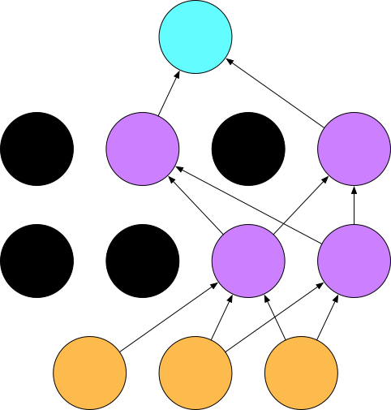

# 丢弃法（Dropout）——从零开始

前面我们介绍了多层神经网络，就是包含至少一个隐含层的网络。我们也介绍了正则法来应对过拟合问题。在深度学习中，一个常用的应对过拟合问题的方法叫做丢弃法（Dropout）。本节以多层神经网络为例，从0开始介绍丢弃法。

由于丢弃法的概念和实现非常容易，在本节中，我们先介绍丢弃法的概念以及它在现代神经网络中是如何实现的。然后我们一起探讨丢弃法的本质。


## 丢弃法的概念

在现代神经网络中，我们所指的丢弃法，通常是对输入层或者隐含层做以下操作：

* 随机选择一部分该层的输出作为丢弃元素；
* 把丢弃元素乘以0；
* 把非丢弃元素拉伸。


## 丢弃法的实现

丢弃法的实现很容易，例如像下面这样。这里的标量`drop_probability`定义了一个`X`（`NDArray`类）中任何一个元素被丢弃的概率。

```{.python .input}
from mxnet import nd

def dropout(X, drop_probability):
    keep_probability = 1 - drop_probability
    assert 0 <= keep_probability <= 1
    # 这种情况下把全部元素都丢弃。
    if keep_probability == 0:
        return X.zeros_like()
    
    # 随机选择一部分该层的输出作为丢弃元素。
    mask = nd.random.uniform(
        0, 1.0, X.shape, ctx=X.context) < keep_probability
    # 保证 E[dropout(X)] == X
    scale =  1 / keep_probability 
    return mask * X * scale
```

我们运行几个实例来验证一下。

```{.python .input}
A = nd.arange(20).reshape((5,4))
dropout(A, 0.0)
```

```{.python .input}
dropout(A, 0.5)
```

```{.python .input}
dropout(A, 1.0)
```

## 丢弃法的本质

了解了丢弃法的概念与实现，那你可能对它的本质产生了好奇。

如果你了解集成学习，你可能知道它在提升弱分类器准确率上的威力。一般来说，在集成学习里，我们可以对训练数据集有放回地采样若干次并分别训练若干个不同的分类器；测试时，把这些分类器的结果集成一下作为最终分类结果。

事实上，丢弃法在模拟集成学习。试想，一个使用了丢弃法的多层神经网络本质上是原始网络的子集（节点和边）。举个例子，它可能长这个样子。



我们在之前的章节里介绍过[随机梯度下降算法](linear-regression-scratch.md)：我们在训练神经网络模型时一般随机采样一个批量的训练数
据。丢弃法实质上是对每一个这样的数据集分别训练一个原神经网络子集的分类器。与一般的集成学习不同，这里每个原神经网络子集的分类器用的是同一套参数。因此丢弃法只是在模拟集成学习。

我们刚刚强调了，原神经网络子集的分类器在不同的训练数据批量上训练并使用同一套参数。因此，使用丢弃法的神经网络实质上是对输入层和隐含层的参数做了正则化：学到的参数使得原神经网络不同子集在训练数据上都尽可能表现良好。

下面我们动手实现一下在多层神经网络里加丢弃层。

## 数据获取

我们继续使用FashionMNIST数据集。

```{.python .input  n=1}
import sys
sys.path.append('..')
import utils
batch_size = 256
train_data, test_data = utils.load_data_fashion_mnist(batch_size)
```

## 含两个隐藏层的多层感知机

[多层感知机](mlp-scratch.md)已经在之前章节里介绍。与[之前章节](mlp-scratch.md)不同，这里我们定义一个包含两个隐含层的模型，两个隐含层都输出256个节点。我们定义激活函数Relu并直接使用Gluon提供的交叉熵损失函数。

```{.python .input  n=2}
num_inputs = 28*28
num_outputs = 10

num_hidden1 = 256
num_hidden2 = 256
weight_scale = .01

W1 = nd.random_normal(shape=(num_inputs, num_hidden1), scale=weight_scale)
b1 = nd.zeros(num_hidden1)

W2 = nd.random_normal(shape=(num_hidden1, num_hidden2), scale=weight_scale)
b2 = nd.zeros(num_hidden2)

W3 = nd.random_normal(shape=(num_hidden2, num_outputs), scale=weight_scale)
b3 = nd.zeros(num_outputs)

params = [W1, b1, W2, b2, W3, b3]

for param in params:
    param.attach_grad()
```

## 定义包含丢弃层的模型

我们的模型就是将层（全连接）和激活函数（Relu）串起来，并在应用激活函数后添加丢弃层。每个丢弃层的元素丢弃概率可以分别设置。一般情况下，我们推荐把更靠近输入层的元素丢弃概率设的更小一点。这个试验中，我们把第一层全连接后的元素丢弃概率设为0.2，把第二层全连接后的元素丢弃概率设为0.5。

```{.python .input  n=4}
drop_prob1 = 0.2
drop_prob2 = 0.5

def net(X):
    X = X.reshape((-1, num_inputs))
    # 第一层全连接。
    h1 = nd.relu(nd.dot(X, W1) + b1)
    # 在第一层全连接后添加丢弃层。
    h1 = dropout(h1, drop_prob1)
    # 第二层全连接。
    h2 = nd.relu(nd.dot(h1, W2) + b2)
    # 在第二层全连接后添加丢弃层。
    h2 = dropout(h2, drop_prob2)
    return nd.dot(h2, W3) + b3
```

## 训练

训练跟之前一样。

```{.python .input  n=8}
from mxnet import autograd
from mxnet import gluon

softmax_cross_entropy = gluon.loss.SoftmaxCrossEntropyLoss()

learning_rate = .5

for epoch in range(5):
    train_loss = 0.
    train_acc = 0.
    for data, label in train_data:
        with autograd.record():
            output = net(data)
            loss = softmax_cross_entropy(output, label)
        loss.backward()
        utils.SGD(params, learning_rate/batch_size)

        train_loss += nd.mean(loss).asscalar()
        train_acc += utils.accuracy(output, label)

    test_acc = utils.evaluate_accuracy(test_data, net)
    print("Epoch %d. Loss: %f, Train acc %f, Test acc %f" % (
        epoch, train_loss/len(train_data), 
        train_acc/len(train_data), test_acc))
```

## 总结

我们可以通过使用丢弃法对神经网络正则化。

## 练习

- 尝试不使用丢弃法，看看这个包含两个隐含层的多层感知机可以得到什么结果。
- 我们推荐把更靠近输入层的元素丢弃概率设的更小一点。想想这是为什么？如果把本节教程中的两个元素丢弃参数对调会有什么结果？

**吐槽和讨论欢迎点**[这里](https://discuss.gluon.ai/t/topic/1278)
