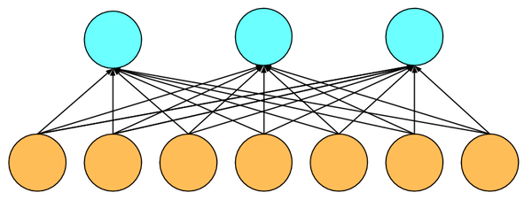

# 多类逻辑回归 --- 从0开始

如果你读过了[从0开始的线性回归](linear-regression-scratch.md)，那么最难的部分已经过去了。现在你知道如果读取和操作数据，如何构造目标函数和对它求导，如果定义损失函数，模型和求解。

下面我们来看一个稍微有意思一点的问题，如何使用多类逻辑回归进行多类分类。这个模型跟线性回归的主要区别在于输出节点从一个变成了多个。




## 获取数据

演示这个模型的常见数据集是手写数字识别MNIST，它长这个样子。


这里我们用了一个稍微复杂点的数据集，它跟MNIST非常像，但是内容不再是分类数字，而是服饰。我们通过gluon的data.vision模块自动下载这个数据。

```{.python .input  n=317}
from mxnet import gluon
from mxnet import ndarray as nd

def transform(data, label):
    return data.astype('float32')/255, label.astype('float32')
mnist_train = gluon.data.vision.FashionMNIST(train=True, transform=transform)
mnist_test = gluon.data.vision.FashionMNIST(train=False, transform=transform)
```

打印一个样本的形状和它的标号

```{.python .input  n=318}
data, label = mnist_train[0]
('example shape: ', data.shape, 'label:', label)
```

```{.json .output n=318}
[
 {
  "data": {
   "text/plain": "('example shape: ', (28, 28, 1), 'label:', 2.0)"
  },
  "execution_count": 318,
  "metadata": {},
  "output_type": "execute_result"
 }
]
```

我们画出前几个样本的内容，和对应的文本标号

```{.python .input  n=319}
import matplotlib.pyplot as plt

def show_images(images):
    n = images.shape[0]
    _, figs = plt.subplots(1, n, figsize=(15, 15))
    for i in range(n):
        figs[i].imshow(images[i].reshape((28, 28)).asnumpy())
        figs[i].axes.get_xaxis().set_visible(False)
        figs[i].axes.get_yaxis().set_visible(False)
    plt.show()

def get_text_labels(label):
    text_labels = [
        't-shirt', 'trouser', 'pullover', 'dress,', 'coat',
        'sandal', 'shirt', 'sneaker', 'bag', 'ankle boot'
    ]
    return [text_labels[int(i)] for i in label]

data, label = mnist_train[0:9]
show_images(data)
print(get_text_labels(label))
```

```{.json .output n=319}
[
 {
  "data": {
   "image/png": "iVBORw0KGgoAAAANSUhEUgAAA1oAAABkCAYAAACfOkHeAAAABHNCSVQICAgIfAhkiAAAAAlwSFlz\nAAALEgAACxIB0t1+/AAAIABJREFUeJztnXdgHNW1/8/21a5WXbKsYslF7g2MscGAAVMNCRAcINTA\nC0loIY2E5CW/hJdCXsh7pEAICYQHj1ACBEjomGIwGDdwb5JtybJk9a7V9v39cXfu9yzatSyxtrV+\n5/NHOLlezc7euXPnzpzvfI8pGo2SIAiCIAiCIAiCkDrMR3sHBEEQBEEQBEEQjjXkRksQBEEQBEEQ\nBCHFyI2WIAiCIAiCIAhCipEbLUEQBEEQBEEQhBQjN1qCIAiCIAiCIAgpRm60BEEQBEEQBEEQUozc\naAmCIAiCIAiCIKQYudESBEEQBEEQBEFIMXKjJQiCIAiCIAiCkGKsw/mw3eSIOsl9uPblmKaXOtui\n0WjhSP5W+n3kfJZ+JzoMfW8yIY5GD/rRYDG+1xRhfxZ7PBJlm+L/HrEjdtT3p2x/hsuo6/shCJTg\nu5wev459vQ4d2/pUH5l9Id0WyrTpmPe9KTOsY9619v3q/0T9+I5Uk259n5TMDMR9A0REZLKjv8Nu\ndLi5c4ixfoQ4rHM9P18PCX5Om9j/xv41xed8UmJfajLh2e6wv3uIzx8rYz4w0alj41hFQug3hyOo\nY78f54LzANqjAcRHgmOl79ORUdH3cZPKwT8azXbpuGxcq4697OLpMKnxGyaLbrOacD2ta8PPtR8Y\nxryf4vXOofb9sG60nOSmBaYlI9+r/8Msjz5bN9K/lX4fOZ+l34lS3/cmBxbtQy20999wso5tfWgP\nx9aeYVxjyRJA3D8OE1LVbasTb9ysJjCTBRNZNMg2koIJ6bD3Pd9HtoCjSHjwZw+BuptO0vHkxXt1\nXP3OBB0Xr1J95NrZots6TirRce847Ift5A4dB0Lo54of+IiIKLxr99A7NcLjMNrG/UiJHDdXx+aV\nG4iIyFpcptu6FpbqOPOZJGP9CHM453o+f1CEjQdzkhuwMDsXYue6iY2pCF+Qj/C8SYoZY94U2z+T\nHYupaDA06E/U3yX+LUPNl8fKmK//9Uwdm83qGPd34oHDlPEHdLxzz1gdT7+rSceh+v2HcxcHcaz0\nfToyGvreZMWtRJTPSwnmFN9pJ+r4nj/cr+OPByp1XOVQY7krjBvAQmuPjr/+8M06Lv/Fh4e+nzY+\n/wQO8slD41D7XqSDgiAIgiAIgiAIKWZYGS1BED4bQz2VrXn8OB3fv/BhHW/z4cn9M/XqM1U5SLt/\nu/hNHbeEM3V812uf03HmeXvwRbEnTdFUP8U+ksRleCJJP2ZgHV+hY8/jvUREtK11jG5zvo0n6Zu3\njcPfTfbquO8EFb923HO67ewtl+m4fw9UBLkm7N/Afo+Oq7+SRUREYWeBbitZgf10P8cyM/w3HkaZ\n55HEOqGSiIjcj/WijWlf2xd16rjuAjzJL/qRyiz+Zerjuu0L//NdHWc+g+/I/yBXx2tWTdHxxO9+\n9Bn2fBSQLIuVpN2ciSfC4R6VFk92zlvLkSn8/oqXdHzj2muJiCjYhmMxfgqyKhM87TretxDnCn+a\nHY0d3mgIWSxLVhY+mmxejKTvOI/DyO4l6fvn96/RcZBW6bgxpH7/ZBvkhH1R9NV+JNtpxlIcn/PP\nuULHkS07iOhTWYdQkmyiIBwqLGM9nPH0rXuf0PEOPzKy97yOtUr5DJXRqttdpNssWci+77z5Ph2f\nvfpGHduWrz/od6ciizUSJKMlCIIgCIIgCIKQYuRGSxAEQRAEQRAEIcWIdFAQjiCRxZAG1n5NyUK+\nMusD3XaW6T0d/7XpFB2XZHTruKlByaI6e+He83omXqB+uwVSqfmF+3R8xR6k1b/0xk1ERFT1GGQo\npg83YkfTQZrGpAtcksMlSXseglzw27Pe0nGpTRlVbPTg3//Sdir+/VVsu3UuJDkdlUqWtcoHU4Jx\nHkjdZp4ASRV3SVpvL9fx7RPUfvz00at0W/+1MM74wl146ff1mfgtaXFMkmApyNfx5a+sJCKiLItP\nt+3xQyLy2G3n6bh8OcbnHV98mYiIdgbx2UAWJIfNt8E8ZqL9Yx3/Y9lvdXyR+xtERDT5Jki1jgmi\n6AeTBS98h7u6B33UMmm8jvdeDelO5gltOr5l45U6vmmmmpOMF9SJiN7sxnzzz81zdJz/L8hBO7fj\nmE95QJ0XoT212LcejHMOf2E9qclHupFAMlhz70L2/zAeH+uequPmoDr/9/RDZjwnC0YXvWFICq/P\nheQw/884Vq2x00LkgkJKYWPa7IZEufFGzAfh09T889oJD+q2v/fMxr8zu8JIFsZnXa2S4JvcaIs2\n45r7VB8k+nf+6TEd7wng2vBK6ywiItpajzlu6o8gcw7VYm10uGX5ktESBEEQBEEQBEFIMYcto5UK\nG8WBi2ADyesEZW5oxLZd6omOyY/v8E3A3e6eL+LJ9LhXsA3nv46xJ5rCqGXvr2Ab/sOLYaLgiyh/\n9rYQjBJa/Dk6Lnbiie+pnl06Pv6UWiIi6o0g01Juw5OazRkwztjcCevxgTAyZF9f9I7axkI8Ef3b\najxhnfy1tfgBo9WEIcmL5TV3ztDx7TPxUv/j+xboeCCo+r5/NZ4Uf+FiGCW82InPRsci8xLxq/nk\np7f9G9rs6J/eEkypXbPxNM6zC+33nHmu2ody/PtAKwxMdo6FQUft01U6rrx8E6UrdV9FlnWeUx2T\nxzpxXjjNeNH5p9/AE0ozMzlpCKpMroVdDO6+8EkdZ5lxnN7pnabj57uP1/FPzniBiIieJJwXxwLc\n9j3Sj7oylkJcCxuuUmOpZyaulWNKUKaguQlzj7UNtSMeCJxGREQF2agx0bgP2SqTD89r27zYhmsC\n5q9t3ysydki3jX8ax5G/xM7XC9zAIZ0ZuFitZab8YKtuuzYH7i0RNs7Pcm/XsT021j9wVuq2yfbm\nhN/RH0VfnZJTreMd69UT/W23Yl40rWLqBUEYAft/CAXB7de8oONi6yc69kXVPLLcC9cWG1N6vNeG\n7O3e8x/S8f1dSgHSxzK2i907dLx2ANtrDmbrOJOpJJaNWUdERN8vxxy341XM+8/OwzYiXpj4pNoC\nnkgyWoIgCIIgCIIgCClHbrQEQRAEQRAEQRBSzGHLyx9Kyq31JkhHltyoZDtnZ23Rbb4o5FKfdyO1\nN+Xhm3Q8Zp1KQ9afj+3u/fyfdbyeSQp3L4Fs4bIH8ZLw+Be+SkREk28WOaGQer689G0db+5HrRp/\nTDrotuKF//4QJEBjHJDebPch5X2iazcREZ1tr9VtP2s+S8c5tgEdl+Z36bjND3na5l4lL9zejpdH\nv3Qi6jdtqJqk43A1q781SjFqMxERBQsgyfvbXReg3QWJX+4ONZ/YKiDZWf44pJOZTJXYx1Rm1lZ1\nzGbeBbOFlzfN0nEG66r8tZAt+6G0or61Sq5YsA8yzDYoFSkUwd9dNw3H5H0nakNFfJBIpAOOhZC2\nmkn97olOSDqCUfzmF9thGNM8AFnt/Lw6IiIKR/F8cF0H6p1l2dEn0zwwA+BSlUqbMnyILlqq20wf\nbBjOTzm6MHMIE5P0crkg58BDGHi9tWqs25gssIWZLFS+in6qX4JtRGpjL7qvg1SZzsNnHe04djao\nC6mP1fOz+NW+2npx7NpvhYlMjhOvCThfwnX4WKn9dMHPlFR7QWzuJiLa7INBzgofJJfH22FK4o1N\nEVwu2BWBCZLLjGvHem+ljvcMYK1jyM5t9+OYbYKaVhBGxLLLUfzRzcbhR31YO7gsav1tvCZBRFRg\ng2HOzGy8BvTbzkodtwU9gz67IwBTCzOTj2ez7/ZGsH7ykpIA7u3FGueUzJ063nnPRTquugXX2WgI\nMvZUIRktQRAEQRAEQRCEFCM3WoIgCIIgCIIgCCnmiFj6RE6FFOSlpyDr2xiAs5nbpGQB1UGkvJuY\nm8ifuiCb+eOV2MZt/q8REdGUyXW67efMySTXCklFqQ1ShfeY8mbD539HRESZFyHteP5lN+g4raQl\nhxNTgpomw3Sh67gBctGiN+uJiChUj7ogSR3uRqvzXRJaboYjzxjbP3TcHkS9iQkZrURE9M9G1JUo\ncUPSajND6tEWhAynMaTOhVp2rtT25ek4HMHzE7cNafVsJq3Ks6vzojwL39cXxviv/jc43024c/RL\nB9tPKtbxWXM26/iDOtT08FWhL3KuVnWrim3ok0AE02HrXyt1PKEc4/Pz85RbVytziqwoh9QnUoZx\neu/kp3W8wQeJm8EvX79Yx1MmN+h4aiZqcQXZPjXdAL1P0R8/HLS90cx3pizXsTfmjjbbUa/buIvU\nuAzUFCuwQ4u2uVtpOCNMOjgjG30VZs8NZ2dg29yl0Ba7zhxYBPlVCcrYjX7CTNNqtyf8SON3MfdY\nCX0ZtcX6oQjnQeY6zEdBN+bViB1x1KW+s30WXy5gP9jhoMwG9HXICUmhb7I6zyJ+zDF57HWAwK3Y\nJ4JRKEXTYK5PBndNvtCj1hjveifrNi6X/aAX7e8R1i+GvDbLDDl4XQByzzofpKGGJJcoXlq1pl+d\nW5fmrNNtK6+8RcdZT8BtVRAOBpfoj3fgGvRBD9xx52XW6rg7rOZZ7gboZzJCLuueYIeU/Ina+URE\ndN14jE0uGbcwl04uF3Qw91rj/Mq2Yp6pDWDNVDYJ3xeH1NESBEEQBEEQBEEY/ciNliAIgiAIgiAI\nQopJjXTQkHUlSbld/CBkIy8ylyOeAnfGJB3ldrhTlTCpX2soS8dNITj0bL7pPiIiWuvHd+8KQPZk\nZ6nJ9hDkVzwN+WqsEObxTkiEXv37X3W8tDSJRU+aydlGRAp+o6UA8obTmLvLxj1z1b9z6WCy70iz\n/u2aixQ2L8aaYUFcEXOXKnLBWacniAJ9fcyBsIDZeRljl6fgzyiEmw5vX9k2Uce72uC+M79k36B9\nNpvQx84p3YP+fTSTfQPG0OxMxIXL0Ler2yt1fEfFa0RE9GQbnAa59KbuEvz+T6ordNzsVZLBOflw\nS1o8BsVB13bgs/++9xId76yBdaEpqI5fxQzI3srdcIf8R/1cHUejOP8ymxIXaE4HlmXCBbAmqH5H\nUxhz+gQHXNUKrXDb5OdOT0idGw4z3OdO9tToOMcCmfh7fZBfccery3KUo11oPsZFWmHCdYsX2eQs\nvhzFf9sCkAbusap+b2uH7LVvFiR7fZVYDjha8T1+izovzH52LQghDuRiXDahJjpFHTh2dqc6ZoFi\nbNcoGk5EVObB+OdHJupnksI0o/5CzCdjLErqVGzFvMKlg2FCf9YNYF2026fm7HEOrIt6WRFXuzmx\nEyOXZE3LaBzU1nYhpFxZTwz1SwRBUX8JrmN5FqxJgswp15BnE0HCygsPu8xwAg+a8Hc7/XAVvLJS\nvVbEZeJhNvfx60J3EDJwLh00vpPLFnlx46vHYS36QiGKeYdbWynVSEZLEARBEARBEAQhxciNliAI\ngiAIgiAIQooZvnQwkUwwgayr5l5Ick51/VbH/+yBLGZmxn76NFsGUNC1yAYJCU+zdzDntv9sV2l2\nnkrkksM9fsilypgssTEIF0NDtvJSLwqPnpW5Db/lcbgmTrr6E+xsmsnZEmKO9Ws0cvDPfZoh5KKc\n+r8wKWcfhlz7t5T0paSmVLeF9sN9LaHLIRGZLBb2f9Szgrgic6PguOQWJx67ESYFe6NLpatDzCVw\nnBtj94APae53G1EEcEymStkvyKvVbe+14t/5d2RY0S82C6Qj/SHlWDYQYsVLfZAUjc+DW1k6iHf4\n79zUhznkigK4FmVb4dx1915VsHZWLiSAL6+cp+P7L3xExwF2/G5/5yoiipcO/u+7p+q4aibmtF37\nMO4z6tHPmfVqfLpnQEJxXi6cEtccgEPhwpJaHV//G7gY/uQf2NfRitmD8bRiAPKOibH5+fYXvqzb\nXlx2r44bmKOdL4p+m+ZWUkunCceaS64WOCAdvHM7pCBtB3Ae3XLuSiIiWlK5S7dB+Dn6MVkwV0ST\n1NU8Jwdj6ZuvXIvPZ6h+LSxlRcyZjNDRinFe/hZkiXVLVaHigXJIgmztmMfL3sY4bpsNuXPfHOYA\n5lOft7nQ1rIHkvLFiyAB3TIWDqKhA5CcphvfX/SKjpvD6rhxeWtvBAWgK1iRYi79NmSvORYcD78V\n/87h7poFVsi6DDe3BvbKxX/N/7uO7yc4HgrCwQguTCy5npGJdRt3ATSkf1zSx6XcHI8ZEr+O2Gs+\nHib7406D3PU3TorIrtXG95yVuVW3/bl1sY7z2DnSthTrp9xHRTooCIIgCIIgCIIw6pEbLUEQBEEQ\nBEEQhBQzfOmgIcsyM/lWZLAb1vOXQC64g7kAFliReuQyQSO1mKywWUcIcsECG7YRiTmc8AJ93KHQ\nxlx5eEqTf35drKBfZwjylo+tkO/sPhMyoqX5Z+o43A55le6PBH0xqhlqf7l8L9ExTzIO9v4KhYmn\n5u3V8bZGyEKumq6cZVZnQ7JJvHZxkoKc6eBEtXAsCmjzVDl3DzTc07KsGPP9rGhwhx/jsSoP0pJ5\n2WrbXvbZsS5IFWt7ULzYYcH4r8pHStxtVen2QNia8LNFTpxj2z/940YJpnmQh/nCkEPt6YUkaVsm\n5hg+hzR3K+nBvq2Q4Lnr8dzp3rqzdVzTiCKHORvVsWybjm3duuQNHb/4g7Owf+fh3HFAEUquZtXP\nuz6s1G31F6GXvzcN2+NSiOV9+L3pQGA+JElu8wodZ5tVv1Q9hmO2+yIcs0ob5tUNPhw/QxJuYe6Q\n7WE4yQaZ/HlMJsZvZxe27YzNZ1zKklaYEz8bjSyGvL3Gj7lAFykmIku3OtdbCRKy/DU4//vPRZ9V\nj8fc68pS2wvXQq4TqcCctfdSzG/2PMxv9h04NobhnWs+5jGzB1LeyU5IBF//Iiv2/vv0lQ4u80Ce\numJAOaqVWjERBE3oezOTRZXZMf4NlzQul+VrJH5t8UexPe7ebPztdh8k+t/Ph2D2/kP6NYJA9OC8\n/9Xxsx3zdczXMCe6d+t4y0A5EcWvw3kcjGDMusxY1631jiciolkeLAh7I3Au5DJDTxJXQaNQcReT\n6Lb6MCf1urC99uNwTcl9lFKOZLQEQRAEQRAEQRBSzIjraHFDgmgsk9H2VWQxmkJ4AY3XyypkGa1O\n5n9f6lBPN/lT+j4Wx9WRYHe23GffgGernKbEGS3+EjV/gqS/I4y74Pdww0zeJ5Etc5zD/i7dMlmH\nCqtdwH+jyaqGTjSE/u26Bsf/98tQh+zW1VfqOMzMMJ7apbIJ47bi5W3OoWSu+i9dQERE2etRkyhU\nO7hG1JFmsgtPYnn9kgmOFh0bRi1j7XiyXz2A7G+eAy9Ae0N4wtwWVE+WeWaX1+fKceJJcZcP47gv\ngPFvGGNUejCGeU2WIhvPaGEbo4nai3AuRpoxroL9eMr7unW6ji8rXqvjZxqUWU/OTswDFlaLL/RL\nHIcKCz7TfIL6766/T9Ftm3MQm65DNuFXs/+l46xzMYn86Fc3qM8yz5ZbcvAU8G+9qCfCX/rltf+M\nDIZ5BTPnGWX4CnAc3OyJfIFFZQMjm3botg6WmZpqT/wysp7r2fzOM34uM75vZyOOX9F6dLTtilg2\nLQN1u7YQMpajnkhi06LGk3GOFrA6ZDeegkzis7XKiMrrw1zSMQuZ2SI35g1fO7bn7VaxrRTzkc3G\nDUuwH1Yr2iPTMYeEd6vje3wRXpo/PYcdf1bjsnc8y0xSemFysNqHFvStsd7IY0/fW8I4t4MsG8Wv\nF8b47o/gmHlZ3M3WKfw6UsIyZyUWdR3NtiSuu2aZjFqL4V27E35GEIiIqv1QJPFx2uBDlrzLiXX9\nGJuqG7c/AJUNN23h2Vk3M7Uwanry7+BmGNwcpodlrPj1YHwsq7u6H0YXm/cjq3tOAQzvzl20QceH\n4wyQjJYgCIIgCIIgCEKKkRstQRAEQRAEQRCEFDNi6WA0GBjUdvO3ntexN4oUOn9xrc4PGWGmFdIw\n40X18Q7IRk52Q2bF0+wEhRMVx1KTxZZu3dbDpIVu9oJdP5MO8v0zTDmMl+eIiGxMcrhxoELHP54I\nOdB/Tb9Ux+Ft6sVXkw1p/UR9NOpIVA+LG2AkkUQaksHAuSfoth/8P7woecdm1jc+pHOtnRhyly5Q\n6dple9fptkveuUXH038C+V37aXgp3p+D5wMzrlLp3/azR9fL7byWG5fFuEwYj21B1W5OIoUqcODF\n8i4z0uO7+9Q5tGQs5Lk1XtSLy2P1hGo7kLIfmw1JkVFry8NeYh0IY+zyF1YtU5B6D+9EvZujzcQH\nYLKy445KHd941js6PsG1R8d/ajxdx2OnqLnlkYsxZi+/5w4d1y2FDO2Gs7G9Z/YqyV6/F/PHbbPf\n1TE/lvkWHD8uuci8TMlcv1eJ7d7VivqCT2+DQUe4FXMZ92+Y1K+2ffQrxiXH78E8UsEkZW3h/kGf\nNWr9EBF5Iwe/LHG5OD9fzOy5oW075Cuepz7Ucfge1WPGdYOIyFo6R8ehBtRHSycGStG/3WFI1s71\nQJYdrFB99fJ+mKrMWYjzY/kGyGyLPkC/dk5XccWJkFvW1LDxXM0MGQowXpeeDanu+05lODUQxmd5\nTanGIKRHpjFMq59mmCvL2f9brSNjzI5hddCq2VxhMWGtUGyGBNCAj3Mum8rJQBxg8sNtfkik8jPU\nMe4O45zgdM6DdDbrWJYO8nUNfyWC1xBNUIOz6ZswZylah/42r9ww6LOHhWHULD0cmOdM03GxDXLf\nt3xoP+CFjN+bxdb+MWngFCde7eA1bFsC+Dt+DfhwfyUREVVU4ZUhfm/A6yv2hTHncKlhVuy+o5qt\njfJzcE1e31up4wvyNur4AcJ6J1VIRksQBEEQBEEQBCHFyI2WIAiCIAiCIAhCihm+dDBBGtNarmRd\nhVbUjdgTKKJE+JkshNcUmuRQMrEX24/XbT/f+Dn8YQRp33PmQQ7x5naVvrQ5IXUKdLF6WV7mSlUJ\n6dTiMqTIz8hWNWy2+0p0W6EDjklc+sXrWfh/D4mDNVY+Jy3kghzjOPK0+qGkqBfOJiKiH9yPogPf\n2niZjgf6cQwsTC6YOQ2SuuNcqh7UK72zddvdi57T8ZkfoobC492otfVCA6Q+H+1V9RYm9o8u97WT\nnXDXeqkPrnT5TC5j1NHi6W4Hk+y91wQ3qFPGQOKzwavOt3d7kbrvD6G/23yQDk0vgvyygEkK93uV\nVCffxuQ77Nzk7p+hfGyPjZKjTugAftukbyNewVwSV07+vI65o9YXt6o6MrVMsuRYCunC9ye+pWM+\nL9w1/Z9EFD8PbPSh5t4bTZBfXQzzQHroPsxl3lJ1fjWX4rvXzsU8NYGGlqSMZsmgwcAYjBbuCHjH\nAUOKgz483o65dB2rH2dh1owBJp9KRIS5UvnzE7vzGU5whRZcC/rnQmblGOXSwWg48e/KLocUkrvS\nccnZJdkfExHRoytO1W0rvZDdWDIx97TPxlwQKVJy5/p2jFezC58NO3FsgzmYyxoHUNMm+I6SO384\nB9fSW4txjnWzGpYzSyEzgg9ieuArz07YbkiKea23SuYMuDuIWm+8NlxvTBbFpa4trE5oJ6sNWGFH\njbKpdsyHrthp2B3CvLg/hLVXXzmet2PLaU4imSB/DSKa+JUI7yULdHzmT1cSEdFTO9BXC76Mdca6\nGyH3jq5N7Jw8FC23QpbovhDHrLEF59r6M+4jIqKrT7lct4Xq6kf0fSOhvxKv7Vzgwjz9tBl9aNSl\nJCJylmNeN17XyTLjTOb1slwWzFVdTNp6Srla7/B6h9yB18UcCvn2uKTQuF5YmUTXakbcHcTcV26F\n+7IlB+dwuAvn3WdBMlqCIAiCIAiCIAgpRm60BEEQBEEQBEEQUszwpYMJZGW7blNOO7wQGXcC4Wm+\nbCtSiLzYniHF+bB+vG7L2cQkCcx0sH0m0uXRAfUT7FtYEeN87GN4LNKKoRBkFPu8cD5x5qr9MzNB\nDk9jcinGVj/c796KyYiIiJbmn6m+r50VMY6T49Hhg31PXCFpVkw4mTQwUeFhswedHemFhNJaCYnU\nHX97XP13+zLdNtAHuZm1EbFzGlyU7p4BZ8rV/Uoa1xPCsdvWB1ngTh+0V5t7IN+qr4VzZfG4WH+f\nCGkhrRlZGj+V7GcyDe4SZWPnyNpO5WY5P7dOt3lYAb/Z+ZAxGS6BRERlbtWfJ2ZCTrifFQzk6fF2\nJiPsCaCfM23qvFjZBnliVRZcffi57M9jx5LSi2QFOHd5lWva7z48W7dVQrVKD37nNB0vHbtFxz/e\nehERxR8P61usWON0nEdbWX/6zsB5VPCMOiavngz3N6LEkjXj/CQiikbYeWtW3x93jo8yuBMe5+Ud\nM4mIaBJBhpNhwhy7w4/znstCEsGvLZ/48dzw7qVP6vjhb+KaEoxJhjxMktJdgetMYsH76CGZNH1x\nGdxAO5icjFMYkyVnV0AOY3+WOYAtwvEqn80cX/vUtZDLwZ0u7EdoJv7O40S/fvxRFdpjh/Gvp/yP\nbuPuwPx8WpSP37Kc2IU/Deic7EjYboktAHzs2suvBXYmH88x43oRiT0L90VY8W92Tlis2AaXTW0N\n4HpZ5tpHREQuC44ZF6B6xyaWo45akrkHxkkD2YIrgUzQf/58HTdeh/784VysTx6/6UIiIpq4BTK9\nd/8XY7rqD7U6bvrKVOzGFjjzNd6hpIF/+PqfdBuXna8dgHz03vVLdDzxL9j/q76tZOfhtiMnF+QE\nMtHHT/VivpjoglS1LR9yVzMNvg9wJ5nH4woSmwafG1xSzAty8zU5X191BLAfBlnsnqMyC+vzHiYd\nDLOXIoKzJuC3vJ+aV1IkoyUIgiAIgiAIgpBi5EZLEARBEARBEAQhxYy4YDHnt194hIiI2kOD3XKI\n4iV5wSTOUbVBVTRvShGcv7afhnReKIi/y7ZBXjUmJh0bKGaFEFlxzIm5SG+GIrivrHAhhWjsd4EN\n8h4/S9VzeQqXRH7kw/fsuLeSiIiqrmXSwSNVYI59T1Ip0RD7wgstc7mgZQzENKf9a7uOf9+g0txt\nDXBosbW/1tj0AAAgAElEQVRjOE06CXK4b5TDXWrjAOSHxlgodkDKEmb3/se5anX85E4UcTX3YyxM\nzFYF7dafP0a3jVtDRwXeV9PsGDNNYeacw4qJFjqVm9EY5ijVxpx1uANhovOGF9XmMhRju0TxhQT9\nYRwfl1XtH5cLZrBxPtaGNH1vGb47LaSDh+Cg+fpO5di4aEa1btv2MVwc834JF7A/Xnu6js+armQh\nHzCJs7+MF/tGWOJAHz5w/N90fH3vDUREFPFBXpqdpNB5NJxYDhNNA7VPZimc/XgxYVOzklfV/uwk\n3Rah9Tr2ssLyeVaM5WCsIGuYycycrNDr2gFIPr6ewwpVn/NFHf+yTX3++lxMEl0nYBujXTqYjLnu\nfTpe04t+8MS5c6nz+IIKFDp/cSwcCMmGQZXnhBwnGLtu+rwYo1Z2jc3LxGfbezG/OdtwzLunqs+f\nnoHveLgbvW1jDmbcPY/STDoYyEncbhRn5qftg23o+9sL39NxdRDXVEMyyGWBXEYYZEWKT3XB9fm/\nmyCJ3j6gZITnZEFS/5EPTpuWsTh+acEQskAiIuuESh03na2kyJbPY1zdMP4VHd/36EU6fvIKSC4t\npFw6+Te4z8P10rMOx6H0cZxTW7qxjT+UKclgbRCvO/zXQ3jdouQ3KKZeFfu+T5P4Fx45+ktwHr/e\nOVPHe3twjTynGGtDJ5NlG66Bydb9ZrZu4UXLjTUhX3vzQvV8fR42o51LCo1zJsOC/flgC6Sf58zF\nKwHz7Ng/71hcfwYLEUeGZLQEQRAEQRAEQRBSzIgzWtFFqCFgIXU3u4uZF4xztOuY332WsNoR/EVn\n4271m2Vv6rZwGZ5ctrLaETz+XL6qOVNsQVagPYKnal0sg8CfhPKXT407cHcUd89dhJfwOngWwops\nD3+CWr3kISIiWkqoA5ZSYk/p48wujJfj2ePthP9OeHmeKD7rlSgD1r8MtSS+9B948rOiY7KOP9le\nSUREzkYc2/nn4QnBdUUf6PitHrz0n2lhNRRiTyv2DhTqtiXZ23T8RMtCHdvW4slmsAS/d80+lSGz\njIICT75Z5Tp+PWa2QIQXoYmIclg9iXEZKvvJDTCqB5CZe2Unnh5dM3P1oO+rDaDfPCzLu7qlQse9\nA8hBnV6Ol8ybfKo/T/Tgyf/Hffg7nlkcVcWzDoVDyCTPq1QZgPPz8ZS363JkmNofRF9QAHOF26rG\n74IyZGy/cvwKHS9yot94rZpft5yh4zHFKtM1nr2Y2x5O/NwyqblNGnDJ+E06tpnY74jVZbph7krd\n9kkA53SBFZkw/hRzODSHcZ6134xacXNixgA+di04ZyaeRteO6NuOPtMdqNv3fhfmaf6Sd7ZZzQVv\nNODF/b6JeNp70VzUb6vpxdyS61R92W7F8123A9fKYjeOV5YD81DNHHbsYoqUvUGcE3yOcZh49j4l\nQpujQjAz8dxTbFG/+8561NPb0oprxA+K3tdxbwTzUF7s73gbz2j5WF/tC8GooNCOfjbWN+UWtO3w\nI+syswR1y3CmHAUMJUIyg4sE+C48Ucdj7oTx0c1jYVR2w8s3EhHR1Nsxxp6vwfguJWSV4jAnyMKw\n/dm9DOvdG954V8ffzP9Ix9edcgURxde9KjmU72NrOnOGOvYRHzOUGKJfUkkgC2N6VibmmbWNUCe5\n2LqOr60PxFK80zJg9uQjlpFltTu5eqFuQGUAudop14rRGU5yXeBrqd6Y2d7MDNRjPXXWTh1Pc2Pc\nP9OH7NxAHuZMyWgJgiAIgiAIgiCMUuRGSxAEQRAEQRAEIcWMOEe/73akBw15Aq+F0clqefAX2prZ\ni57ZzP/+QOxFuA+Dk3RbkR0yPW6o0cm89ff584iIaCCMl+C4bz5/yTaTpRW5nDHboj7PX8zj8P3v\nZbW/uOHH+pi8qP7fT9Zt5b9IkiIeCTE51FDyoWT/nuzl+cji44iI6MDt+I3fnY5aEg/uxQu7zS04\ndvZWNXSmLYGZwO3Fy3X8VCfkhwU2pIS7WX0pc6xuwqIsbIPXzlr3ESQwkQom3ypl4yK2jSlnISXc\n/VM6KniZIYslSeE0blph9AWXtHIDjMUT0S/8ZVLjM/H1udA/03ObdbzHipR4RwDnzd4udd4QFBRx\nL41u6cfL0r6CdNMODo0xV/2lDuPbZcM5MFCIZ1BZYyBfuDhHvbB8w2s36raVuahFFvKyKTWEbRR+\nhOPXeqrq5yI3zotkUhAu/0031pySp+NzeyE1n1qmDI++vRr1Zp7sxXnPpSeBJC9RJ6KQSQ7X+SHL\n+t2sp3V898TZsQjXGaIBSkfMLpzPHlabx8/kODlsPnkvdvnzvo+TPmshpPwvbsQxyl2LuWzy1Wpu\nNVswd7ls+L5N+zFX0F7sEzdEqnujkoiItp0MU4B8JmXjNTX5fJhuhNyJz9fdQTUPl2bAIOe4STAw\naQ3jN/PXILoiqj/72Uv+ZlZvqISZFnWEIXQqd0KWbKxfGsN83YTrwlQPrhfrj+azd0PyncTgIhG/\n/D3qU912zy06vvsBvLpSRUp2P2yx3RDyvFAtjt9fz16sY/dbb+h44nOqHt3OE0b+fRHv0TUrCeRj\nv/gaudCD89cbZgZG7Lw2pHwWZgPDzY78TPrKpcQVGdwQR8HvKfhanhvFOJgRR5VD9T1/1SjA5sat\nfZi3CnOwpgxmpX7+kYyWIAiCIAiCIAhCipEbLUEQBEEQBEEQhBQzYung3+Y/rOMPvcqbnqe0udwu\nnMS2jLsLGU463GWKu+uU2ZEK53WHjDQk/w4us+IpTS6v6gwPljbmWSAh4d/NU5pcLmhhaVSjTsIf\nb0Aq++5fzKZUY8mFsxDZ1T5GvdjvKHOmsRRBptGxGA4x0auRlr1snHJMW9NdqdvuWgVnJLOVaQ7Z\nYTTSyVcUox7NZn+ZjrOZfJM7xHA3yuLYcfxXOyQrb29CLSNTPtLA7mxsLxDAuInuVsdx0vlwDvv4\nuFnY0Y+fpSNFxIoOOteFenArfKgPwaU8Rhqb153gY9dwJSQiinD3sFjf8jpau/uYJMcBqUG+E049\nIXYcOlpVOn1/BeRd2Wz8n+aBrOtN83w61qh5RslSM1oxvuvOZrLb6YghPCD6+uNfJyIiswtzXcYe\nSHIcHWh3N2EbHdPYyRNUx2HbGtTimmTDseZ1tOLcQtOgdhaH1+Pj+CcpZ01z3JyNc5pLB4fCYkos\n1WphcpELsnC9MOR2R1uOkwpMFZC+ONm1KBBhde9YTbmn2pWLq5X99Dgn3gZc86LMxtWQ2YaCOEYZ\nVsxZ5mqM/8IN2I+9VZCnRWKSut/sPVe3fWUcXCf53ONma4e0w5x4PNbEpKxfzsPrBB72WsOeIMYr\nl2cZ65osJpVq87PaiHH1PnHt52udGQ7lusbl7HztEu/Ye5SevbucZJqhXHZ7JkICafy83C2QBTed\nguvpj3bDHbbwgVU6tsyYouOo4djM3Wj9bIyZE//mqEutHSNOjHtTGNuI2PB3oVVwWL35lS/reM+y\nB4mI6Na1eJWi5quQLbfOx7Fkxn2UaFoL41DTmHfgmEe7B382ldhysWN8PV3pYa65QaynV3shpY+v\niafga/VkNXaN+aCFnRd8juASQV7bNpGT+dMtWL8UOSBr3OfFWpqv67nLYqqQjJYgCIIgCIIgCEKK\nkRstQRAEQRAEQRCEFDMs6WDU46LQgnlERDTPgeKGr/Yqx6ABltv0mRHzImI+9pW82J6RFowvOIZ0\n3m5fkY65ix0vYpYInm7kqckiO1LRhpsJTzvy7zs7C4V414VQpJg7nzQGVRqSO6pYJ1RiRz5Lejcz\ngyLHK3fA159+RDdfsfdMIiKKROFI5A0h7T47G4XaHOZaHa/tRLr9vvWnExFR1I++MTkhO4gmcYAy\nRVT7X/efgv0pWavjSQ44GfF+XdOPtPK9m5cQEVGwDY5TxKSK0Qi+u68VqWlrF5OwtKnPcLc+s+/o\nSE9CGK4UZinxfjYmeKHUC3LVOfSPNlgS9Ybw2WmeJh3zFHtLQBUb5uPPxaQ8/SGMB+4EyuNTp+1S\nf8dkOlyyss0HWdIIa8aOanrnq3khowDzgGc5ikVn7kdfZH0Nn6mpUsfnvhOf1G0/r7lAxw0NkGLm\nj4e8o9KCc2rr+koiIrrmHBQ6XvXUcdi59ZDBEitYTGlWsNjsxAkR8WGsts5R7e/6EsuzeRxJ8CzQ\nTIk1lNyh0M5ktW8MYO4InKSkyda31us2kwPnXNTP9DujnGA+ftdjXScm/ExTGH3y1h4ll2V1h2la\nASTOfYsgseRy78Y+5TbrcGKu6A9ijqk8Be5r+2dC1jVnDMb/6jYll6rbCTfInPG8ACnmJu6wZy3D\nPBTaj2KpoxVTKPH10phbnUlksU0hOPpW2iC3yjerPjJeTSCKL+zKXZD52oPLs0pi7rSt7N/59SQv\nbg3FXk04knh9FF2n1lk5PVgj+Map8dQ33qPbsmpxblvvwv623oQizJywU/UFW4bQMMxM4zCH0G9c\n4RqduVDHk56ENnfpg5cTEVHDOZDR9l+JbVi54Sk7B/gwMeIQK4adVY/xcLilgyX5mBf6mHSQuxQ3\nsNcjPu4o1/FdE18kIqLNPrRxuITVNoRknL8qkWPBmOVuhL0RXHMKY59ZmLNXt23oxest2xowF109\nFrLTkY6Ng3EMLqEEQRAEQRAEQRCOLnKjJQiCIAiCIAiCkGKGJR0MZpmofolK6z/cjbSbUXg1y+pL\n+Hdx22AFw3ixMiOV7WLWK/GFjuE+ciCANLshBzQncdThciju0MNdSwwJ1kWZKHp78vtLdfxiB9LC\nu657QMffb4ZbnlGQ7fQcbONXX0YRTvoxjZhQhpnaZ6qU6A+b4WS4vVVJnaxMlmRjRSX/2QH3PW8v\nUr4cm1OlYy1u9HWQu/qxz5rNzA0pW/3Lru1Ixd61EzIPaza2F2KyRPIhtmSpY+AphTTLbsVvsbDv\nC4Twd72ZkEv0OVS/9HDdXgNki0cSQ6LwabLMOC+8bPy3x2Secz31um1FR5WOg8w9bGpGI/4uqNzq\nulnh7rPytun4g25so3kAkguHBan3QqeSn9z38em67S+LHtXxyj64NoWdaVA0l7mrUXTo/T1rinJV\nnMTcIaffBGnSd/52g47L7Dh+v5mvXCw3+zDuJ2RD6pPlwGe/WvaejmsDkHpUnqacN984MBV/x9ys\n+N6b2O9Kg6MQRzScWOI3UKx+CZeKBJPoNbiEzZKkoLwBdyvsZ+dZnKNhq5KTxG0pPOxSpqOCnvGY\nB3lfhiKs8KcVoyYcVu2hadArNfThWtq1CtJZ2/EoZJyTMfi63uNjEmcmLdrZgmvA2n5I1G056roe\nCuA482PrY/L3AwHIkIIVKK5sSgPpYNSe+Cw1nNGaWNHgYlZwnhd55bRHlCyKr2Ma/ZDLZTMLyWIr\njkMdm28MyWAOW091smsHf11jNBDeBS2cbVfsv4fwd4Urh/7MkcY4K4u3HvRjoxq+bugJYc7xhzGv\nWtn4bGjD+VtYpcanO4EbIBFRMMktiDcmH+brdC6NdUbQnm1J7CDbHlH7+m77ZN12XA7WWh+EIVF1\nsoLvh6NeumS0BEEQBEEQBEEQUozcaAmCIAiCIAiCIKSYYUkHLa4Q5R+npDYLM+DkYTh9tAQg75vk\ngnyLu65xB7q2EGRNhnSEFx/jrmpjbJCXcTdCo7Awl07EFeNjgpsCKwpocncSowjbigE4o7x93r06\n/noFnPVeWAbLpktz4LJnpDV/WHuJbpvwGFzjqmnkhJ1EXdPUb+KF4fr61G+IdkF2wfVF0Qz0iSuX\nFXuzIRUcjLlS+QawjTjpEosjzMHKEpMoOpnsr68baWW+DU8uUruXjEdhP0fMRea1A9N1Gy96beOS\nyAwuKcRnOmLOhAPMqSqcpFDq4YapMSjC5GvcJa02BPehvX7lbOll+17hQhFA7qS4vBN9ZKTeB8L4\nOz+TStlYIUwec9fBVh+zHovBpTwFNvShOb3M7g6Jt2uUNNJWhWPzj3pIgYtPglRzWwtk0v/Zqwqu\nLiiq021fKPhYx080ozDlRi+KhNcO4LjX9ipnwkwbk9dmQ8KV9OnXMOWRR50kFZbNgcHaDC4n4e5S\nvkMSDSm46yDfRg+7XphqG+nTRCNp0JcJCHjQj93MfY7PoSt9g13kcnLg2NW2Ce66+btxvNqmoM+m\nxpwJG1ogCeLXkK4AvtvRjHkobzuOadMpap/yKyFJ3MKutyV2tH/YBmdf24EuHafDNBS1Jx7zxlom\nj8nIA0lksS1hrIuKLGoe5nNznOsgW8e0svUUl1MZa5Ny9lrGOAeuM3xNJgifhhcnr+mFJLXcjXOz\nNAOxdRvWKhNOU/P3q31Yb4yxQeLK5622IMZvmV2NT36PYGMyQn4+cEkhf8XoS1k1RERU14k58PT8\nXTq2MIfrnX685hN2HVyiPhIkoyUIgiAIgiAIgpBihpfRajBR9o/VHeiFt9yq25fNUU907yn+RLdN\nXXmNjqM7cTe7/npkin7SfLKOc23qCQw3teDmFbwe1lg77p6NF2cjLPfiY38XNDETBfZkk99V8+8x\n8CZ5OfuBqknY5w9QM6f6UfWEvODPqwb9zWfFZIuQtUj9/kvz1ul22xR15/1JO15AbqzFEwdrB35X\noI3F/MF47GVp/nMj/KmchT3ttbFsk0c9XyzMxNPRecWo2/W94td17GGmFtdXf0nHxkvbOU4cW38I\nQ9Jtw5O2bvbUtL2dZWNiv4XXcKPo0Xm5lyWVqCuC3+yLYt+m2GC+0OVQKbAaH15Cj7CsBc90zfWg\nb7f2qXohPOM10Ynt8hpwdgueQvNzq8OnMqPfmPe2buO1XPjTpciwZomjxDAzPBOLW4mIKMiejDXV\nIuv0yDkP6biEZcLPW3EbERFljsXY/NY7GNOl49rxdxmYY3jfN3aofr51JupovdyDrDn/JVH+u9Ih\ni3UIlK5Qfee9Ck8ieQYqkqRwm/EU05zEFIPX3OJZ5O4wVADhnh4aRJLM22jHj8sPtfkxJ/YF0a+v\nds4Z9He9/bgO2iexepJMkZKbjXndbVWZV/4EOMDm6TFOnB9bS/DUudWJzziLVRamh333bi+MLrgh\nQ7cfn8k79ITm6GCIocSvhd3M7IgbtpRau+jTJDOCmWBvZdvA9oy6nkREOeaB2DZwbeF1tvj1SRA+\nTa4D2dHtHVircDOMBye/oeN/RbGuD0aVouZQjI/ia2qp6wE3w+DqNF5r0ZykFpehKupncw430sv2\nYN2Zx+pyRd2pN0eSjJYgCIIgCIIgCEKKkRstQRAEQRAEQRCEFDM8UZDXR9F1W4iIaPL1aDbsDZZO\nv0y3VWzbrOOa36IOlcOENHWzn0kVYtJBnvrjcNkfl1QlqgGRLDXJt83T5UYdMI8LqcSrN+IHFtGO\nhNvrXIQXSgso9ZJBA/ueARp/herlf7/+K7p9/s1Kqjm/cJ9uqyzHi/lcErm5F/LChn6kTweC6jMe\nB6RQ/OXHfAdSqqXOwZIG3td//+QEHe/9GWoEOV+HpNQcQh2D4DJlHHDRz17Ubf9qgdTFzsww+Ave\nObnYJ39QDWEuHbTkc03NoF0+bITc2Mc8C/qF1zexszR3ICYXMV78JCLa1I8XxDNY3ZMyOyRpPpf6\nrXU+/M5CKzOLseNcCUVQ78llxfaMek9THQd02+4AJIdx51W6KdYOwTSiulH91oZNqPVTXI9j852y\nZTr2sppBno9V364qGa/bnj77jzq+9rHbdfxiKY6Pcz/mrLFr1fn1u6vO0G1TOnB84176T9MaT0TJ\nTSasb68nIqJ9QUg1+dzMTS2Gqp0VTlL0xMLmi8uzUGPuJVo0+MMm9rwxmj79PVARTNje5YPMes0A\nDFmMAjF2O5tXea3Cibj+cTxGfUzWp34f5tt+ZsqTVQijhnA++jXTqa4vLW245lvN/HqMpUhlNubD\nA0yq70SJyrRgawD9mRMzp+ByQU6xBfM374uemNmFjdBXTian6mdroSw2Z5fYYC7SElayUrMJEk9e\no9QylN5R+D9NdwDriWTrxBK23rGyaSTDpMYnX5/w8dtIkLjydb0hpeUyciczbclhUj87k53z9Wiu\nRb2aYapncuVyvFqT5cT5wu8HzA6RDgqCIAiCIAiCIIx65EZLEARBEARBEAQhxQzfT8wcS81FBqfX\nwtt2DWojIsraxd2gIPUocEBm0BZU6e3uIGQPGRakGK2mxDIyQ3LC23gqnLdH4mQmGYPaeb2vflZX\nimOyHrzL4uQyCfros5L3CCSKux8ZvE+bT1ui46YF+D1lZ0FeeHXZah3Pdar2Vla742NvpY47WXGo\nJ1bCTWbcK6qPHa+glthkgiMiJ5nyLOt9VYvt9fYZuq3QiTHBaz15bEjzBp1ID7s8Sg6xZn2Vbqtq\nx+87koSZE90nfjid5bGaJruZG5SR5ubpcTerdZLNcvCtIUhujGNSaEdfcaeqZ9sg4dzHakhMLoAz\nYSBWE43Lt2p9SKuXOiA9MaWbdPAQ3PnOn6LkZDvHQi7Z+QRklnm/xvFzFWAu6Jim/tu4Ep+9at03\ndGxlp/xJ03br+IrFGJPfcV6ntrueya9mIHbUQV4bJ2s7xuDzNHeRCkfR304TJE6RIZ4L8toqvDZQ\nfejYdFWbNAF1GtvZfMOld9tamaNpWF3nkp0eLhf6zBfENYVfhw3MFhw7fl21sxOgswfXn2zXYFni\n1g7Uril3Yr65omiNjn88DRL0kpcS7/dowtmAsTbDzmqbUS0REb3ejxpDX8nGKwmr/bjOelitLUNy\n2BV2DWojImpg1xMfO29mOzCHrPdVEhFRaxjXkFty8O8veyGtIiokQeD0BjE+xrlxnvL1e6YZnyl9\nYIOOe76pxjJfW7eHsa5zsfUOlxR6Yi7jvE4cl5f3svpbyeTlu4Nq/8reZXUZF+D8nOCBXL96APOk\n1SbSQUEQBEEQBEEQhFGP3GgJgiAIgiAIgiCkmOFLBxPJ4WIuXyY7UtdRP1KCRX/8UMeWH+Hebq4b\ncjbDlSTHjLQ4Tzd6o4i5K5XhTpLMfYoXAnQzOQmXqrSGlGxuMismm/ERK4rLONzSwKHgMsFoKBT3\nXyI4ehERlaEWLdHdCP9OxQnjxOD3VtHBJXkmh+Og/04UPy7Czaq/u1GrlbrjPt1PiXAQijQaR6CK\nGof87sON2ZJYk8OL4vI0tzEem4NwgfSz6sB7vZDyHVdQq+NXW2YSEVEWk1N6cpF255LCqYXNOrYy\nhzF7LDXPHXuqMvDZzhCkSJaBxOfWqMXMq28nPkfdVtX315RCivvrC87Vcc08/P5rF63UcV9IjfGX\nambqtjPHV+v4qgJsz2nCMdnmh+vnlIW1RER0fckHuu2nf75axyWvYD9NFoydaGKTubSFy0JS4YLG\n53Q7k5k83z1vRNsb7eQ7MT/2MGewmW7MhR4r5tu3upQMLxJBP3GDTpcDx4C7i1X3xuRk7BobDOAc\n29sF+bGJ6YytTEbY7VVSH6sd802ZB3JnLgt6thXS59xdcR6co55x/4G1zgV/vUDHof0NRER0/lb8\n5q4IfhufK3LYudAbGSx77WEOzB4zJJlFrLB6UxjXlKXu7UREdPOUs3TbYz642wrCwWjuxVp4ShbW\nyNmWxC6lES/W8IbzH197twXwmorh+E1EVGDDuqU5mENE8c7Z/BUL7kLO5Yd8nyba1H5n1MB6urkP\nv2VsRoLi9XRIbx4MG8loCYIgCIIgCIIgpBi50RIEQRAEQRAEQUgxw5cOJiKWa+OysGRMfu9aHS8e\nD1euDa1KWmNh8iYuQ7AksT5z21SaPcTSimEmjQiymLsjBUKQPvhjRXtfy4H7XfFvIQGII5pE1mJo\nMA5H3pF/fWj0SikO5fgfy7jXIQ2etwjpcy9LfxeyQnur+pVTYmcQjlKZLA3exRw49/jhitPmVbI2\npwdyEy6dLbJDQlLnRdHc/b05Oi52q7T53RvP023nT0Jh11mu/fhdB9LLdtDEiidGk0gHjX55bvtc\n3WauRX//57IndMwdH4MR5fL16PxHdFt7BDLDR1ugg82xYQysbq3Usf03ahu/+Mb52OdjsGZosuNg\nyJ+5u1p4GM/8kl0L7KzUM5eXxxe1d9OxwifvTtHxuefC8XVPPyTH1Q/Bte/O76nC8Nxhy2WBTI3D\npZyL3cod7/cWSM/y7BjbEzIg5W4O4lwJsWuv4f5bZIdc508bTtPx5+Zv1HG9DXPWbhe2gbMzPTDk\ngpzbcvboeFeQrVnY+G8MQVqVYx4sz+Kug00hzOk9TIrLpYjjYxKqiI+fB4JwaITD7Bxk80VL0JPo\n43FMeO5rRET0rTNf020zM+B4aSHuIB4a1B5mLuV8THOpcVMIMtk1/RN1PP7VpURENLkGc6PZNBn/\n7oKk8HAjGS1BEARBEARBEIQUIzdagiAIgiAIgiAIKSY10sFhMP6KTTrex9rzKHGx40PFmiQe2gcP\nHJJAKpk08DBLBoXRjzmJcnJ5HySpj75yho6rr32AiIj+bR/kZq1+uOIUsoKA3ggcPe+sUmn4bQNw\nstsZROFd7uSzvQUyoaoCpMq/NEYVBe09dYJu2/8+JEfTXXAu8+WlmetgMnkvcyPsCw6eGcqXQxZx\n9/6rdOy56ICOc5xKyvNmAyRZfevQb0zRQJVn1uqYy6gaLlX7kbEGbm2FSdzVouE01hQmlVmrvvBF\nIanl7lJcFsJncENa0hvF+A4yiaDDnFha0hLgEpcE+5RsP0c54UpIwaa4ULy4pneWjgue/ETH95x9\nDhERZb+F/vM0YNxl1MERL1K9V8dvh5RrY8+VkCruYVNCdTXk0JYuyNqIOWYG85Vks3sivnvKSzt1\nvOHNcTp+ZSscPSdXYw5MiyvsEI6nz/WjwPBUe/OgfyeKl9T2xNyWuYtmbwR9mMOk6NxhmcdveNV5\nYbIxV+gg5rpk7YJARJTxCuTAld/BGoI7Xk55H68EVRLW+FW3Kafqlwjj3jLpeB17q3Dt7CvFmPXl\nq1jdxqcAAAQvSURBVAnG2YGzPnM/5ipHJxZb1hbIkUN7anU8mSAZ1N+xFt83cwpej+AFwaOR1Oef\nJKMlCIIgCIIgCIKQYo54RksQjlX8eIebPOzFzu/nb9Xx+3fiheVpvpuJiGj7V/+o2x7uRl2zbvaU\nZboTL1bPsbcTEdGrnXhyvXcAT2qmuZGB+eFMvITKn9rcc9eVRESUTR/ptmcnLtfx3/vwgulAcXo9\n8Y+rdccw2TDdGTU0xkyAccjY/0YVt+efPlXHzWtxTB655h4iInrXO0m3rR9TqeNP2pBlfLLqOR3/\noeM4HTcVqr51L8RTuU/egSnHp35M4vY0JtFT8wWuGh3zTNcJcVld9VTfacLzQZcZn13lQ/YrjxkG\nFFuRqdlCOGfSnaobkRF6adIiHQ+UIYPn8CEzPeHKDQfd3lBVIbOe+GiITyTfhnHEclGSLu6zm/CQ\nm6oItSDTIovFGaK25soevIw/rxBzeo4V49zFipsVWIxsE58HEtf/eY95XZRasD1jrkqWrYqGjrEC\nfUJKcXZj7OWzcTXdgXVGoNNJCTEyvOy8CNcgW+7g8Qj3L6k9XILvztqLGaWaGYx1h1zsz1J/zZWM\nliAIgiAIgiAIQoqRGy1BEARBEARBEIQUI9JBQUgR5T9H7bWvvX2Ljq3bue1Lp47G/VR9/ryXr9Ft\nu76MFLa7BLK244rx4ububJVuX9VYqdv6uvB363LLdWx7Hi+h5v7PKh1zyaDB0iVf1HEoB9ubtGpo\nydCogst3mAyH13nbt2Cwc0lTRaWOKyPsmDHJ4bWbvktERM52yG0sPnxftBISist33ohtbNiBz4QG\nf7eJEsu6ouGhBF2jl6Fq/j3xk6U6/v0cVnMphGPmG4NtmFwqjrK6LtYWSAcdnfi7vJ3M5OGFNUPs\naPoI1LhxQcTLjCc2YXw5NrE/YOYMRl0zk5OJdMKJzxXeJ3oMMkmuyW5jceJ94nXUEtWZjAbZ+GAS\nWb49Pv6PhTqNO0/AvHGr6xz8w+RKHQZzMYdEY/3my8cc5GpJLAG0tsOcwNSE2mbhtvaD71QajX/h\nyON+DvPnvRlX6DgI3y6a+iEz0uF/bFyL+TzErqdxtRYDh27EknSO4NtIIOPNeQxroOWPJa4Dxs08\nUoVktARBEARBEARBEFKM3GgJgiAIgiAIgiCkGFN0GGljk8nUSkR1h293jmkqotFo4Uj+UPr9MzHi\nfieSvv+MSN8fPaTvjx4y1x8dZMwfPaTvjx7S90ePQ+r7Yd1oCYIgCIIgCIIgCEMj0kFBEARBEARB\nEIQUIzdagiAIgiAIgiAIKUZutARBEARBEARBEFKM3GgJgiAIgiAIgiCkGLnREgRBEARBEARBSDFy\noyUIgiAIgiAIgpBi5EZLEARBEARBEAQhxciNliAIgiAIgiAIQoqRGy1BEARBEARBEIQU8/8Bmit/\n0TmEW0wAAAAASUVORK5CYII=\n",
   "text/plain": "<matplotlib.figure.Figure at 0x7f7699e7e5c0>"
  },
  "metadata": {},
  "output_type": "display_data"
 },
 {
  "name": "stdout",
  "output_type": "stream",
  "text": "['pullover', 'ankle boot', 'shirt', 't-shirt', 'dress,', 'coat', 'coat', 'sandal', 'coat']\n"
 }
]
```

## 数据读取

虽然我们可以像前面那样通过`yield`来定义获取批量数据函数，这里我们直接使用gluon.data的DataLoader函数，它每次`yield`一个批量。

```{.python .input  n=320}
batch_size = 256
train_data = gluon.data.DataLoader(mnist_train, batch_size, shuffle=True)
test_data = gluon.data.DataLoader(mnist_test, batch_size, shuffle=False)
```

注意到这里我们要求每次从训练数据里读取一个由随机样本组成的批量，但测试数据则不需要这个要求。

## 初始化模型参数

跟线性模型一样，每个样本会表示成一个向量。我们这里数据是 28 * 28 大小的图片，所以输入向量的长度是 28 * 28 = 784。因为我们要做多类分类，我们需要对每一个类预测这个样本属于此类的概率。因为这个数据集有10个类型，所以输出应该是长为10的向量。这样，我们需要的权重将是一个 784 * 10 的矩阵：

```{.python .input  n=321}
num_inputs = 784
num_outputs = 10

W = nd.random_normal(shape=(num_inputs, num_outputs))
b = nd.random_normal(shape=num_outputs)

params = [W, b]
print(params)
```

```{.json .output n=321}
[
 {
  "name": "stdout",
  "output_type": "stream",
  "text": "[\n[[-3.1499455  -0.72057486 -2.19789672 ..., -0.13561046  0.0271231\n  -0.31172526]\n [-0.05862837  2.2914474   0.77115297 ..., -2.75706077 -1.10474265\n   0.73031342]\n [ 0.58125681 -0.98907238 -0.34368923 ..., -1.21590662 -0.02738994\n  -0.14839172]\n ..., \n [ 0.89813292  0.0472224  -0.99647075 ..., -1.71915317 -0.82406622\n   0.8815223 ]\n [ 0.15282029  0.86902535 -1.09175003 ..., -1.65973544 -0.78632033\n  -2.30170536]\n [ 0.54508597 -2.00527763  0.81519485 ..., -0.80274016  0.54322022\n   0.06384534]]\n<NDArray 784x10 @cpu(0)>, \n[ 0.09880264 -0.66165638  0.32853478  1.26203787 -1.33519387 -0.16991799\n -0.78083819  0.24759594  0.87623763  0.98823547]\n<NDArray 10 @cpu(0)>]\n"
 }
]
```

同之前一样，我们要对模型参数附上梯度：

```{.python .input  n=322}
for param in params:
    param.attach_grad()
```

## 定义模型

在线性回归教程里，我们只需要输出一个标量`yhat`使得尽可能的靠近目标值。但在这里的分类里，我们需要属于每个类别的概率。这些概率需要值为正，而且加起来等于1. 而如果简单的使用 $\boldsymbol{\hat y} = \boldsymbol{W} \boldsymbol{x}$, 我们不能保证这一点。一个通常的做法是通过softmax函数来将任意的输入归一化成合法的概率值。

```{.python .input  n=323}
from mxnet import nd
def softmax(X):
    exp = nd.exp(X)
    # 假设exp是矩阵，这里对行进行求和，并要求保留axis 1，
    # 就是返回 (nrows, 1) 形状的矩阵
    partition = exp.sum(axis=1, keepdims=True)
#     print(partition)
#     print(exp.shape)
    return exp / partition
```

可以看到，对于随机输入，我们将每个元素变成了非负数，而且每一行加起来为1。

```{.python .input  n=324}
# X = nd.random_normal(shape=(4,5))
# X_prob = softmax(X)
# print(X_prob)
# print(X_prob.sum(axis=1))
```

现在我们可以定义模型了：

```{.python .input  n=325}
def net(X):
    return softmax(nd.dot(X.reshape((-1,num_inputs)), W) + b)
```

## 交叉熵损失函数

我们需要定义一个针对预测为概率值的损失函数。其中最常见的是交叉熵损失函数，它将两个概率分布的负交叉熵作为目标值，最小化这个值等价于最大化这两个概率的相似度。

具体来说，我们先将真实标号表示成一个概率分布，例如如果`y=1`，那么其对应的分布就是一个除了第二个元素为1其他全为0的长为10的向量，也就是 `yvec=[0, 1, 0, 0, 0, 0, 0, 0, 0, 0]`。那么交叉熵就是`yvec[0]*log(yhat[0])+...+yvec[n]*log(yhat[n])`。注意到`yvec`里面只有一个1，那么前面等价于`log(yhat[y])`。所以我们可以定义这个损失函数了

```{.python .input  n=326}
def cross_entropy(yhat, y):
#     return - nd.pick(nd.log(yhat), y)
    return - nd.log(nd.pick(yhat, y))
```

```{.python .input  n=327}
# import math
# yhat = math.exp(1) ** (-1 * nd.arange(20).reshape((2,10)))
# y = nd.array([6,2])
# print(yhat)
# print(y)
# cross_entropy(yhat, y)
```

## 计算精度

给定一个概率输出，我们将预测概率最高的那个类作为预测的类，然后通过比较真实标号我们可以计算精度：

```{.python .input  n=328}
def accuracy(output, label):
#     print((output.argmax(axis=1)==label).shape)
    return nd.mean(output.argmax(axis=1)==label).asscalar()
```

我们可以评估一个模型在这个数据上的精度。（这两个函数我们之后也会用到，所以也都保存在[../utils.py](../utils.py)。）

```{.python .input  n=329}
def evaluate_accuracy(data_iterator, net):
    acc = 0.
    for data, label in data_iterator:
        output = net(data)
        acc += accuracy(output, label)
    return acc / len(data_iterator)
```

因为我们随机初始化了模型，所以这个模型的精度应该大概是`1/num_outputs = 0.1`.

```{.python .input  n=330}
evaluate_accuracy(test_data, net)
```

```{.json .output n=330}
[
 {
  "data": {
   "text/plain": "0.017968749999999999"
  },
  "execution_count": 330,
  "metadata": {},
  "output_type": "execute_result"
 }
]
```

## 训练

训练代码跟前面的线性回归非常相似：

```{.python .input  n=331}
import sys
sys.path.append('..')
from utils import SGD
from mxnet import autograd

learning_rate = .1

for epoch in range(5):
    train_loss = 0.
    train_acc = 0.
    for data, label in train_data:
        with autograd.record():
            output = net(data)
            loss = cross_entropy(output, label)
#             print(output)
        loss.backward()
        # 将梯度做平均，这样学习率会对batch size不那么敏感
        SGD(params, learning_rate/batch_size)

        train_loss += nd.mean(loss).asscalar()
        train_acc += accuracy(output, label)

    test_acc = evaluate_accuracy(test_data, net)
    print("Epoch %d. Loss: %f, Train acc %f, Test acc %f" % (
        epoch, train_loss/len(train_data), train_acc/len(train_data), test_acc))
```

```{.json .output n=331}
[
 {
  "name": "stdout",
  "output_type": "stream",
  "text": "Epoch 0. Loss: 3.693376, Train acc 0.452244, Test acc 0.591406\nEpoch 1. Loss: 1.941630, Train acc 0.628241, Test acc 0.649219\nEpoch 2. Loss: 1.606576, Train acc 0.672895, Test acc 0.683496\n"
 },
 {
  "ename": "KeyboardInterrupt",
  "evalue": "",
  "output_type": "error",
  "traceback": [
   "\u001b[0;31m---------------------------------------------------------------------------\u001b[0m",
   "\u001b[0;31mKeyboardInterrupt\u001b[0m                         Traceback (most recent call last)",
   "\u001b[0;32m<ipython-input-331-14ae0e7a64fa>\u001b[0m in \u001b[0;36m<module>\u001b[0;34m()\u001b[0m\n\u001b[1;32m      9\u001b[0m     \u001b[0mtrain_loss\u001b[0m \u001b[0;34m=\u001b[0m \u001b[0;36m0.\u001b[0m\u001b[0;34m\u001b[0m\u001b[0m\n\u001b[1;32m     10\u001b[0m     \u001b[0mtrain_acc\u001b[0m \u001b[0;34m=\u001b[0m \u001b[0;36m0.\u001b[0m\u001b[0;34m\u001b[0m\u001b[0m\n\u001b[0;32m---> 11\u001b[0;31m     \u001b[0;32mfor\u001b[0m \u001b[0mdata\u001b[0m\u001b[0;34m,\u001b[0m \u001b[0mlabel\u001b[0m \u001b[0;32min\u001b[0m \u001b[0mtrain_data\u001b[0m\u001b[0;34m:\u001b[0m\u001b[0;34m\u001b[0m\u001b[0m\n\u001b[0m\u001b[1;32m     12\u001b[0m         \u001b[0;32mwith\u001b[0m \u001b[0mautograd\u001b[0m\u001b[0;34m.\u001b[0m\u001b[0mrecord\u001b[0m\u001b[0;34m(\u001b[0m\u001b[0;34m)\u001b[0m\u001b[0;34m:\u001b[0m\u001b[0;34m\u001b[0m\u001b[0m\n\u001b[1;32m     13\u001b[0m             \u001b[0moutput\u001b[0m \u001b[0;34m=\u001b[0m \u001b[0mnet\u001b[0m\u001b[0;34m(\u001b[0m\u001b[0mdata\u001b[0m\u001b[0;34m)\u001b[0m\u001b[0;34m\u001b[0m\u001b[0m\n",
   "\u001b[0;32m~/miniconda3/envs/gluon/lib/python3.6/site-packages/mxnet/gluon/data/dataloader.py\u001b[0m in \u001b[0;36m__iter__\u001b[0;34m(self)\u001b[0m\n\u001b[1;32m     90\u001b[0m     \u001b[0;32mdef\u001b[0m \u001b[0m__iter__\u001b[0m\u001b[0;34m(\u001b[0m\u001b[0mself\u001b[0m\u001b[0;34m)\u001b[0m\u001b[0;34m:\u001b[0m\u001b[0;34m\u001b[0m\u001b[0m\n\u001b[1;32m     91\u001b[0m         \u001b[0;32mfor\u001b[0m \u001b[0mbatch\u001b[0m \u001b[0;32min\u001b[0m \u001b[0mself\u001b[0m\u001b[0;34m.\u001b[0m\u001b[0m_batch_sampler\u001b[0m\u001b[0;34m:\u001b[0m\u001b[0;34m\u001b[0m\u001b[0m\n\u001b[0;32m---> 92\u001b[0;31m             \u001b[0;32myield\u001b[0m \u001b[0m_batchify\u001b[0m\u001b[0;34m(\u001b[0m\u001b[0;34m[\u001b[0m\u001b[0mself\u001b[0m\u001b[0;34m.\u001b[0m\u001b[0m_dataset\u001b[0m\u001b[0;34m[\u001b[0m\u001b[0midx\u001b[0m\u001b[0;34m]\u001b[0m \u001b[0;32mfor\u001b[0m \u001b[0midx\u001b[0m \u001b[0;32min\u001b[0m \u001b[0mbatch\u001b[0m\u001b[0;34m]\u001b[0m\u001b[0;34m)\u001b[0m\u001b[0;34m\u001b[0m\u001b[0m\n\u001b[0m\u001b[1;32m     93\u001b[0m \u001b[0;34m\u001b[0m\u001b[0m\n\u001b[1;32m     94\u001b[0m     \u001b[0;32mdef\u001b[0m \u001b[0m__len__\u001b[0m\u001b[0;34m(\u001b[0m\u001b[0mself\u001b[0m\u001b[0;34m)\u001b[0m\u001b[0;34m:\u001b[0m\u001b[0;34m\u001b[0m\u001b[0m\n",
   "\u001b[0;32m~/miniconda3/envs/gluon/lib/python3.6/site-packages/mxnet/gluon/data/dataloader.py\u001b[0m in \u001b[0;36m<listcomp>\u001b[0;34m(.0)\u001b[0m\n\u001b[1;32m     90\u001b[0m     \u001b[0;32mdef\u001b[0m \u001b[0m__iter__\u001b[0m\u001b[0;34m(\u001b[0m\u001b[0mself\u001b[0m\u001b[0;34m)\u001b[0m\u001b[0;34m:\u001b[0m\u001b[0;34m\u001b[0m\u001b[0m\n\u001b[1;32m     91\u001b[0m         \u001b[0;32mfor\u001b[0m \u001b[0mbatch\u001b[0m \u001b[0;32min\u001b[0m \u001b[0mself\u001b[0m\u001b[0;34m.\u001b[0m\u001b[0m_batch_sampler\u001b[0m\u001b[0;34m:\u001b[0m\u001b[0;34m\u001b[0m\u001b[0m\n\u001b[0;32m---> 92\u001b[0;31m             \u001b[0;32myield\u001b[0m \u001b[0m_batchify\u001b[0m\u001b[0;34m(\u001b[0m\u001b[0;34m[\u001b[0m\u001b[0mself\u001b[0m\u001b[0;34m.\u001b[0m\u001b[0m_dataset\u001b[0m\u001b[0;34m[\u001b[0m\u001b[0midx\u001b[0m\u001b[0;34m]\u001b[0m \u001b[0;32mfor\u001b[0m \u001b[0midx\u001b[0m \u001b[0;32min\u001b[0m \u001b[0mbatch\u001b[0m\u001b[0;34m]\u001b[0m\u001b[0;34m)\u001b[0m\u001b[0;34m\u001b[0m\u001b[0m\n\u001b[0m\u001b[1;32m     93\u001b[0m \u001b[0;34m\u001b[0m\u001b[0m\n\u001b[1;32m     94\u001b[0m     \u001b[0;32mdef\u001b[0m \u001b[0m__len__\u001b[0m\u001b[0;34m(\u001b[0m\u001b[0mself\u001b[0m\u001b[0;34m)\u001b[0m\u001b[0;34m:\u001b[0m\u001b[0;34m\u001b[0m\u001b[0m\n",
   "\u001b[0;32m~/miniconda3/envs/gluon/lib/python3.6/site-packages/mxnet/gluon/data/vision.py\u001b[0m in \u001b[0;36m__getitem__\u001b[0;34m(self, idx)\u001b[0m\n\u001b[1;32m     47\u001b[0m     \u001b[0;32mdef\u001b[0m \u001b[0m__getitem__\u001b[0m\u001b[0;34m(\u001b[0m\u001b[0mself\u001b[0m\u001b[0;34m,\u001b[0m \u001b[0midx\u001b[0m\u001b[0;34m)\u001b[0m\u001b[0;34m:\u001b[0m\u001b[0;34m\u001b[0m\u001b[0m\n\u001b[1;32m     48\u001b[0m         \u001b[0;32mif\u001b[0m \u001b[0mself\u001b[0m\u001b[0;34m.\u001b[0m\u001b[0m_transform\u001b[0m \u001b[0;32mis\u001b[0m \u001b[0;32mnot\u001b[0m \u001b[0;32mNone\u001b[0m\u001b[0;34m:\u001b[0m\u001b[0;34m\u001b[0m\u001b[0m\n\u001b[0;32m---> 49\u001b[0;31m             \u001b[0;32mreturn\u001b[0m \u001b[0mself\u001b[0m\u001b[0;34m.\u001b[0m\u001b[0m_transform\u001b[0m\u001b[0;34m(\u001b[0m\u001b[0mself\u001b[0m\u001b[0;34m.\u001b[0m\u001b[0m_data\u001b[0m\u001b[0;34m[\u001b[0m\u001b[0midx\u001b[0m\u001b[0;34m]\u001b[0m\u001b[0;34m,\u001b[0m \u001b[0mself\u001b[0m\u001b[0;34m.\u001b[0m\u001b[0m_label\u001b[0m\u001b[0;34m[\u001b[0m\u001b[0midx\u001b[0m\u001b[0;34m]\u001b[0m\u001b[0;34m)\u001b[0m\u001b[0;34m\u001b[0m\u001b[0m\n\u001b[0m\u001b[1;32m     50\u001b[0m         \u001b[0;32mreturn\u001b[0m \u001b[0mself\u001b[0m\u001b[0;34m.\u001b[0m\u001b[0m_data\u001b[0m\u001b[0;34m[\u001b[0m\u001b[0midx\u001b[0m\u001b[0;34m]\u001b[0m\u001b[0;34m,\u001b[0m \u001b[0mself\u001b[0m\u001b[0;34m.\u001b[0m\u001b[0m_label\u001b[0m\u001b[0;34m[\u001b[0m\u001b[0midx\u001b[0m\u001b[0;34m]\u001b[0m\u001b[0;34m\u001b[0m\u001b[0m\n\u001b[1;32m     51\u001b[0m \u001b[0;34m\u001b[0m\u001b[0m\n",
   "\u001b[0;32m<ipython-input-317-dbe92c6d285e>\u001b[0m in \u001b[0;36mtransform\u001b[0;34m(data, label)\u001b[0m\n\u001b[1;32m      3\u001b[0m \u001b[0;34m\u001b[0m\u001b[0m\n\u001b[1;32m      4\u001b[0m \u001b[0;32mdef\u001b[0m \u001b[0mtransform\u001b[0m\u001b[0;34m(\u001b[0m\u001b[0mdata\u001b[0m\u001b[0;34m,\u001b[0m \u001b[0mlabel\u001b[0m\u001b[0;34m)\u001b[0m\u001b[0;34m:\u001b[0m\u001b[0;34m\u001b[0m\u001b[0m\n\u001b[0;32m----> 5\u001b[0;31m     \u001b[0;32mreturn\u001b[0m \u001b[0mdata\u001b[0m\u001b[0;34m.\u001b[0m\u001b[0mastype\u001b[0m\u001b[0;34m(\u001b[0m\u001b[0;34m'float32'\u001b[0m\u001b[0;34m)\u001b[0m\u001b[0;34m/\u001b[0m\u001b[0;36m255\u001b[0m\u001b[0;34m,\u001b[0m \u001b[0mlabel\u001b[0m\u001b[0;34m.\u001b[0m\u001b[0mastype\u001b[0m\u001b[0;34m(\u001b[0m\u001b[0;34m'float32'\u001b[0m\u001b[0;34m)\u001b[0m\u001b[0;34m\u001b[0m\u001b[0m\n\u001b[0m\u001b[1;32m      6\u001b[0m \u001b[0mmnist_train\u001b[0m \u001b[0;34m=\u001b[0m \u001b[0mgluon\u001b[0m\u001b[0;34m.\u001b[0m\u001b[0mdata\u001b[0m\u001b[0;34m.\u001b[0m\u001b[0mvision\u001b[0m\u001b[0;34m.\u001b[0m\u001b[0mFashionMNIST\u001b[0m\u001b[0;34m(\u001b[0m\u001b[0mtrain\u001b[0m\u001b[0;34m=\u001b[0m\u001b[0;32mTrue\u001b[0m\u001b[0;34m,\u001b[0m \u001b[0mtransform\u001b[0m\u001b[0;34m=\u001b[0m\u001b[0mtransform\u001b[0m\u001b[0;34m)\u001b[0m\u001b[0;34m\u001b[0m\u001b[0m\n\u001b[1;32m      7\u001b[0m \u001b[0mmnist_test\u001b[0m \u001b[0;34m=\u001b[0m \u001b[0mgluon\u001b[0m\u001b[0;34m.\u001b[0m\u001b[0mdata\u001b[0m\u001b[0;34m.\u001b[0m\u001b[0mvision\u001b[0m\u001b[0;34m.\u001b[0m\u001b[0mFashionMNIST\u001b[0m\u001b[0;34m(\u001b[0m\u001b[0mtrain\u001b[0m\u001b[0;34m=\u001b[0m\u001b[0;32mFalse\u001b[0m\u001b[0;34m,\u001b[0m \u001b[0mtransform\u001b[0m\u001b[0;34m=\u001b[0m\u001b[0mtransform\u001b[0m\u001b[0;34m)\u001b[0m\u001b[0;34m\u001b[0m\u001b[0m\n",
   "\u001b[0;32m~/miniconda3/envs/gluon/lib/python3.6/site-packages/mxnet/ndarray/ndarray.py\u001b[0m in \u001b[0;36m__truediv__\u001b[0;34m(self, other)\u001b[0m\n\u001b[1;32m    247\u001b[0m \u001b[0;34m\u001b[0m\u001b[0m\n\u001b[1;32m    248\u001b[0m     \u001b[0;32mdef\u001b[0m \u001b[0m__truediv__\u001b[0m\u001b[0;34m(\u001b[0m\u001b[0mself\u001b[0m\u001b[0;34m,\u001b[0m \u001b[0mother\u001b[0m\u001b[0;34m)\u001b[0m\u001b[0;34m:\u001b[0m\u001b[0;34m\u001b[0m\u001b[0m\n\u001b[0;32m--> 249\u001b[0;31m         \u001b[0;32mreturn\u001b[0m \u001b[0mdivide\u001b[0m\u001b[0;34m(\u001b[0m\u001b[0mself\u001b[0m\u001b[0;34m,\u001b[0m \u001b[0mother\u001b[0m\u001b[0;34m)\u001b[0m\u001b[0;34m\u001b[0m\u001b[0m\n\u001b[0m\u001b[1;32m    250\u001b[0m \u001b[0;34m\u001b[0m\u001b[0m\n\u001b[1;32m    251\u001b[0m     \u001b[0;32mdef\u001b[0m \u001b[0m__rtruediv__\u001b[0m\u001b[0;34m(\u001b[0m\u001b[0mself\u001b[0m\u001b[0;34m,\u001b[0m \u001b[0mother\u001b[0m\u001b[0;34m)\u001b[0m\u001b[0;34m:\u001b[0m\u001b[0;34m\u001b[0m\u001b[0m\n",
   "\u001b[0;32m~/miniconda3/envs/gluon/lib/python3.6/site-packages/mxnet/ndarray/ndarray.py\u001b[0m in \u001b[0;36mdivide\u001b[0;34m(lhs, rhs)\u001b[0m\n\u001b[1;32m   1972\u001b[0m         \u001b[0moperator\u001b[0m\u001b[0;34m.\u001b[0m\u001b[0mtruediv\u001b[0m\u001b[0;34m,\u001b[0m\u001b[0;34m\u001b[0m\u001b[0m\n\u001b[1;32m   1973\u001b[0m         \u001b[0m_internal\u001b[0m\u001b[0;34m.\u001b[0m\u001b[0m_div_scalar\u001b[0m\u001b[0;34m,\u001b[0m\u001b[0;34m\u001b[0m\u001b[0m\n\u001b[0;32m-> 1974\u001b[0;31m         _internal._rdiv_scalar)\n\u001b[0m\u001b[1;32m   1975\u001b[0m     \u001b[0;31m# pylint: enable= no-member, protected-access\u001b[0m\u001b[0;34m\u001b[0m\u001b[0;34m\u001b[0m\u001b[0m\n\u001b[1;32m   1976\u001b[0m \u001b[0;34m\u001b[0m\u001b[0m\n",
   "\u001b[0;32m~/miniconda3/envs/gluon/lib/python3.6/site-packages/mxnet/ndarray/ndarray.py\u001b[0m in \u001b[0;36m_ufunc_helper\u001b[0;34m(lhs, rhs, fn_array, fn_scalar, lfn_scalar, rfn_scalar)\u001b[0m\n\u001b[1;32m   1726\u001b[0m                 \u001b[0;32mreturn\u001b[0m \u001b[0mrfn_scalar\u001b[0m\u001b[0;34m(\u001b[0m\u001b[0mrhs\u001b[0m\u001b[0;34m,\u001b[0m \u001b[0mfloat\u001b[0m\u001b[0;34m(\u001b[0m\u001b[0mlhs\u001b[0m\u001b[0;34m)\u001b[0m\u001b[0;34m)\u001b[0m\u001b[0;34m\u001b[0m\u001b[0m\n\u001b[1;32m   1727\u001b[0m     \u001b[0;32melif\u001b[0m \u001b[0misinstance\u001b[0m\u001b[0;34m(\u001b[0m\u001b[0mrhs\u001b[0m\u001b[0;34m,\u001b[0m \u001b[0mnumeric_types\u001b[0m\u001b[0;34m)\u001b[0m\u001b[0;34m:\u001b[0m\u001b[0;34m\u001b[0m\u001b[0m\n\u001b[0;32m-> 1728\u001b[0;31m         \u001b[0;32mreturn\u001b[0m \u001b[0mlfn_scalar\u001b[0m\u001b[0;34m(\u001b[0m\u001b[0mlhs\u001b[0m\u001b[0;34m,\u001b[0m \u001b[0mfloat\u001b[0m\u001b[0;34m(\u001b[0m\u001b[0mrhs\u001b[0m\u001b[0;34m)\u001b[0m\u001b[0;34m)\u001b[0m\u001b[0;34m\u001b[0m\u001b[0m\n\u001b[0m\u001b[1;32m   1729\u001b[0m     \u001b[0;32melif\u001b[0m \u001b[0misinstance\u001b[0m\u001b[0;34m(\u001b[0m\u001b[0mrhs\u001b[0m\u001b[0;34m,\u001b[0m \u001b[0mNDArray\u001b[0m\u001b[0;34m)\u001b[0m\u001b[0;34m:\u001b[0m\u001b[0;34m\u001b[0m\u001b[0m\n\u001b[1;32m   1730\u001b[0m         \u001b[0;32mreturn\u001b[0m \u001b[0mfn_array\u001b[0m\u001b[0;34m(\u001b[0m\u001b[0mlhs\u001b[0m\u001b[0;34m,\u001b[0m \u001b[0mrhs\u001b[0m\u001b[0;34m)\u001b[0m\u001b[0;34m\u001b[0m\u001b[0m\n",
   "\u001b[0;32m~/miniconda3/envs/gluon/lib/python3.6/site-packages/mxnet/ndarray/op.py\u001b[0m in \u001b[0;36m_div_scalar\u001b[0;34m(data, scalar, out, name, **kwargs)\u001b[0m\n",
   "\u001b[0;32m~/miniconda3/envs/gluon/lib/python3.6/site-packages/mxnet/_ctypes/ndarray.py\u001b[0m in \u001b[0;36m_imperative_invoke\u001b[0;34m(handle, ndargs, keys, vals, out)\u001b[0m\n\u001b[1;32m     95\u001b[0m         \u001b[0;32mreturn\u001b[0m \u001b[0moriginal_output\u001b[0m\u001b[0;34m\u001b[0m\u001b[0m\n\u001b[1;32m     96\u001b[0m     \u001b[0;32mif\u001b[0m \u001b[0mnum_output\u001b[0m\u001b[0;34m.\u001b[0m\u001b[0mvalue\u001b[0m \u001b[0;34m==\u001b[0m \u001b[0;36m1\u001b[0m\u001b[0;34m:\u001b[0m\u001b[0;34m\u001b[0m\u001b[0m\n\u001b[0;32m---> 97\u001b[0;31m         return _ndarray_cls(ctypes.cast(output_vars[0], NDArrayHandle),\n\u001b[0m\u001b[1;32m     98\u001b[0m                             stype=out_stypes[0])\n\u001b[1;32m     99\u001b[0m     \u001b[0;32melse\u001b[0m\u001b[0;34m:\u001b[0m\u001b[0;34m\u001b[0m\u001b[0m\n",
   "\u001b[0;31mKeyboardInterrupt\u001b[0m: "
  ]
 }
]
```

## 预测

训练完成后，现在我们可以演示对输入图片的标号的预测

```{.python .input  n=16}
data, label = mnist_test[0:9]
print(data.shape)
print(label.shape)
show_images(data)
print('true labels')
print(get_text_labels(label))

predicted_labels = net(data).argmax(axis=1)
print(net(data).max(axis=1))
print(predicted_labels)
print('predicted labels')
print(get_text_labels(predicted_labels.asnumpy()))
```

## 结论

与前面的线性回归相比，你会发现多类逻辑回归教程的结构跟其非常相似：获取数据、定义模型及优化算法和求解。事实上，几乎所有的实际神经网络应用都有着同样结构。他们的主要区别在于模型的类型和数据的规模。每一两年会有一个新的优化算法出来，但它们基本都是随机梯度下降的变种。

## 练习

尝试增大学习率，你会马上发现结果变得很糟糕，精度基本徘徊在随机的0.1左右。这是为什么呢？提示：

- 打印下output看看是不是有什么异常
- 前面线性回归还好好的，这里我们在net()里加了什么呢？
- 如果给exp输入个很大的数会怎么样？
- 即使解决exp的问题，求出来的导数是不是还是不稳定？

请仔细想想再去对比下我们小伙伴之一@[pluskid](https://github.com/pluskid)早年写的一篇[blog解释这个问题](http://freemind.pluskid.org/machine-learning/softmax-vs-softmax-loss-numerical-stability/)，看看你想的是不是不一样。

**吐槽和讨论欢迎点**[这里](https://discuss.gluon.ai/t/topic/741)

#### 练习

1. output是nan
