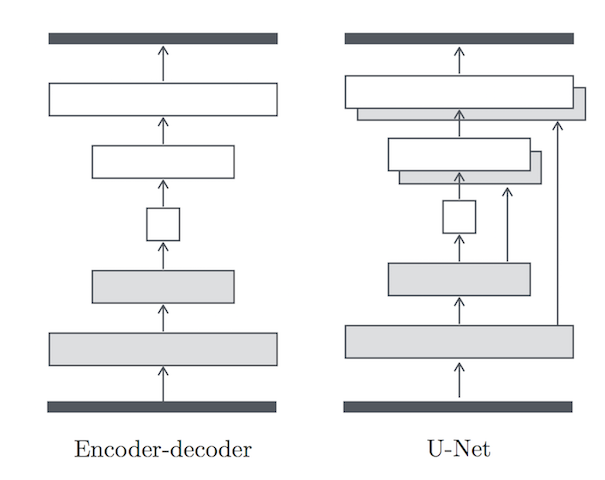

# 像素到像素的对抗式生成网络

[像素到像素的对抗式生成网络](https://arxiv.org/abs/1611.07004)使用了[条件对抗式生成网络](https://arxiv.org/abs/1411.1784)作为图像翻译问题的通用解决方案。这些网络不仅学习了从输入图像到输出图像的映射，还学习了如何通过损失函数来训练这个映射。

使用像素到像素的对抗式生成网络，使得在小型数据集上完成不同的图像翻译问题成为一种可能。在本教程中，我们将在三个图像翻译任务上进行训练：包含了400张图片的[CMP外墙数据集](http://cmp.felk.cvut.cz/%7Etylecr1/facade/)，包含了2975张城市景观图片的[城市景观数据集](https://www.cityscapes-dataset.com/)和包含了1096张从Google地图获得的地图数据集。

对于一些更难的任务，例如说[edges2shoes](http://vision.cs.utexas.edu/projects/finegrained/utzap50k/)和 [edges2handbags](https://github.com/junyanz/iGAN)，使用更大的数据集可能是有必要的，但那会花费更多的时间。你可以尝试使用[多GPU](http://zh.gluon.ai/chapter_gluon-advances/multiple-gpus-gluon.html)来进行训练。


```python
from __future__ import print_function
import os
import matplotlib as mpl
import tarfile
import matplotlib.image as mpimg
from matplotlib import pyplot as plt

import mxnet as mx
from mxnet import gluon
from mxnet import ndarray as nd
from mxnet.gluon import nn, utils
from mxnet.gluon.nn import Dense, Activation, Conv2D, Conv2DTranspose, \
    BatchNorm, LeakyReLU, Flatten, HybridSequential, HybridBlock, Dropout
from mxnet import autograd
import numpy as np
```

## 设置训练参数


```python
epochs = 100
batch_size = 10

use_gpu = True
ctx = mx.gpu() if use_gpu else mx.cpu()

lr = 0.0002
beta1 = 0.5
lambda1 = 100

pool_size = 50
```

## 下载和处理数据集

我们首先在外墙数据集上进行训练。需要将数据集中的图片切割成输入图片和输出图片两部分。你也可以通过设置 ```is-reversed=True``` 来翻转输入和输出的模式。


```python
dataset = 'facades'
```

我们首先将图片缩放到 512*256 像素，然后将像素值归一化到 [-1, 1] 之间。


```python
img_wd = 256
img_ht = 256
train_img_path = '%s/train' % (dataset)
val_img_path = '%s/val' % (dataset)

def download_data(dataset):
    if not os.path.exists(dataset):
        url = 'https://people.eecs.berkeley.edu/~tinghuiz/projects/pix2pix/datasets/%s.tar.gz' % (dataset)
        os.mkdir(dataset)
        data_file = utils.download(url)
        with tarfile.open(data_file) as tar:
            tar.extractall(path='.')
        os.remove(data_file)

def load_data(path, batch_size, is_reversed=False):
    img_in_list = []
    img_out_list = []
    for path, _, fnames in os.walk(path):
        for fname in fnames:
            if not fname.endswith('.jpg'):
                continue
            img = os.path.join(path, fname)
            img_arr = mx.image.imread(img).astype(np.float32)/127.5 - 1
            img_arr = mx.image.imresize(img_arr, img_wd * 2, img_ht)
            # Crop input and output images
            img_arr_in, img_arr_out = [mx.image.fixed_crop(img_arr, 0, 0, img_wd, img_ht),
                                       mx.image.fixed_crop(img_arr, img_wd, 0, img_wd, img_ht)]
            img_arr_in, img_arr_out = [nd.transpose(img_arr_in, (2,0,1)), 
                                       nd.transpose(img_arr_out, (2,0,1))]
            img_arr_in, img_arr_out = [img_arr_in.reshape((1,) + img_arr_in.shape), 
                                       img_arr_out.reshape((1,) + img_arr_out.shape)]
            img_in_list.append(img_arr_out if is_reversed else img_arr_in)
            img_out_list.append(img_arr_in if is_reversed else img_arr_out)

    return mx.io.NDArrayIter(data=[nd.concat(*img_in_list, dim=0), nd.concat(*img_out_list, dim=0)], 
                             batch_size=batch_size)

download_data(dataset)
train_data = load_data(train_img_path, batch_size, is_reversed=True)
val_data = load_data(val_img_path, batch_size, is_reversed=True)
```

可视化其中四张图片：


```python
def visualize(img_arr):
    plt.imshow(((img_arr.asnumpy().transpose(1, 2, 0) + 1.0) * 127.5).astype(np.uint8))
    plt.axis('off')

def preview_train_data():
    img_in_list, img_out_list = train_data.next().data
    for i in range(4):
        plt.subplot(2,4,i+1)
        visualize(img_in_list[i])
        plt.subplot(2,4,i+5)
        visualize(img_out_list[i])
    plt.show()
    
preview_train_data()
```

## 设计网络

生成模型和判别模型均使用了**卷积-批量标准化-Relu**模块。

生成模型的关键在于使用[U-net](https://lmb.informatik.uni-freiburg.de/people/ronneber/u-net/)的结果；在U-net中一些跨层连接将输入图像的低层次信息共享给输出图像。



本教程使用了PatchGAN作为判别模型，它仅在patch大小的范围上运行。换句话说，这种判别模型每次只区分一张图像中N × N大小的区域是真实的还是伪造的。我们在图像上以卷积的形式使用这种判别模型，将得到的响应平均后作为netD的输出。


```python
# Define Unet generator skip block
class UnetSkipUnit(HybridBlock):
    def __init__(self, inner_channels, outer_channels, inner_block=None, innermost=False, outermost=False,
                 use_dropout=False, use_bias=False):
        super(UnetSkipUnit, self).__init__()
        
        with self.name_scope():
            self.outermost = outermost
            en_conv = Conv2D(channels=inner_channels, kernel_size=4, strides=2, padding=1,
                             in_channels=outer_channels, use_bias=use_bias)
            en_relu = LeakyReLU(alpha=0.2)
            en_norm = BatchNorm(momentum=0.1, in_channels=inner_channels)
            de_relu = Activation(activation='relu')
            de_norm = BatchNorm(momentum=0.1, in_channels=outer_channels)

            if innermost:
                de_conv = Conv2DTranspose(channels=outer_channels, kernel_size=4, strides=2, padding=1,
                                          in_channels=inner_channels, use_bias=use_bias)
                encoder = [en_relu, en_conv]
                decoder = [de_relu, de_conv, de_norm]
                model = encoder + decoder
            elif outermost:
                de_conv = Conv2DTranspose(channels=outer_channels, kernel_size=4, strides=2, padding=1,
                                          in_channels=inner_channels * 2)
                encoder = [en_conv]
                decoder = [de_relu, de_conv, Activation(activation='tanh')]
                model = encoder + [inner_block] + decoder
            else:
                de_conv = Conv2DTranspose(channels=outer_channels, kernel_size=4, strides=2, padding=1,
                                          in_channels=inner_channels * 2, use_bias=use_bias)
                encoder = [en_relu, en_conv, en_norm]
                decoder = [de_relu, de_conv, de_norm]
                model = encoder + [inner_block] + decoder
            if use_dropout:
                model += [Dropout(rate=0.5)]
        
            self.model = HybridSequential()
            with self.model.name_scope():
                for block in model:
                    self.model.add(block)

    def hybrid_forward(self, F, x):
        if self.outermost:
            return self.model(x)
        else:
            return F.concat(self.model(x), x, dim=1)

# Define Unet generator
class UnetGenerator(HybridBlock):
    def __init__(self, in_channels, num_downs, ngf=64, use_dropout=True):
        super(UnetGenerator, self).__init__()

        #Build unet generator structure
        unet = UnetSkipUnit(ngf * 8, ngf * 8, innermost=True)
        for _ in range(num_downs - 5):
            unet = UnetSkipUnit(ngf * 8, ngf * 8, unet, use_dropout=use_dropout)
        unet = UnetSkipUnit(ngf * 8, ngf * 4, unet)
        unet = UnetSkipUnit(ngf * 4, ngf * 2, unet)
        unet = UnetSkipUnit(ngf * 2, ngf * 1, unet)
        unet = UnetSkipUnit(ngf, in_channels, unet, outermost=True)

        with self.name_scope():
            self.model = unet

    def hybrid_forward(self, F, x):
        return self.model(x)

# Define the PatchGAN discriminator
class Discriminator(HybridBlock):
    def __init__(self, in_channels, ndf=64, n_layers=3, use_sigmoid=False, use_bias=False):
        super(Discriminator, self).__init__()
        
        with self.name_scope():
            self.model = HybridSequential()
            kernel_size = 4
            padding = int(np.ceil((kernel_size - 1)/2))
            self.model.add(Conv2D(channels=ndf, kernel_size=kernel_size, strides=2,
                                  padding=padding, in_channels=in_channels))
            self.model.add(LeakyReLU(alpha=0.2))

            nf_mult = 1
            for n in range(1, n_layers):
                nf_mult_prev = nf_mult
                nf_mult = min(2 ** n, 8)
                self.model.add(Conv2D(channels=ndf * nf_mult, kernel_size=kernel_size, strides=2,
                                      padding=padding, in_channels=ndf * nf_mult_prev,
                                      use_bias=use_bias))
                self.model.add(BatchNorm(momentum=0.1, in_channels=ndf * nf_mult))
                self.model.add(LeakyReLU(alpha=0.2))

            nf_mult_prev = nf_mult
            nf_mult = min(2 ** n_layers, 8)
            self.model.add(Conv2D(channels=ndf * nf_mult, kernel_size=kernel_size, strides=1,
                                  padding=padding, in_channels=ndf * nf_mult_prev,
                                  use_bias=use_bias))
            self.model.add(BatchNorm(momentum=0.1, in_channels=ndf * nf_mult))
            self.model.add(LeakyReLU(alpha=0.2))
            self.model.add(Conv2D(channels=1, kernel_size=kernel_size, strides=1,
                                  padding=padding, in_channels=ndf * nf_mult))
            if use_sigmoid:
                self.model.add(Activation(activation='sigmoid'))

    def hybrid_forward(self, F, x):
        out = self.model(x)
        #print(out)
        return out
```

## 构建网络，初始化参数，设计损失函数和优化器

我们使用了二分类交叉熵损失函数和L1损失函数作为损失函数，L1损失用于捕捉图片中的低频信息。


```python
def param_init(param):
    if param.name.find('conv') != -1:
        if param.name.find('weight') != -1:
            param.initialize(init=mx.init.Normal(0.02), ctx=ctx)
        else:
            param.initialize(init=mx.init.Zero(), ctx=ctx)
    elif param.name.find('batchnorm') != -1:
        param.initialize(init=mx.init.Zero(), ctx=ctx)
        # Initialize gamma from normal distribution with mean 1 and std 0.02
        if param.name.find('gamma') != -1:
            param.set_data(nd.random_normal(1, 0.02, param.data().shape))

def network_init(net):
    for param in net.collect_params().values():
        param_init(param)

def set_network():
    # Pixel2pixel networks
    netG = UnetGenerator(in_channels=3, num_downs=8)
    netD = Discriminator(in_channels=6)

    # Initialize parameters
    network_init(netG)
    network_init(netD)

    # trainer for the generator and the discriminator
    trainerG = gluon.Trainer(netG.collect_params(), 'adam', {'learning_rate': lr, 'beta1': beta1})
    trainerD = gluon.Trainer(netD.collect_params(), 'adam', {'learning_rate': lr, 'beta1': beta1})
    
    return netG, netD, trainerG, trainerD

# Loss
GAN_loss = gluon.loss.SigmoidBinaryCrossEntropyLoss()
L1_loss = gluon.loss.L1Loss()

netG, netD, trainerG, trainerD = set_network()
```

## 判别模型中的图像池

我们利用历史图像池用于帮助判别模型基于历史损失，而不是仅仅比较计算当前的真是输入和虚假输出之间的损失。


```python
class ImagePool():
    def __init__(self, pool_size):
        self.pool_size = pool_size
        if self.pool_size > 0:
            self.num_imgs = 0
            self.images = []

    def query(self, images):
        if self.pool_size == 0:
            return images
        ret_imgs = []
        for i in range(images.shape[0]):
            image = nd.expand_dims(images[i], axis=0)
            if self.num_imgs < self.pool_size:
                self.num_imgs = self.num_imgs + 1
                self.images.append(image)
                ret_imgs.append(image)
            else:
                p = nd.random_uniform(0, 1, shape=(1,)).asscalar()
                if p > 0.5:
                    random_id = nd.random_uniform(0, self.pool_size - 1, shape=(1,)).astype(np.uint8).asscalar()
                    tmp = self.images[random_id].copy()
                    self.images[random_id] = image
                    ret_imgs.append(tmp)
                else:
                    ret_imgs.append(image)
        ret_imgs = nd.concat(*ret_imgs, dim=0)
        return ret_imgs
```

## 训练

我们推荐你使用GPU进行训练，这样在经过几轮训练之后你就可以看到生成的非常类似于建筑结构的图像。


```python
from datetime import datetime
import time
import logging

def facc(label, pred):
        pred = pred.ravel()
        label = label.ravel()
        return ((pred > 0.5) == label).mean()

def train():
    image_pool = ImagePool(pool_size)
    metric = mx.metric.CustomMetric(facc)

    stamp =  datetime.now().strftime('%Y_%m_%d-%H_%M')
    logging.basicConfig(level=logging.DEBUG)

    for epoch in range(epochs):
        tic = time.time()
        btic = time.time()
        train_data.reset()
        iter = 0
        for batch in train_data:
            ############################
            # (1) Update D network: maximize log(D(x, y)) + log(1 - D(x, G(x, z)))
            ###########################
            real_in = batch.data[0].as_in_context(ctx)
            real_out = batch.data[1].as_in_context(ctx)

            fake_out = netG(real_in)
            fake_concat = image_pool.query(nd.concat(real_in, fake_out, dim=1))
            with autograd.record():
                # Train with fake image
                # Use image pooling to utilize history images
                output = netD(fake_concat)
                fake_label = nd.zeros(output.shape, ctx=ctx)
                errD_fake = GAN_loss(output, fake_label)
                metric.update([fake_label,], [output,])
            
                # Train with real image
                real_concat = nd.concat(real_in, real_out, dim=1)
                output = netD(real_concat)
                real_label = nd.ones(output.shape, ctx=ctx)
                errD_real = GAN_loss(output, real_label)
                errD = (errD_real + errD_fake) * 0.5
                errD.backward()
                metric.update([real_label,], [output,])

            trainerD.step(batch.data[0].shape[0])

            ############################
            # (2) Update G network: maximize log(D(x, G(x, z))) - lambda1 * L1(y, G(x, z))
            ###########################
            with autograd.record():
                fake_out = netG(real_in)
                fake_concat = nd.concat(real_in, fake_out, dim=1)
                output = netD(fake_concat)
                real_label = nd.ones(output.shape, ctx=ctx)
                errG = GAN_loss(output, real_label) + L1_loss(real_out, fake_out) * lambda1
                errG.backward()

            trainerG.step(batch.data[0].shape[0])

            # Print log infomation every ten batches
            if iter % 10 == 0:
                name, acc = metric.get()
                logging.info('speed: {} samples/s'.format(batch_size / (time.time() - btic)))
                logging.info('discriminator loss = %f, generator loss = %f, binary training acc = %f at iter %d epoch %d' 
                         %(nd.mean(errD).asscalar(), 
                           nd.mean(errG).asscalar(), acc, iter, epoch))
            iter = iter + 1
            btic = time.time()

        name, acc = metric.get()
        metric.reset()
        logging.info('\nbinary training acc at epoch %d: %s=%f' % (epoch, name, acc))
        logging.info('time: %f' % (time.time() - tic))

        # Visualize one generated image for each epoch
        fake_img = fake_out[0]
        visualize(fake_img)
        plt.show()
        
train()
```

## 结果

使用生成模型生成几张图像。


```python
def print_result():
    num_image = 4
    img_in_list, img_out_list = val_data.next().data
    for i in range(num_image):
        img_in = nd.expand_dims(img_in_list[i], axis=0)
        plt.subplot(2,4,i+1)
        visualize(img_in[0])
        img_out = netG(img_in.as_in_context(ctx))
        plt.subplot(2,4,i+5)
        visualize(img_out[0])
    plt.show()
    
print_result()
```

## 其他的数据集试验

在城市街景和地图数据集上进行训练试验。


```python
datasets = ['cityscapes', 'maps']
is_reversed = False
batch_size = 64

for dataset in datasets:
    train_img_path = '%s/train' % (dataset)
    val_img_path = '%s/val' % (dataset)
    download_data(dataset)
    train_data = load_data(train_img_path, batch_size, is_reversed=is_reversed)
    val_data = load_data(val_img_path, batch_size, is_reversed=is_reversed)

    print("Preview %s training data:" % (dataset))
    preview_train_data()

    netG, netD, trainerG, trainerD = set_network()
    train()
    
    print("Training result for %s" % (dataset))
    print_result()
    
```

## 引用

CMP Facades dataset:
@INPROCEEDINGS{
  Tylecek13,
  author = {Radim Tyle{\v c}ek, Radim {\v S}{\' a}ra},
  title = {Spatial Pattern Templates for Recognition of Objects with Regular Structure},
  booktitle = {Proc. GCPR},
  year = {2013},
  address = {Saarbrucken, Germany},
}

Cityscapes training set:
@inproceedings{Cordts2016Cityscapes,
    title={The Cityscapes Dataset for Semantic Urban Scene Understanding},
    author={Cordts, Marius and Omran, Mohamed and Ramos, Sebastian and Rehfeld, Timo and Enzweiler, Markus and      Benenson, Rodrigo and Franke, Uwe and Roth, Stefan and Schiele, Bernt},
    booktitle={Proc. of the IEEE Conference on Computer Vision and Pattern Recognition (CVPR)},
    year={2016}
}
