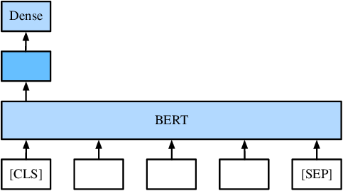
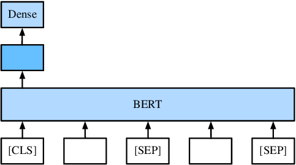
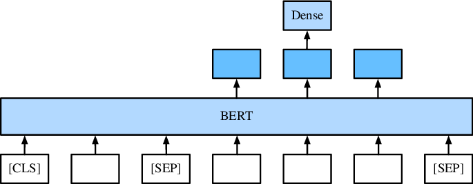

# 通过下游任务微调BERT

在“双向语言表征模型（BERT）”章节中，我们提到BERT在预训练阶段完成后，如果要适用于广泛的任务时，只需要一个额外的输出层，就可以对预训练的 BERT表示进行微调，从而无需对特定于任务进行大量模型结构的修改。
在这一节我们将介绍如何将BERT接入下游任务，并通过下游任务微调BERT。

## 下游任务接入方式
在获得训练好的BERT后，最终只需在BERT的输出层上加简单的多层感知机或线性分类器即可。

### 单句分类任务

单句分类任务如情感分析、文本分类。

> 输入：This movie is great. 
> 标签：积极

直接取“[CLS]”位置的输出表示接入全连接层作为输出。

### 句对分类任务

句对分类任务如自然语言推理。

> 前提：Two blond women are hugging one another.
> 假设：There are women showing affection.
> 关系：蕴含 （展示爱意可以由互相拥抱推理得出）

需要将两个句子拼接，在每个句子的结束位置加入“[SEP]”标记，最终取“[CLS]”位置的输出表示接入全连接层作为输出。

### 问答任务

问答是指给定问题和描述文本，这是从描述文本中找到答案。
对于问答这种抽取式任务，取第二个句子每个位置的输出表示作为下游任务的输入。

> 文本：Input_0: KDD 2019 is held in Anchorage
> 问题: Where is KDD held
> 输出: 在文本中标定“Anchorage”

### 序列标注任务
序列标注任务如命名实体识别，确定一个词是否是命名实体，例如人员，组织和位置。

取除了特殊标记外其他位置的输出表示接入全连接层作为输出。

> 输入: Jim bought 3000 shares of Amazon in 2006.
> 输出: [person]              [organization] [time]

## 小结

- 只需在BERT的输出层上加简单的多层感知机或线性分类器即可接入下游任务。
- 单句分类任务和句对分类任务取“[CLS]”位置的输出表示接入全连接层作为输出。
- 问答任务取第二个句子每个位置的输出表示作为下游任务的输入。
- 序列标注任务取除了特殊标记外其他位置的输出表示接入全连接层作为输出。
