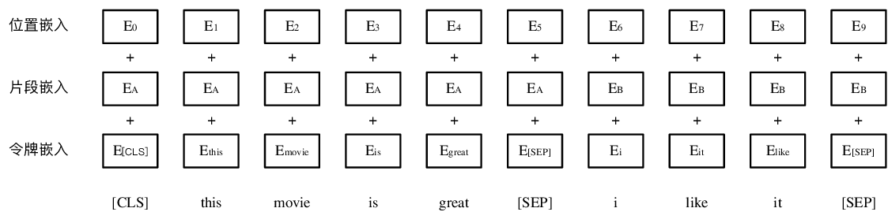
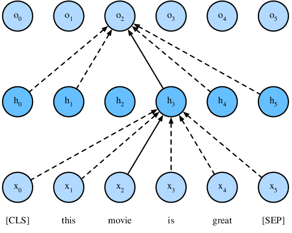
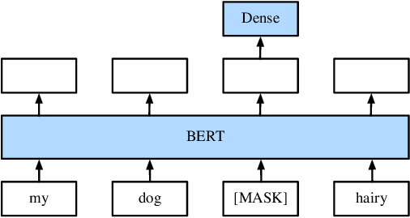
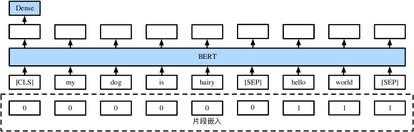

# 基于Transformer的双向语言表征模型（BERT）

在“词嵌入”章节中，我们提到了词向量是用来表示词的向量，也就是说词向量能够反映出语义的特征。但如Word2Vec这类常用的词嵌入模型在训练完成后，每个单词的词向量就会固定。在之后使用的时候，无论出现单词的上下文是什么，单词的词向量都不会随着上下文发生变化。例如“bank”这个词既有“银行”的意思，又有“河岸”的意思，在不同的上下文中，“bank”这个词的词向量应该不同。我们期待一个好的词向量应该能够这样随着不同上下文产生变化。

为了达到这点，我们可以设计一种能够动态计算词向量的网络。这个网络的输入是一段文本序列中的每个词，输出是每个词在当前文本序列上下文语境的词向量。这个网络类似于词嵌入模型，可以预先在大量的语料中进行训练。

为了能根据上下文动态计算词向量，同时可以预先在大量语料中进行训练。一个比较简单的办法是使用双向的LSTM语言模型。深度语境化词表征（ELMo）[2] 采用的就是这个办法。ELMo由一个前向和一个后向语言模型构成，目标函数就是取这两个方向语言模型的最大似然。但受限于LSTM的时序依赖特性，双向的LSTM语言模型无法并行计算每个词。这使得LSTM语言模型训练较慢，难以在大量语料中进行训练。

另一个动态计算词向量网络叫做通用预训练（GPT）。它使用Transformer代替了LSTM作为语言模型，Transformer相对LSTM更加容易并行计算，从而利于大量语料中进行训练。GPT使用的是在“语言模型”章节中提到的单向语言模型作为目标函数，即通过前$k-1$个词预测第k个词。但是单向语言模型往往会遗漏下文的信息。如下面两句话：

> I went to the bank to deposit some money.
> I went to the bank to sit down.

单向语言模型在同样读取到“Bank”这个词的时候，由于上文是一样的，所以无法区分“Bank”是指“银行”还是“河岸”。只有根据“Bank”的下文，才能有效的区分这两者。所以，我们期待有一种模型在动态计算词向量时，能根据同时考虑来自上文和下文的双向信息。

基于Transformer的双向编码器表征（BERT）就是这么一种语言表示模型。该模型首先在大规模语料上来预训练上下文深度双向深度表示，这一阶段叫做预训练阶段。在应用于广泛的下游任务时，只需要少量额外的输出层，就可以对预训练的 BERT 表示进行微调，而无需对特定任务进行大量模型结构的修改。

首先导入实验所需的包和模块。

```{.python .input  n=3}
import d2l
from mxnet import gluon, np, npx
from mxnet.gluon import nn

npx.set_np()
```

## 模型结构

BERT的基础模型结构是在`Transformer`章节中描述的多层双向Transformer编码器。原始的Transformer包括编码器和解码器部分。由于BERT是语言表示模型，目标是对文本序列进行编码表示，因此只需要Transformer中的编码器机制。
BERT分为Base和Large两个版本。Base版本包含12层Transformer，有110M的参数。Large版本包含24层Transformer，有340M的参数。

### 输入表征

BERT的输入支持单个句子或一对句子。分别适用于单句任务（如文本分类任务）和句对任务（如自然语言推理任务）。BERT的输入包含三部分，分别是词片嵌入，片段嵌入和位置嵌入。

词片嵌入（Token Embeddings）是将各个词转换成固定维度的向量。首先，对于单句的输入，在句子序列的结束位置加入特殊标记“[SEP]”。对于句对输入，在每个句子序列的结束位置都加入“[SEP]”，同时连结这两个句子序列变成一个序列。然后，在这一个序列的开始位置加入特殊标记“[CLS]”。最后，将每个词转换成固定维度的向量。在本节中，我们遵循BERT原文中的设定，每个词会被转换成768维的向量表示。词片嵌入层参数的形状是（词表大小，768）。对于长度为n的输入序列，词片嵌入输出形状是（n，768）。

片段嵌入（Segment Embeddings）是为了使BERT能够处理句对的输入。句子对中的两个句子被简单的连结在一起作为输入。因为我们需要使模型能够区分一个句子对中的两个句子，这就是片段嵌入的作用。片段嵌入只有两种向量表示：向量A和向量B。把向量A分配给第一个句子序列中的每个令牌，把向量B分配给第二个句子序列中的每个令牌。如果是输入仅仅有一个句子，则序列中的每个词片标记的片段嵌入都是向量A。向量A和向量B都是在训练过程中更新得到的。每个向量都是768维，所以片段嵌入层参数的形状是（2，768）。每个词片标记都会对应一个片段嵌入的输出。所以对于长度为n的输入序列，片段嵌入输出形状是（n，768）。

位置嵌入（Position Embeddings）。为了解决编码序列问题，Transformer引入位置嵌入从而将顺序的信息编码进来。BERT在原文中设置最大序列长度为512，所以位置嵌入层参数的形状是（512，768）。值得注意的是，对于句对输入，这里的512是指在连结两句子后包含了特殊标记的序列的长度。对于单句输入，这里的512也是指包含了特殊标记的序列的长度。每个词片标记也都会对应一个位置嵌入的输出。所以对于长度为n的输入序列，位置嵌入输出形状也是（n，768）。



对于一个长度为$ n $的输入序列，我们将得到三种嵌入，令牌嵌入（n，768）用来表示句子中的词，片段嵌入（n，768）用来区分两个句子，位置嵌入（n，768）用来学习到顺序信息。将该序列这三种嵌入按元素相加，由于输入的大小都是（n, 768），所以也会得到一个（n，768）的表示，这一表示就是这个长度为$ n $的序列在BERT的输入。

在代码实现中，我们修改“Transformer”中的`TransformerEncoder`类，加入BERT所需要的词片嵌入，片段嵌入和位置嵌入。

```{.python .input  n=4}
# Saved in the d2l package for later use
class BERTEncoder(nn.Block):
    def __init__(self, vocab_size, units, hidden_size,
                 num_heads, num_layers, dropout, **kwargs):
        super(BERTEncoder, self).__init__(**kwargs)
        self.word_embedding = gluon.nn.Embedding(vocab_size, units)
        self.segment_embedding = gluon.nn.Embedding(2, units)
        self.pos_encoding = d2l.PositionalEncoding(units, dropout)
        self.blks = gluon.nn.Sequential()
        for i in range(num_layers):
            self.blks.add(d2l.EncoderBlock(units, hidden_size, num_heads, dropout))

    def forward(self, words, segments, mask):
        X = self.word_embedding(words) + self.segment_embedding(segments)
        X = self.pos_encoding(X)
        for blk in self.blks:
            X = blk(X, mask)
        return X
```

为了测试这个BERTEncoder，现在我们模拟一个句对数据输入。每个句子对包含8个单词，不同的单词由不同的整数表示。

```{.python .input  n=5}
encoder = BERTEncoder(vocab_size=10000, units=768, hidden_size=1024,
                      num_heads=4, num_layers=2, dropout=0.1)
encoder.initialize()
num_samples, num_words = 2, 8
# 随机生成单词用于测试
words = np.random.randint(0, 10000, (2, 8))
# 我们使用0来表示样本中对应位置的单词来自第一个句子，使用1表示对应位置的单词来自第二个句子
segments = np.array([[0, 0, 0, 0, 1, 1, 1, 1],
                     [0, 0, 0, 1, 1, 1, 1, 1]])
encodings = encoder(words, segments, None)
print(encodings.shape)  # (批量大小, 单词数, 嵌入大小)
```

## 预训练任务

BERT包含两个预训练任务：掩码语言模型和下一句预测。

### 掩码语言模型
一般来说语言表示模型只能从左到右或者从右到左的单向训练。因为如果允许双向训练就意味着会使得每个词在多层的网络中间接地“看到自己”。如下图通过 $ o_2 $来预测“movie”这个词，$ o_2 $可以通过$ h_3 $间接的看到输入$ x_2 $。



为了训练深度双向的表示，BERT设计了一种名为掩码语言模型的任务。这个任务类似于完形填空的猜词任务。具体来说，就是随机将一定比例的输入标记替换为掩码标记“[MASK]”，然后预测这些掩码标记。也就是说，将掩码标记对应的隐藏向量输入一个前馈网络，用softmax计算词汇表中每个单词的概率，以预测被替换掉词的原始词。


下面我们创建掩码语言模型。

```{.python .input  n=6}
# Saved in the d2l package for later use
class MaskLMDecoder(nn.Block):
    def __init__(self, vocab_size, units, **kwargs):
        super(MaskLMDecoder, self).__init__(**kwargs)
        self.decoder = gluon.nn.Sequential()
        self.decoder.add(gluon.nn.Dense(units, flatten=False, activation='relu'))
        self.decoder.add(gluon.nn.LayerNorm())
        self.decoder.add(gluon.nn.Dense(vocab_size, flatten=False))

    def forward(self, X, masked_positions):
        ctx = masked_positions.context
        dtype = masked_positions.dtype
        # 首先将表示要选择的掩码位置拉平
        num_masked_positions = masked_positions.shape[1]
        masked_positions = masked_positions.reshape((1, -1))
        # 我们是以批量作为输入数据。需要确认每个掩码位置属于批量中的哪个样本
        batch_size = X.shape[0]
        batch_size = encodings.shape[0]
        batch_idx = np.arange(0, batch_size)
        batch_idx = np.repeat(batch_idx, num_masked_positions)
        batch_idx = batch_idx.reshape((1, -1))  # 每个掩码位置所属的样本索引
        # 同时按样本索引和掩码位置选择对应的向量
        encoded = X[batch_idx, masked_positions]
        # 变形为（批量大小, 掩码位置数目, 嵌入大小）
        encoded = encoded.reshape((batch_size, num_masked_positions, X.shape[-1]))
        pred = self.decoder(encoded)
        return pred
```

下面我们生成一些随机单词作为演示。我们使用交叉熵作为损失函数。然后将预测结果和真实标签传递给损失函数。

```{.python .input  n=30}
mlm_decoder = MaskLMDecoder(vocab_size=10000, units=768)
mlm_decoder.initialize()

mlm_positions = np.array([[0, 1], [4, 8]])
mlm_label = np.array([[100, 200], [100, 200]])
mlm_pred = mlm_decoder(encodings, mlm_positions)  # (批量大小, 掩码数目, 词表大小)
mlm_loss_fn = gluon.loss.SoftmaxCrossEntropyLoss()
mlm_loss = mlm_loss_fn(mlm_pred, mlm_label)
print(mlm_pred.shape, mlm_loss.shape)
```

### 下一句预测

在自然语言处理中有很多下游任务是建立在理解两个句子之间关系的基础上，比如自然语言推理任务。这并不是语言模型所能直接学习到的。为了能够学习到句子间关系，BERT设计了一个简单的任务，这个任务是预测输入的两个句子是否为连续文本的二分类任务。具体就是，我们首先选择文档库中的一个句子A。然后，以一半的概率将句子A的真实下一句作为句子B，标签设为1。一半概率使用来自语料库的随机句子作为句子B，标签设为0。

我们来看两个例子：

我们使用句子A的真实下一句作为句子B，此时标签为IsNext。
> 句子A：[CLS] the man went to [MASK] store [SEP]
> 句子B：he bought a gallon [MASK] milk [SEP]
> 标签：1

我们使用来自语料库的随机句子作为句子B，此时标签为NotNext。
> 句子A：[CLS] the man [MASK] to the store [SEP]
> 句子B：penguin [MASK] are flight ##less birds [SEP]
> 标签：0

正如在`输入表征`部分所讲的，我们需要连结句子A和句子B。在训练时，将“[CLS]”标记的输出送入一个前馈神经网络，并使用softmax计算“是下一句”标签的概率，以判断句子是否是当前句子的下一句。使用“[CLS]”是因为Transformer是可以把全局信息编码进每个位置，因此“[CLS]”位置的输出表示可以包含整个输入序列的特征。

我们设计出这个下一句预测任务的模型。我们将编码后的结果传递给前馈神经网络以预测下一个句子。



```{.python .input  n=18}
# Saved in the d2l package for later use
class NextSentenceClassifier(nn.Block):
    def __init__(self, units=768, **kwargs):
        super(NextSentenceClassifier, self).__init__(**kwargs)
        self.classifier = gluon.nn.Sequential()
        self.classifier.add(gluon.nn.Dense(units=units, flatten=False,
                                           activation='tanh'))
        self.classifier.add(gluon.nn.Dense(units=2, flatten=False))

    def forward(self, X):
        X = X[:, 0, :]  # 获取第一个标记“[CLS]”的编码
        return self.classifier(X)
```

下一句预测是二分类问题，我们依然使用交叉熵作为损失函数。 我们将编码结果传递给`NextSentenceClassifier`这个类以获得下一句预测结果。 如果是真实的下一句则标签为1，否则使用0。然后，我们将预测结果和真实标签传递给损失函数。

```{.python .input  n=19}
ns_classifier = NextSentenceClassifier()
ns_classifier.initialize()

ns_pred = ns_classifier(encodings)  # (批量大小, 1)
ns_label = np.array([0, 1])  # 标签1为真实的下一句，标签0为随机的下一句
ns_loss_fn = gluon.loss.SoftmaxCrossEntropyLoss()
ns_loss = ns_loss_fn(ns_pred, ns_label)
print(ns_pred.shape, ns_loss.shape)
```

## 构建模型

我们将刚才修改得到的`TransformerEncoder`，下一句任务预测模型和遮蔽语言模型串联到一起，得到BERT模型。

```{.python .input  n=20}
# Saved in the d2l package for later use
class BERTModel(nn.Block):
    def __init__(self, vocab_size=None, embed_size=128, hidden_size=512,
                 num_heads=2, num_layers=4, dropout=0.1):
        super(BERTModel, self).__init__()
        self.encoder = BERTEncoder(vocab_size=vocab_size, units=embed_size, hidden_size=hidden_size,
                                   num_heads=num_heads, num_layers=num_layers, dropout=dropout)
        self.ns_classifier = NextSentenceClassifier()
        self.mlm_decoder = MaskLMDecoder(vocab_size=vocab_size, units=embed_size)

    def forward(self, inputs, token_types, valid_length=None, masked_positions=None):
        # 使用Transfomer编码序列的每个词
        seq_out = self.encoder(inputs, token_types, valid_length)
        # 进行下一句预测任务
        next_sentence_classifier_out = self.ns_classifier(seq_out)
        # 进行掩码语言模型任务
        mlm_decoder_out = self.mlm_decoder(seq_out, masked_positions)
        return seq_out, next_sentence_classifier_out, mlm_decoder_out
```

## 小结

- BERT旨在预训练上下文深度双向表示。
- BERT的基础模型结构是多层双向Transformer编码器。
- BERT是由遮蔽语言模型和预测下一句任务组成。
- 在遮蔽语言模型中，随机将输入标记遮蔽，然后预测这些被遮蔽的标记。
- 预测下一句任务是二分类任务，预测输入的两个句子是否为连续的文本。

## 参考文献

[1] Devlin, J., Chang, M. W., Lee, K., & Toutanova, K. (2018). Bert: Pre-training of deep bidirectional transformers for language understanding. arXiv preprint arXiv:1810.04805.

## 扫码直达[讨论区](https://discuss.gluon.ai/t/topic/7762)


